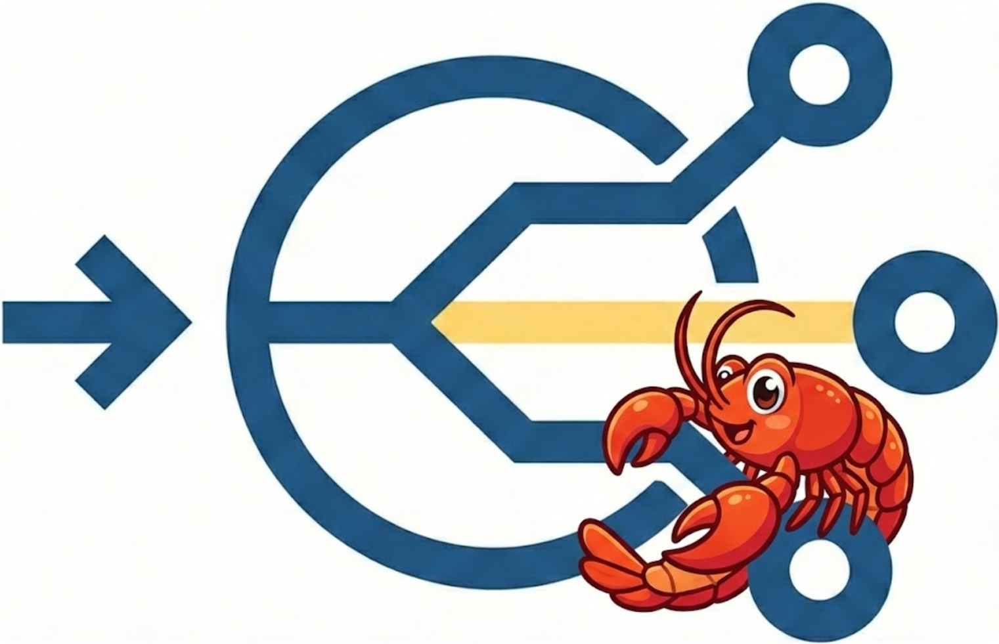
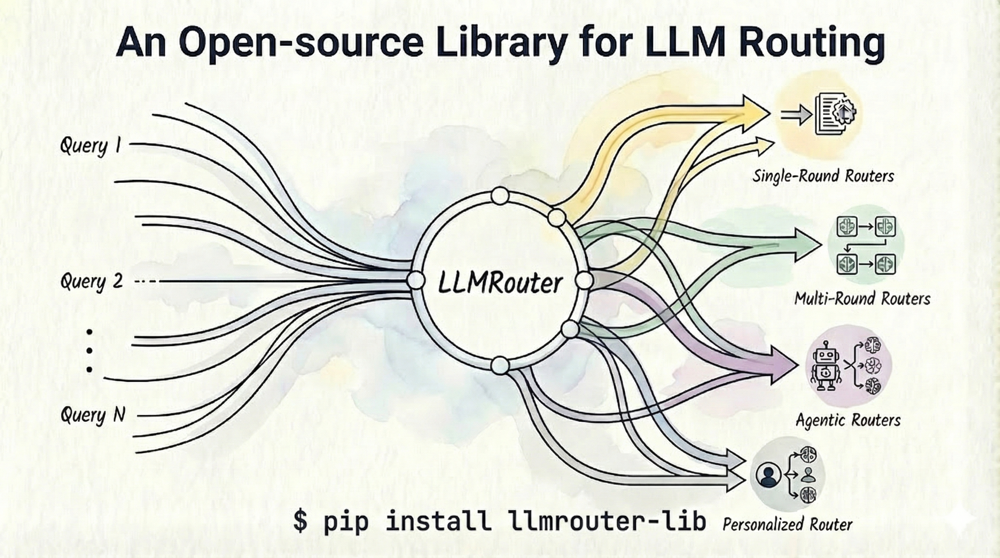
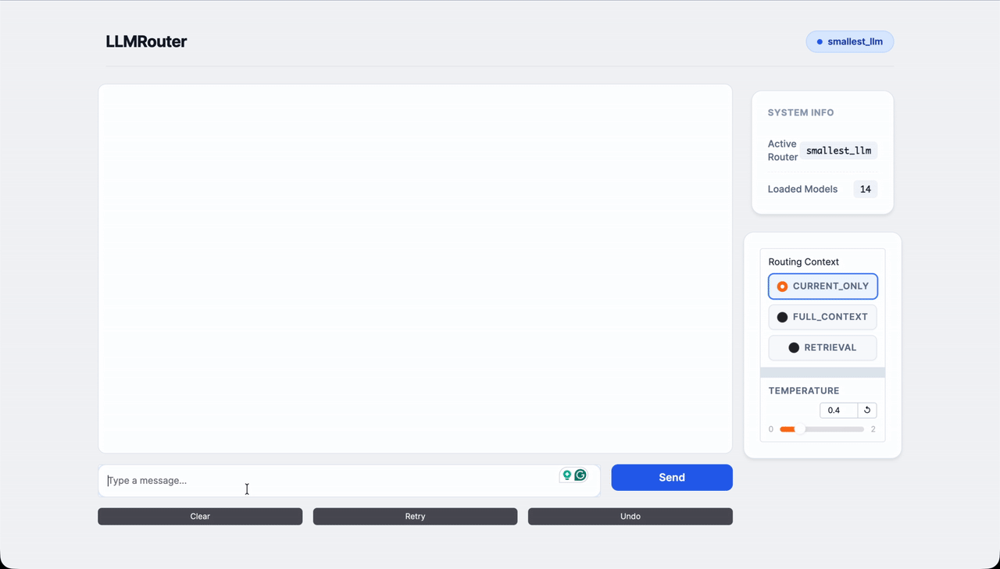
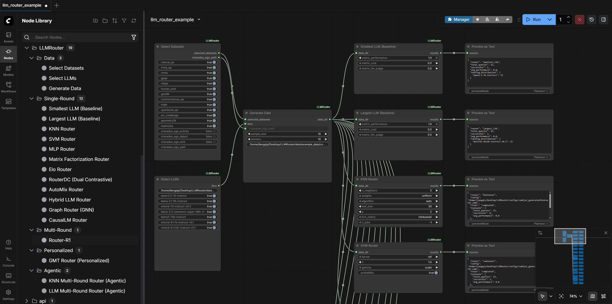

<div align="center">
  
</div>

<h1 align="center">🚀 LLMRouter: An Open-Source Library for LLM Routing</h1>

<div align="center">
  <p>
    <a href="https://www.python.org/downloads/release/python-3109/"></a>
    <a href="https://github.com/ulab-uiuc/LLMRouter/pulls"></a>
    <a href="https://join.slack.com/t/llmrouteropen-ri04588/shared_invite/zt-3mkx82cut-A25v5yR52xVKi7_jm_YK_w"></a>
    <a href="https://github.com/ulab-uiuc/LLMRouter/issues/136"></a>
    <a href="https://ulab-uiuc.github.io/LLMRouter/" style="text-decoration:none;"></a>
    <a href="https://x.com/youjiaxuan/status/2005877938554589370" style="text-decoration:none;"></a>
    <a href="LICENSE"></a>
  </p>
</div>

## ✨ Introduction

<div align="center">
  
</div>

**LLMRouter** 是一款智能路由系统，旨在通过动态选择最合适的模型来优化 LLM 推断。为了实现智能路由，它定义了：

1. 🚀 *智能路由*：根据任务复杂度、成本和性能需求自动将查询路由到最优LLM。
2. 📊 *多路由器模型*：支持**超过16种路由模型**，分为四大类——**单轮路由器、多轮路由器、代理路由器和个性化路由器**，涵盖多种策略，如KNN、SVM、MLP、矩阵分解、Elo评级、基于图的路由、基于BERT的路由、混合概率方法、转换分数路由等。
   
   单轮路由：用户发来一个独立的问题，路由器根据这个问题本身的特征，决定调用那个模型。——看一次，定终身
   
   多轮路由：路由器维护整个对话的上下文，不仅看当前问题，还会回顾之前的对话，才能决定用哪个模型。——看全局，跟节奏
   
   代理路由：无内置模型，只有决策逻辑+模型的路由表。本身就是一个轻量级的agent，可以拆解任务、分配子任务、整合结果、调用工具
   
   个性化路由：看人下菜碟，为每个用户动态优化。
   
   KNN（K邻近）：看历史数据里，和当前问题最像的K个问题当时派给了谁，少数服从多数。把每个问题转化成向量（比如用TF-IDF）。新问题来了，计算它和所有历史问题向量的距离，找最近的K个，看它们调用了哪个模型，投票决定。
   
   SVM（支持向量机）：在问题空间画一条分界线，新问题落在那一侧，就用那个模型。训练时，把历史问题分成几类（每个模型一类），SVM找到最优的“决策边界”。新问题来了，看它在边界的哪一边。
   
   MLP（多层感知机）：一个简单的前馈神经网络，通过多层“神经元”学习问题到模型的非线性映射。输入层接收问题的特征（长度、关键词、复杂度分），经过几个隐藏层计算，输出层给出每个模型的概率分数。
   
   矩阵分解：把“问题”和“模型”都映射到同一个隐空间，相似的问题和模型在空间中距离近。构建一个大矩阵，行是问题类型，列是模型，单元格是“历史表现分”（比如准确率、用户满意度）。矩阵分解拆成两个小矩阵：问题嵌入矩阵 & 模型嵌入矩阵。新问题来时，计算它的嵌入和所有模型嵌入的点积，得分最高的模型胜出。
   
   Elo评级：从竞技游戏（如国际象棋）借来，给每个模型打一个分数，分数越高表示“赢得比赛”越多——这里的“比赛”是看谁能更好地解决同一类问题。每当两个模型处理同一批问题，路由记录哪个模型的结果更好（通过自动评估或用户反馈），更新Elo分。新问题来了，路由用当前Elo分作为模型能力的估计。
   
   基于图的路由：把问题、模型、中间结果、用户偏好等都当作图上的节点，路由决策变成图上的搜索或路径优化问题。构建一个异构知识图。新问题作为查询节点，在图上执行随机游走或图神经网络，找到最相关的模型节点。
   
   基于BERT的路由：用预训练语言模型（如BERT）理解问题的深层语义，而不是靠表面特征。微调一个BERT模型，输入是问题文本，输出是一个分类（选哪个模型）或一个相似度分数（问题和模型能力描述的匹配度）。
   
   **混合概率方法**：不给出唯一的硬决策，而是输出一个概率分布，表示“每个模型是最优的概率。结合多个信号（如KNN的投票、SVM的分数、矩阵分解的匹配度），用贝叶斯方法融合成一个后验概率。
   
   **转换分数路由**：在多轮对话中，考虑“切换模型”本身也有成本或收益。除了评估每个模型对当前问题的得分，还要加上一个“转换惩罚”：如果换成不同的模型，额外扣分。
   
   硬决策：给出一个确定答案，做出一个确定的选择，不存在摸棱两可的现象。
   
   冷启动：系统在新用户、新问题、新模型加入时，缺乏历史数据，无法做出准确判断的问题。
3. 🛠️ *统一CLI*：完整的命令行接口，支持培训、推理和交互式聊天，基于基于Gradio的用户界面。
   
   Gradio：一个Python库，能把模型**快速变成一个网页界面**（有按钮、文本框、滑块），适合演示、分享、非技术人员使用。
4. 📈 *数据生成流程*：完整的流程，可从11个基准数据集生成训练数据，并实现自动API调用和评估。

## 📰 新闻

- 🚀 **[2026-05]**：**RouteProfile代码及论文发布**——我们发布了**RouteProfile**，一个用于设计LLM路由配置文件的通用框架！RouteProfile 支持从异构交互历史构建结构化配置文件，支持扁平、基于嵌入、文本 GNN 和可训练的 GNN 配置文件，并在标准和新大型语言模型设置下评估 SimRouter、MLPRouter 和 GraphRouter 的路由性能。详情请查阅[论文](https://arxiv.org/abs/2605.00180)和[代码](https://github.com/ulab-uiuc/RouteProfile)。

- 🖥️ **[2026-02]**：**ComfyUI 界面**——我们发布了 LLMRouter 的视觉界面！现在你可以直观地构建数据生成和路由流水线，拖拽节点来训练路由器，并实时监控性能。详情请参见 [ComfyUI 界面](https://github.com/ulab-uiuc/LLMRouter/blob/main/README.md#-comfyui-interface)。

- 🔗 **[2026-02]**：**OpenClaw 路由器**——兼容 OpenAI 的服务器，集成 OpenClaw！我们还发布了 llmrouter-lib v0.3.1。部署LLMRouter作为生产API服务器，通过[OpenClaw](https://github.com/openclaw/openclaw)与Slack、Discord及其他消息平台无缝协作。功能包括多模态理解（图像/音频/视频）、检索增强路由内存、流媒体支持以及所有16+ LLMRouter路由策略。参见[OpenClaw路由器集成](https://github.com/ulab-uiuc/LLMRouter/blob/main/README.md#-openclaw-router-openclaw-integration)。关于使用像Slack这样的社交平台部署，请参阅《[入门指南](https://www.moltcn.com/start/getting-started.html)》中的逐步设置说明。

- ⭐ **[2026-01]**：**LLMRouter** 刚刚突破了 1000 个 GitHub 星数！我们还发布了 llmrouter-lib v0.2.0。更新内容包括服务专用的dict配置（OpenAI、Anthropic等）和多模态路由（视频/图像+文本），均在Geometry3K、MathVista和Charades-Ego上——所有这些都集成在首个统一开源LLM路由库中，包含16+路由器、统一CLI、Gradio界面和11个数据集。通过 pip 安装 llmrouter-lib。更多更新很快！🚀

- 🚀 **[2025-12]**：**LLMRouter** 正式发布——提供更🧠智能、成本意识💸强的 LLM 路由，配备 16+ 路由器🧭、统一的 CLI 🛠️ 和定制路由器🧩插件工作流程。`llmrouter`

## 🔗 Links

- [Supported Routers](#-supported-routers)
- [Installation](#installation)
- [Use Your Own Dataset](#-preparing-training-data)
- [Training a Router](#training-a-router)
- [Running Inference via a Router](#running-inference)
- [Interactive Chat Interface with a Router](#interactive-chat-interface)
- [ComfyUI Interface](#-comfyui-interface)
- [Creating Your Own Routers](#-creating-your-own-routers)
- [Adding Your Own Tasks](#-adding-your-own-tasks)
- [OpenClaw Router (OpenClaw Integration)](#-openclaw-router-openclaw-integration)
- [Acknowledgments](#-acknowledgments)
- [Citation](#-citation)

## 🧭 Supported Routers

### Single-Round Routers

| Router            | Training | Inference | Description                             | Tutorial                                         |
| ----------------- |:--------:|:---------:| --------------------------------------- |:------------------------------------------------:|
| `knnrouter`       | ✅        | ✅         | K-Nearest Neighbors based routing       | [📖](llmrouter/models/knnrouter/README.md)       |
| `svmrouter`       | ✅        | ✅         | Support Vector Machine based routing    | [📖](llmrouter/models/svmrouter/README.md)       |
| `mlprouter`       | ✅        | ✅         | Multi-Layer Perceptron based routing    | [📖](llmrouter/models/mlprouter/README.md)       |
| `mfrouter`        | ✅        | ✅         | Matrix Factorization based routing      | [📖](llmrouter/models/mfrouter/README.md)        |
| `elorouter`       | ✅        | ✅         | Elo Rating based routing                | [📖](llmrouter/models/elorouter/README.md)       |
| `routerdc`        | ✅        | ✅         | Dual Contrastive learning based routing | [📖](llmrouter/models/routerdc/README.md)        |
| `automix`         | ✅        | ✅         | Automatic model mixing                  | [📖](llmrouter/models/automix/README.md)         |
| `hybrid_llm`      | ✅        | ✅         | Hybrid LLM routing strategy             | [📖](llmrouter/models/hybrid_llm/README.md)      |
| `graphrouter`     | ✅        | ✅         | Graph-based routing                     | [📖](llmrouter/models/graphrouter/README.md)     |
| `causallm_router` | ✅        | ✅         | Causal Language Model router            | [📖](llmrouter/models/causallm_router/README.md) |
| `smallest_llm`    | N/A      | ✅         | Always routes to smallest model         | [📖](llmrouter/models/smallest_llm/README.md)    |
| `largest_llm`     | N/A      | ✅         | Always routes to largest model          | [📖](llmrouter/models/largest_llm/README.md)     |

### Multi-Round Routers

| Router      | Training                                       | Inference | Description                                              | Tutorial                                   |
| ----------- |:----------------------------------------------:|:---------:| -------------------------------------------------------- |:------------------------------------------:|
| `router_r1` | [LINK](https://github.com/ulab-uiuc/Router-R1) | ✅         | Pre-trained Router-R1 model for multi-turn conversations | [📖](llmrouter/models/router_r1/README.md) |

### Personalized Routers

| Router               | Training | Inference | Description                                                   | Tutorial                                            |
| -------------------- |:--------:|:---------:| ------------------------------------------------------------- |:---------------------------------------------------:|
| `gmtrouter`          | ✅        | ✅         | Graph-based personalized router with user preference learning | [📖](llmrouter/models/gmtrouter/README.md)          |
| `personalizedrouter` | ✅        | ✅         | GNN-based personalized router with user features              | [📖](llmrouter/models/personalizedrouter/README.md) |

### Agentic Routers

| Router                | Training | Inference | Description                                | Tutorial                                             |
| --------------------- |:--------:|:---------:| ------------------------------------------ |:----------------------------------------------------:|
| `knnmultiroundrouter` | ✅        | ✅         | KNN-based agentic router for complex tasks | [📖](llmrouter/models/knnmultiroundrouter/README.md) |
| `llmmultiroundrouter` | N/A      | ✅         | LLM-based agentic router for complex tasks | [📖](llmrouter/models/llmmultiroundrouter/README.md) |

## 🚀 Get Started

### Installation

#### Install from source

Clone the repository and install in editable mode using a virtual environment (e.g., with anaconda3):

```bash
# Clone the repository
git clone https://github.com/ulab-uiuc/LLMRouter.git
cd LLMRouter

# Create and activate virtual environment
conda create -n llmrouter python=3.10
conda activate llmrouter

# Install the package (base installation)
pip install -e .

# Optional: Install with RouterR1 support (requires GPU)
# RouterR1 is tested with vllm==0.6.3 (torch==2.4.0); the extra pins these versions.
pip install -e ".[router-r1]"

# Optional: Install all optional dependencies
pip install -e ".[all]"
```

#### Install from PyPI

```bash
pip install llmrouter-lib
```

### 🔑 Setting Up API Keys

LLMRouter requires API keys to make LLM API calls for inference, chat, and data generation. Set the `API_KEYS` environment variable using one of the following formats:

> 💡 **Free NVIDIA API Keys**: The NVIDIA endpoints currently used in LLMRouter have freely available API keys. To get started, visit [https://build.nvidia.com/](https://build.nvidia.com/) to create an account, then you can generate your API keys at no cost.

#### **Service-Specific Dict Format** (recommended for multiple providers)

Use this format when you have models from different service providers (e.g., NVIDIA, OpenAI, Anthropic) and want to use different API keys for each provider:

```bash
export API_KEYS='{"NVIDIA": "nvidia-key-1,nvidia-key-2", "OpenAI": ["openai-key-1", "openai-key-2"], "Anthropic": "anthropic-key-1"}'
```

**Dict Format Details:**

- **Keys**: Service provider names (must match the `service` field in your LLM candidate JSON)
- **Values**: Can be:
  - Comma-separated string: `"key1,key2,key3"`
  - JSON array: `["key1", "key2", "key3"]`
  - Single string: `"key1"`
- **Service Matching**: The system automatically matches the `service` field from your LLM candidate JSON to select the appropriate API keys
- **Round-Robin**: Each service maintains its own round-robin counter for load balancing
- **Error Handling**: If a service is not found in the dict, a clear error message will be raised with available services listed

**Example LLM Candidate JSON with service field:**

```json
{
  "qwen2.5-7b-instruct": {
    "service": "NVIDIA",
    "model": "qwen/qwen2.5-7b-instruct",
    "api_endpoint": "https://integrate.api.nvidia.com/v1"
  },
  "gpt-4": {
    "service": "OpenAI",
    "model": "gpt-4",
    "api_endpoint": "https://api.openai.com/v1"
  }
}
```

#### **Legacy Formats** (for single provider or backward compatibility)

**JSON Array Format** (for multiple keys from same provider):

```bash
export API_KEYS='["your-key-1", "your-key-2", "your-key-3"]'
```

**Comma-Separated Format** (alternative for multiple keys):

```bash
export API_KEYS='key1,key2,key3'
```

**Single Key** (for one API key):

```bash
export API_KEYS='your-api-key'
```

**Notes**: 

- API keys are used for **inference**, **chat interface**, and **data generation** (Step 3 of the pipeline)
- Multiple keys enable automatic load balancing across API calls
- When using **dict format**, ensure the `service` field in your LLM candidate JSON matches the keys in your `API_KEYS` dict
- The environment variable must be set before running inference, chat, or data generation commands
- For persistent setup, add the export command to your shell profile (e.g., `~/.bashrc` or `~/.zshrc`)

### 🌐 Configuring API Endpoints

API endpoints can be specified at two levels (resolved in priority order):

1. **Per-Model** (highest priority): `api_endpoint` field in LLM candidate JSON (`default_llm.json`)
2. **Router-Level** (fallback): `api_endpoint` field in router YAML config
3. **Error**: Raises descriptive error if neither is specified

**LLM Candidate JSON** (per-model endpoints):

```json
{
  "qwen2.5-7b-instruct": {
    "model": "qwen/qwen2.5-7b-instruct",
    "api_endpoint": "https://integrate.api.nvidia.com/v1",
    ...
  },
  "custom-model": {
    "model": "custom/model-name",
    "api_endpoint": "https://api.customprovider.com/v1",
    ...
  }
}
```

**Router YAML** (default endpoint):

```yaml
api_endpoint: 'https://integrate.api.nvidia.com/v1'  # Fallback for all models
```

**Benefits**: Different models can use different providers; easy migration; backward compatible with router configs.

For details, see [Data Generation Pipeline documentation](llmrouter/data/README.md#llm-data-json-default_llmjson).

### 🖥️ Using Local LLM Models

LLMRouter supports locally hosted LLM inference servers that provide OpenAI-compatible APIs (e.g., Ollama, vLLM, SGLang). For local providers, you can use an empty string `""` as the API key value - the system automatically detects localhost endpoints and handles authentication accordingly.

**Example with Ollama:**

```bash
export API_KEYS='{"Ollama": ""}'
```

```json
{
  "gemma3": {
    "size": "3B",
    "feature": "Gemma 3B model hosted locally via Ollama",
    "input_price": 0.0,
    "output_price": 0.0,
    "model": "gemma3",
    "service": "Ollama",
    "api_endpoint": "http://localhost:11434/v1"
  }
}
```

**Important**: Use the `/v1` endpoint (OpenAI-compatible), not the native API endpoints. Empty strings are automatically detected for localhost endpoints (`localhost` or `127.0.0.1`).

### 🧪 Testing Model Availability

You can test the availability of different candidate models using the following curl commands. This is useful for verifying that your API keys work correctly and that specific models are accessible:

**Note**: If you're using the dict format for `API_KEYS`, extract the NVIDIA key first (e.g., using `echo $API_KEYS | python3 -c "import sys, json; print(json.load(sys.stdin)['NVIDIA'].split(',')[0])"`), or set a temporary variable with your NVIDIA API key.

```bash
# export API_KEYS=...

# Example API endpoint - adjust based on your configuration
# This example uses NVIDIA's endpoint, but you should use the endpoint
# specified in your LLM candidate JSON or router config
API_ENDPOINT="https://integrate.api.nvidia.com/v1/chat/completions"

# Example model list - adjust based on your LLM candidate configuration
# These are example models; replace with the actual model names/IDs
# from your LLM candidate JSON file
MODELS=(
  "qwen/qwen2.5-7b-instruct"
  "meta/llama-3.1-8b-instruct"
  "mistralai/mistral-7b-instruct-v0.3"
  "nvidia/llama-3.3-nemotron-super-49b-v1"
  "mistralai/mixtral-8x7b-instruct-v0.1"
  "mistralai/mixtral-8x22b-instruct-v0.1"
)

SYSTEM_PROMPT="Hello."
PROMPT="Hello."

for MODEL in "${MODELS[@]}"; do
  echo "===== $MODEL ====="

  curl "$API_ENDPOINT" \
    -H "Content-Type: application/json" \
    -H "Authorization: Bearer $API_KEYS" \
    -d "{
      \"model\": \"$MODEL\",
      \"messages\": [
        {
          \"role\": \"system\",
          \"content\": \"$SYSTEM_PROMPT\"
        },
        {
          \"role\": \"user\",
          \"content\": \"$PROMPT\"
        }
      ],
      \"temperature\": 0.8,
      \"max_tokens\": 200
    }"

  echo
done
```

This script will test each model in the list and display the response, helping you verify which models are available and working with your API key.

### 📊 Preparing Training Data

LLMRouter includes a complete data generation pipeline that transforms raw benchmark datasets into formatted routing data with embeddings. The pipeline supports 11 diverse benchmark datasets including Natural QA, Trivia QA, MMLU, GPQA, MBPP, HumanEval, GSM8K, CommonsenseQA, MATH, OpenbookQA, and ARC-Challenge.

> 💡 **Multimodal Integration**: Learn how to incorporate complex multimodal tasks (Video/Image + Text) into LLMRouter by checking our [Multimodal Task Guide](data/multimodal_tasks/README.md). We currently support 5 multimodal tasks across 3 datasets (Geometry3K, MathVista, Charades-Ego).

#### Pipeline Overview

The data generation pipeline consists of three main steps:

1. **Generate Query Data** - Extract queries from benchmark datasets and create train/test split JSONL files
2. **Generate LLM Embeddings** - Create embeddings for LLM candidates from their metadata
3. **API Calling & Evaluation** - Call LLM APIs, evaluate responses, and generate unified embeddings + routing data

#### Quick Start

Start with the sample configuration file:

```bash
# Step 1: Generate query data
python llmrouter/data/data_generation.py --config llmrouter/data/sample_config.yaml

# Step 2: Generate LLM embeddings
python llmrouter/data/generate_llm_embeddings.py --config llmrouter/data/sample_config.yaml

# Step 3: API calling & evaluation (requires API_KEYS - see "Setting Up API Keys" section above)
python llmrouter/data/api_calling_evaluation.py --config llmrouter/data/sample_config.yaml --workers 100
```

#### Output Files

The pipeline generates the following files:

- **Query Data** (JSONL): `query_data_train.jsonl` and `query_data_test.jsonl` - Query data with train/test split
- **LLM Embeddings** (JSON): `default_llm_embeddings.json` - LLM metadata with embeddings
- **Query Embeddings** (PyTorch): `query_embeddings_longformer.pt` - Unified embeddings for all queries
- **Routing Data** (JSONL): `default_routing_train_data.jsonl` and `default_routing_test_data.jsonl` - Complete routing data with model responses, performance scores, and token usage

**Example routing data entry:**

```json
{
  "task_name": "gsm8k",
  "query": "Janet has 4 apples. She gives 2 to Bob. How many does she have left?",
  "ground_truth": "2",
  "metric": "GSM8K",
  "model_name": "llama3-chatqa-1.5-8b",
  "response": "Janet has 4 apples and gives 2 to Bob, so she has 4 - 2 = 2 apples left.",
  "performance": 1.0,
  "embedding_id": 42,
  "token_num": 453
}
```

#### Configuration

All paths and parameters are controlled via YAML configuration. The sample config file (`llmrouter/data/sample_config.yaml`) references the example data directory and can be used as-is or customized for your setup.

**Note**: Step 3 requires API keys for calling LLM services. See the [Setting Up API Keys](#-setting-up-api-keys) section above for configuration details.

For complete documentation including detailed file formats, embedding mapping system, configuration options, and troubleshooting, see **[llmrouter/data/README.md](llmrouter/data/README.md)**.

### Training a Router

Before training, ensure you have prepared your data using the [Data Generation Pipeline](#-preparing-training-data) or use the example data in `data/example_data/`.

Train various router models with your configuration:

```bash
# Train KNN router
llmrouter train --router knnrouter --config configs/model_config_train/knnrouter.yaml

# Train MLP router with GPU
CUDA_VISIBLE_DEVICES=2 llmrouter train --router mlprouter --config configs/model_config_train/mlprouter.yaml --device cuda

# Train MF router quietly
CUDA_VISIBLE_DEVICES=1 llmrouter train --router mfrouter --config configs/model_config_train/mfrouter.yaml --device cuda --quiet
```

### Running Inference

Perform inference with trained routers (requires API keys - see [Setting Up API Keys](#-setting-up-api-keys) section):

```bash
# Single query inference
llmrouter infer --router knnrouter --config config.yaml --query "What is machine learning?"

# Batch inference from file
llmrouter infer --router knnrouter --config config.yaml --input queries.txt --output results.json

# Route only (without calling LLM API - no API keys needed)
llmrouter infer --router knnrouter --config config.yaml --query "Hello" --route-only

# Custom generation parameters
llmrouter infer --router knnrouter --config config.yaml --query "Explain AI" --temp 0.7 --max-tokens 2048 --verbose
```

Input file formats supported: `.txt` (one query per line), `.json` (list of strings or objects with `"query"` field), `.jsonl` (one JSON object per line).

### Interactive Chat Interface

<div style="text-align:center;">
    
</div>

<p align="center">
    <strong>📱 Quick Preview:</strong> Animated overview of the LLMRouter chat interface showing real-time routing and model selection.
</p>

<div style="text-align:center;">
    <video width="100%" controls style="max-width: 800px; height: auto;">
        <source src="assets/llmrouter_chat_demo.mov" type="video/quicktime">
        Your browser does not support the video tag.
    </video>
</div>

Launch the chat interface (requires API keys - see [Setting Up API Keys](#-setting-up-api-keys) section):

```bash
# Basic chat interface
llmrouter chat --router knnrouter --config config.yaml

# Custom host and port
llmrouter chat --router knnrouter --config config.yaml --host 0.0.0.0 --port 7860

# With public sharing link
llmrouter chat --router knnrouter --config config.yaml --share

# Specify query mode
llmrouter chat --router knnrouter --config config.yaml --mode full_context --top_k 5
```

Query Modes:

- `current_only`: Routes based on current query only (default)
- `full_context`: Combines all chat history with current query
- `retrieval`: Retrieves top-k similar historical queries for context

### Direct Script Execution

You can also run the CLI scripts directly:

```bash
# Training
python -m llmrouter.cli.router_train --router knnrouter --config config.yaml

# Inference
python -m llmrouter.cli.router_inference --router knnrouter --config config.yaml --query "Hello"

# Chat
python -m llmrouter.cli.router_chat --router knnrouter --config config.yaml
```

## 🎨 ComfyUI Interface

LLMRouter offers a powerful **Visual Interface** via [ComfyUI](https://github.com/Comfy-Org/ComfyUI), transforming how you interact with the routing pipeline. Instead of editing YAML files and running terminal scripts, you can drag, drop, and connect nodes to build your workflow.

<div align="center">
  
</div>

### Key Highlights

- **Visual Configuration**: Forget complex YAML files and terminal scripts. Adjust parameters (e.g., sample size, model candidates) and select datasets directly on the canvas.
- **End-to-End Automation**: Seamlessly link nodes to build a complete pipeline: Data Generation $\to$ Router Training $\to$ Evaluation.
- **Real-Time Monitoring**: Track the status of query generation, embedding extraction, and model training with instant visual feedback.
- **Modular Design**: Custom construct your pipeline by dragging, dropping, and connecting nodes for Datasets, LLMs, and Routers.

### Installation & Setup

Prerequisites: You must have [ComfyUI](https://github.com/Comfy-Org/ComfyUI) installed.

To install the LLMRouter custom nodes, you need to create two symbolic links (soft links).

#### 1. Link the Custom Nodes

This allows ComfyUI to load the LLMRouter Python backend logic in the ComfyUI "Nodes" category.

```bash
ln -s /path/to/LLMRouter/ComfyUI /path/to/ComfyUI/custom_nodes/LLMRouter
```

#### 2. Link the Workflow Example (Optional)

This allows you to see the pre-configured workflow in the ComfyUI "Workflows" category.

```bash
ln -s /path/to/LLMRouter/ComfyUI/workflows/llm_router_example.json /path/to/ComfyUI/user/default/workflows/llm_router_example.json
```

#### 3. Running the Application

To start the ComfyUI server with the LLMRouter nodes:

```bash
python /path/to/ComfyUI/main.py
```

#### 4. Remote Access & Port Forwarding

If you are running ComfyUI on a remote server (e.g., a compute cluster) and wish to access the interface locally, you can use SSH tunneling. Once the tunnel is established, access the interface at `http://127.0.0.1:8188`.

### Using the ComfyUI Interface

#### Find the Nodes

To use the nodes:

1. Open the ComfyUI web interface.
2. Use the **Node Library** sidebar or **Right-click** on the canvas.
3. Navigate to the **`LLMRouter`** category.
4. You will find nodes organized by function:
   - **Data**: `Select Datasets`, `Select LLMs`, `Generate Data`.
   - **Single-Round**: `KNN Router`, `SVM Router`, `MLP Router`, etc.
   - **Multi-Round / Agentic**: Specialized routers for complex tasks.

#### Load the Example

To use the ready-to-run example:

1. Click the **`Workflows`** tab.
2. Select **`llm_router_example.json`**.
3. This loads a complete pipeline.

## 🔧 Creating Your Own Routers

LLMRouter supports a **plugin system** that allows you to add custom router implementations without modifying the core codebase. This makes it easy to experiment with new routing strategies or domain-specific routers.

### Quick Start

**1. Create your router directory:**

```bash
mkdir -p custom_routers/my_router
```

**2. Implement your router** (`custom_routers/my_router/router.py`):

```python
from llmrouter.models.meta_router import MetaRouter
import torch.nn as nn

class MyRouter(MetaRouter):
    """Your custom router implementation."""

    def __init__(self, yaml_path: str):
        # Initialize with a model (can be nn.Identity() for simple routers)
        model = nn.Identity()
        super().__init__(model=model, yaml_path=yaml_path)

        # Get available LLM names from config
        self.llm_names = list(self.llm_data.keys())

    def route_single(self, query_input: dict) -> dict:
        """Route a single query to the best LLM."""
        query = query_input['query']

        # Your custom routing logic here
        # Example: route based on query length
        selected_llm = (self.llm_names[0] if len(query) < 50
                       else self.llm_names[-1])

        return {
            "query": query,
            "model_name": selected_llm,
            "predicted_llm": selected_llm,
        }

    def route_batch(self, batch: list) -> list:
        """Route multiple queries."""
        return [self.route_single(q) for q in batch]
```

**3. Create configuration** (`custom_routers/my_router/config.yaml`):

```yaml
data_path:
  llm_data: 'data/example_data/llm_candidates/default_llm.json'

hparam:
  # Your hyperparameters here

# Optional: Default API endpoint (used as fallback if models don't specify their own)
# Individual models can override this by specifying api_endpoint in the llm_data JSON file
api_endpoint: 'https://integrate.api.nvidia.com/v1'
```

**4. Use your custom router** (same as built-in routers!):

```bash
# Inference
llmrouter infer --router my_router \
  --config custom_routers/my_router/config.yaml \
  --query "What is machine learning?"

# List all routers (including custom ones)
llmrouter list-routers
```

### Plugin Discovery

Custom routers are automatically discovered from:

- `./custom_routers/` (recommended - project directory)
- `~/.llmrouter/plugins/` (user home directory)
- `$LLMROUTER_PLUGINS` environment variable (colon-separated paths)

### Example Routers

LLMRouter includes example custom routers you can learn from:

**RandomRouter** - Simple baseline that randomly selects an LLM

```bash
llmrouter infer --router randomrouter \
  --config custom_routers/randomrouter/config.yaml \
  --query "Hello world"
```

**ThresholdRouter** - Advanced trainable router with difficulty estimation

```bash
# Train the router
llmrouter train --router thresholdrouter \
  --config custom_routers/thresholdrouter/config.yaml

# Use for inference
llmrouter infer --router thresholdrouter \
  --config custom_routers/thresholdrouter/config.yaml \
  --query "Explain quantum computing"
```

### Documentation

For detailed guides on creating custom routers:

- 📖 **Quick Start**: [custom_routers/README.md](custom_routers/README.md)
- 📖 **Implementation Summary**: [CUSTOM_ROUTER_SUMMARY.md](CUSTOM_ROUTER_SUMMARY.md)

### Common Routing Patterns

**Rule-based routing:**

```python
def route_single(self, query_input):
    query = query_input['query'].lower()
    if 'code' in query:
        return {"model_name": "code-specialist"}
    elif len(query) < 50:
        return {"model_name": "small-fast-model"}
    else:
        return {"model_name": "large-capable-model"}
```

**Embedding-based routing:**

```python
from llmrouter.utils import get_longformer_embedding

def route_single(self, query_input):
    embedding = get_longformer_embedding(query_input['query'])
    # Use embedding similarity to select best model
    selected = self._find_best_model(embedding)
    return {"model_name": selected}
```

**Cost-optimized routing:**

```python
def route_single(self, query_input):
    difficulty = self._estimate_difficulty(query_input)
    # Select cheapest model that can handle the difficulty
    for model_name, info in sorted(self.llm_data.items(),
                                   key=lambda x: x[1]['cost']):
        if info['capability'] >= difficulty:
            return {"model_name": model_name}
```

## 📝 Adding Your Own Tasks

LLMRouter supports **custom task definitions** that allow you to add new task types with custom prompt templates and evaluation metrics. Custom tasks are automatically discovered and integrated into the data generation and evaluation pipeline.

### Quick Start

**1. Create a task formatter** (`custom_tasks/my_tasks.py`):

```python
from llmrouter.utils.prompting import register_prompt
from llmrouter.prompts import load_prompt_template

@register_prompt('my_task', default_metric='my_metric')
def format_my_task_prompt(sample_data):
    system_prompt = load_prompt_template("task_my_task")
    user_query = f"Question: {sample_data.get('query', '')}"
    return {"system": system_prompt, "user": user_query}
```

**2. Create a prompt template** (`custom_tasks/task_prompts/task_my_task.yaml`):

```yaml
template: |
  You are an expert at [task description]. [Instructions].
```

**3. Register a custom metric** (optional):

```python
from llmrouter.evaluation import evaluation_metric

@evaluation_metric('my_metric')
def my_metric(prediction: str, ground_truth: str, **kwargs) -> float:
    return 1.0 if prediction == ground_truth else 0.0
```

**4. Use your custom task:**

```python
import custom_tasks.my_tasks  # Import triggers registration

from llmrouter.utils import generate_task_query
from llmrouter.utils.evaluation import calculate_task_performance

# Generate prompt
prompt = generate_task_query('my_task', {'query': '...'})

# Evaluate (metric automatically inferred from task)
score = calculate_task_performance(
    prediction="...", 
    ground_truth="...", 
    task_name="my_task"
)
```

### Documentation

For detailed guides on creating custom tasks:

- 📖 **Complete Guide**: [custom_tasks/README.md](custom_tasks/README.md)

### 🎥 Hands-on: Multi-View Video Tasks

Follow our **step-by-step walkthrough** in the [Charades-Ego Integration Guide](data/charades_ego/README.md) to process paired egocentric videos, generate VLM-based features, and train routers for **Activity**, **Object**, and **Verb** recognition.

## 🔌 OpenClaw Router (OpenClaw Integration)

**OpenClaw Router** is an OpenAI-compatible API server that brings LLMRouter's intelligent routing to production environments. It integrates seamlessly with [OpenClaw](https://github.com/openclaw/openclaw), enabling you to deploy LLM routing via Slack, Discord, and other messaging platforms.

### Why OpenClaw Router?

| Feature                      | Benefit                                                                        |
| ---------------------------- | ------------------------------------------------------------------------------ |
| **OpenAI-Compatible API**    | Drop-in replacement for any OpenAI client (`/v1/chat/completions`)             |
| **All Routing Strategies**   | Use any of the 16+ LLMRouter strategies (KNN, SVM, MLP, LLM-based, etc.)       |
| **Multimodal Understanding** | Process images, audio, and video - convert to text for routing decisions       |
| **Routing Memory**           | Persist query→model history; retrieve similar past routes for better decisions |
| **Streaming Support**        | Full streaming responses with optional `[model_name]` prefix                   |
| **Multi-Provider**           | Route to Together AI, NVIDIA, OpenAI, Anthropic, or local models               |

### Architecture

```
┌─────────────────┐     ┌──────────────────────┐     ┌─────────────────────┐
│  Slack/Discord  │────▶│   OpenClaw Gateway   │────▶│   OpenClaw Router    │
│  (Mobile/Web)   │     │   (Socket Mode)      │     │   (Port 8000)       │
└─────────────────┘     └──────────────────────┘     └──────────┬──────────┘
                                                                 │
                        ┌────────────────────────────────────────┼────────────────────────────────────────┐
                        │                                        │                                        │
                        ▼                                        ▼                                        ▼
              ┌─────────────────┐                      ┌─────────────────┐                      ┌─────────────────┐
              │   Fast Model    │                      │ Balanced Model  │                      │ Powerful Model  │
              │   (e.g. 8B)     │                      │   (e.g. 70B)    │                      │  (e.g. 405B)    │
              └─────────────────┘                      └─────────────────┘                      └─────────────────┘
```

### Quick Start

**1. Configure OpenClaw Router** (`openclaw_router/config.yaml`):

```yaml
serve:
  host: "0.0.0.0"
  port: 8000
  show_model_prefix: true

router:
  strategy: llm  # or: random, round_robin, rules, llmrouter
  provider: together
  base_url: https://api.together.xyz/v1
  model: "meta-llama/Meta-Llama-3.1-8B-Instruct-Turbo"

api_keys:
  together: ${TOGETHER_API_KEY}

llms:
  llama-3.1-8b:
    provider: together
    model: "meta-llama/Meta-Llama-3.1-8B-Instruct-Turbo"
    base_url: https://api.together.xyz/v1
    description: "Fast responses"

  llama-3.3-70b:
    provider: together
    model: "meta-llama/Llama-3.3-70B-Instruct-Turbo"
    base_url: https://api.together.xyz/v1
    description: "Complex reasoning"
```

**2. Start the server**:

```bash
# Using the startup script (recommended - also starts OpenClaw gateway)
./scripts/start-openclaw.sh

# Or directly via CLI
llmrouter serve --config openclaw_router/config.yaml

# With ML-based router
llmrouter serve --config openclaw_router/config.yaml --router knnrouter
```

**3. Test the API**:

```bash
curl http://localhost:8000/v1/chat/completions \
  -H "Content-Type: application/json" \
  -d '{
    "model": "auto",
    "messages": [{"role": "user", "content": "Explain quantum computing"}]
  }'
```

### Optional Features

**Routing Memory** (retrieval-augmented routing):

```yaml
memory:
  enabled: true
  path: "${HOME}/.llmrouter/openclaw_memory.jsonl"
  top_k: 10
  retriever_model: "facebook/contriever-msmarco"
```

**Media Understanding** (multimodal support):

```yaml
media:
  enabled: true
  vision_model: "Qwen/Qwen3-VL-8B-Instruct"
  audio_model: "openai/whisper-large-v3"
```

### Documentation

For complete setup instructions including Slack/Discord integration:

- 📖 **Full Guide**: [openclaw_router/README.md](openclaw_router/README.md)

## 🗺️ TODO

- [ ] Improve personalized routers: stronger user profiling, cold-start strategies, and online feedback updates.
- [ ] Integrate a multimodal router: support image/audio inputs and route by modality + task type to the right multimodal model.
- [ ] Add continual/online learning to adapt routers to domain drift (e.g., periodic re-training + feedback loops).

## 🙏 Acknowledgments

LLMRouter builds upon the excellent research from the community. We gratefully acknowledge the following works that inspired our router implementations:

- [**RouteLLM**](https://arxiv.org/abs/2406.18665) - Learning to Route LLMs with Preference Data (ICLR 2025)
- [**RouterDC**](https://arxiv.org/abs/2409.19886) - Query-Based Router by Dual Contrastive Learning (NeurIPS 2024)
- [**AutoMix**](https://arxiv.org/abs/2310.12963) - Automatically Mixing Language Models (NeurIPS 2024)
- [**Hybrid LLM**](https://arxiv.org/abs/2404.14618) - Cost-Efficient and Quality-Aware Query Routing (ICLR 2024)
- [**GraphRouter**](https://arxiv.org/abs/2410.03834) - A Graph-based Router for LLM Selections (ICLR 2025)
- [**GMTRouter**](https://arxiv.org/abs/2511.08590) - Personalized LLM Router over Multi-turn User Interactions
- [**PersonalizedRouter**](https://arxiv.org/abs/2511.16883) - Personalized LLM Routing via Graph-based User Preference Modeling
- [**Router-R1**](https://arxiv.org/abs/2506.09033) - Teaching LLMs Multi-Round Routing and Aggregation via RL (NeurIPS 2025)
- [**FusionFactory**](https://arxiv.org/abs/2507.10540) - Fusing LLM Capabilities with Multi-LLM Log Data

We warmly welcome contributions from the community! A powerful open-source router framework requires the collective effort of everyone. If you have developed a new routing method, please consider submitting a PR to add it to LLMRouter. Together, we can build the most comprehensive LLM routing library!

## 🤝 Contribution

We warmly welcome contributions from the community. **LLMRouter is a living, extensible research framework**, and its impact grows through the creativity and expertise of its contributors.

If you have developed a **new routing strategy, learning objective, training paradigm, or evaluation protocol**, we strongly encourage you to submit a pull request to integrate it into LLMRouter. **All accepted contributions are explicitly credited**, documented, and made available to a broad research and practitioner audience.

Contributing to LLMRouter is more than adding code. It is an opportunity to **increase the visibility, adoption, and long-term impact of your work** within the LLM systems community. Together, we aim to build the **most comprehensive and extensible open-source library for LLM routing**.

> **Notable contributions** may be highlighted in documentation, examples, benchmarks, or future releases.

</br>

<div align="center">
  <a href="https://github.com/ulab-uiuc/LLMRouter/graphs/contributors">
    
  </a>
</div>

## Star History

[](https://www.star-history.com/#ulab-uiuc/LLMRouter&type=date&legend=top-left)

## 📚 Citation

If you find LLMRouter useful for your research or projects, please cite it as:

```bibtex
@misc{llmrouter2025,
  title        = {LLMRouter: An Open-Source Library for LLM Routing},
  author       = {Tao Feng and Haozhen Zhang and Zijie Lei and Haodong Yue and Chongshan Lin and Ge Liu and Jiaxuan You},
  year         = {2025},
  howpublished = {\url{https://github.com/ulab-uiuc/LLMRouter}},
  note         = {GitHub repository}
}
```
