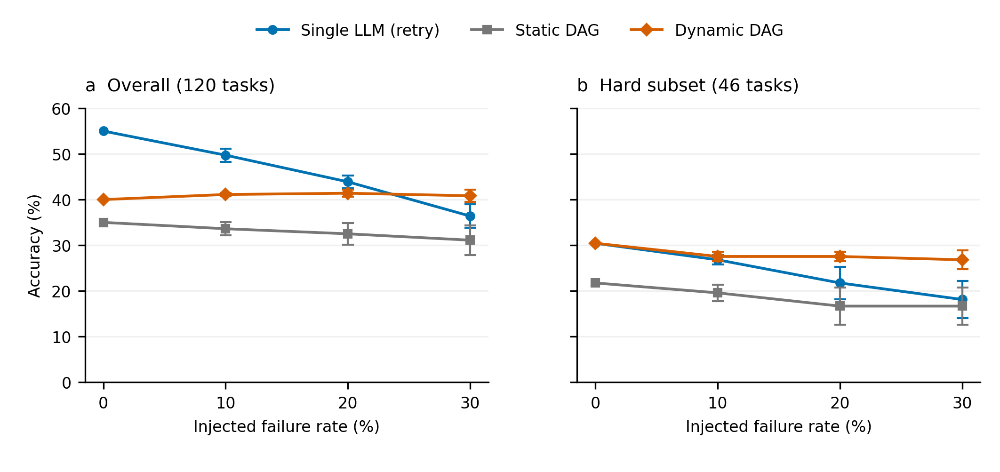
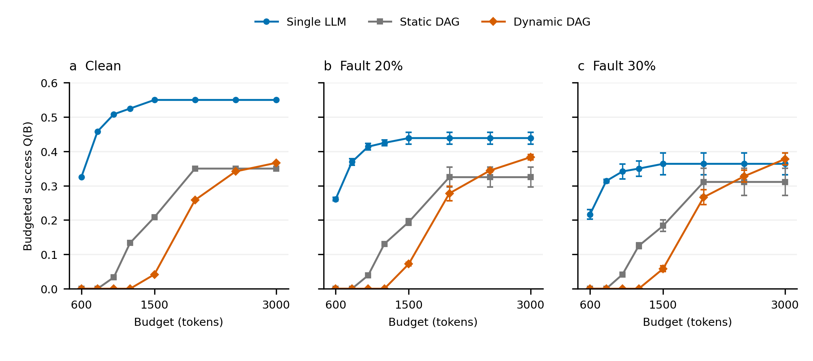

# 4 实验结果与分析

本章评价面向异构大语言模型执行工作流的 Pareto 感知多目标协同调度方法。实验按三层逻辑组织：4.2 构造执行策略空间并分析不同决策粒度的差异，4.3 揭示反馈感知动态执行在故障环境中的质量—鲁棒性—资源表现，4.4 在上述冲突目标下进行 Pareto 感知多目标策略选择分析，4.5 提供跨任务适用边界参照。

## 4.1 实验设置

### 4.1.1 任务面板

本文使用两类面板：开发面板（development panel）用于方法设计与机制分析，独立冻结面板（independent frozen panel）用于一次性最终确认。

开发面板包含 120 个 TAT-QA 表格—文本混合算术任务。每个任务通过四节点有向无环图执行：表格证据抽取节点 $e_1$ 与文本证据抽取节点 $e_2$ 并联构成两条分支，推理节点 $r$ 汇总前驱输出并生成计算表达式，验证节点 $v$ 检查数值结果。任务同时涉及表格与文本材料，保证分支结构不可退化。任务难度按标准推导中的运算符数量预先划分：单运算任务（Easy，74 题）与至少两个运算符的任务（Hard，46 题），该标签仅用于离线分层分析。

基础分析沿用两个已有面板：条件能力确认面板（100 任务、493 个主要节点），用于测量阶段能力差异；严格配对分解基准（MultiHiertt 100 题 + TAT-QA 200 题），用于区分任务分解与模型分配的影响。

独立冻结面板（Frozen 200）包含 200 个新任务，与此前全部已使用任务标识零重叠（UUID 全集审计验证）。任务选择采用 SHA-256 哈希排序（种子 frozen200），方法、提示、模型池、故障语义、评分器、预算规则与分析方案均在任何模型调用之前冻结并提交。

跨任务分析使用 Math500 和 MBPP 各 100 题，定位为适用边界参照而非泛化验证。各面板分别回答不同问题，不合并分母。

### 4.1.2 模型池与执行配置

候选模型池固定为三个本地部署模型：Qwen2.5-7B-Instruct（medium）、Qwen2.5-14B-Instruct-GPTQ-Int8（large）和 Qwen2.5-Coder-7B-Instruct（coder）。生成参数统一为 temperature 0、top_p 1、max_tokens 512，通过本地 vLLM 推理服务执行。四节点图的初始分配为 $e_1/e_2$ 使用 large、$r$ 使用 medium、$v$ 使用 coder。

### 4.1.3 执行策略

**单模型执行（Single LLM）**使用 large 直接完成任务，作为能力基线。故障条件下允许同模型重试。

**静态 DAG 执行（Static DAG）**使用固定结构与初始模型分配，不依据运行时反馈调整。静态臂在故障后可执行整图同模型重执行（检测到失败后重新执行完整四节点图），但同模型重执行无法修复持续性能力故障。

**动态 DAG 执行（Dynamic DAG）**根据部署可得反馈重新执行失败节点及其受影响后继，保留未受影响分支。失败检测信号为：证据节点输出不可解析或为空；推理表达式不可执行；验证值与推理值不一致。恢复目标为：抽取失败按跨任务记忆切换（首次→coder，后续→medium）；推理失败→large；验证失败→large。每个节点至多一次恢复尝试。

**整图重执行（Full Replay）**使用与动态执行相同的检测规则和恢复目标，但每次恢复重新执行完整四节点图，用于隔离重执行范围的影响。

归因消融另设三个对照臂：Static-with-fallback 允许固定局部回退；Static-Matched 在静态语义下匹配动态策略的恢复目标；Dynamic-Ideal 使用理想失败检测（仅用于机制分析，不作为可部署方法）。

### 4.1.4 故障设置

故障注入采用绑定"任务—节点—规划模型"的持续性能力故障。被选中的调用返回冻结故障池中的失败输出，同一模型重试相同节点会复现故障，切换模型则可能恢复。故障池中的失败输出采样自面板真实失败输出。注入率为 10%、20% 和 30%，随机种子为 20260923、20260924 和 20260925，三个种子产生嵌套的故障任务集合。

该设置用于检验执行单元失效时反馈驱动的异构恢复能力，不等同于瞬态网络错误或基础设施异常。注入率不等于最终质量必然下降幅度。单模型重试的局限由故障定义决定，不能据此推断 Single LLM 对所有异常都缺乏恢复能力。

### 4.1.5 评价指标与统计口径

**质量。**端到端质量 $Q$ 为最终答案正确率（数值容差 $\max(10^{-4}, 10^{-4}|gold|)$），代码任务以冻结单元测试判定成功。条件化节点质量单独报告，不与任务成功率混用。

**可靠性。**通过故障条件下的质量保持率、相对退化和恢复率评价。相对退化定义为

$$\mathrm{Degradation}(p) = \frac{Q(0) - Q(p)}{Q(0)}.$$

恢复率按冻结失败任务分母计算；静态臂在注入后仍正确的比例称为存活率，不称为恢复率。Help/Harm 分别计数由错到对与由对到错的任务。

**成本与时延。**$C$ 为 token 消耗，适配调用次数单独记录。$L$ 为观测服务时延（逐调用记录、顺序求和），不解释为包含排队和模型加载的端到端墙钟时延。

**多目标评价。**经验 Pareto 集合在最大化 $Q$、最小化 $C$ 与 $L$ 的方向上构建。对每个场景令 $C_{\mathrm{ref}} = 1.1\max C$、$L_{\mathrm{ref}} = 1.1\max L$，将目标变换为 $(Q,\;1 - C/C_{\mathrm{ref}},\;1 - L/L_{\mathrm{ref}})$ 后相对原点计算超体积（HV）。某策略的独占贡献为移除该策略前后的总体 HV 差值。HV 仅在同一场景内解释，不跨场景比较。可靠性通过跨故障条件的表现补充评价，本次 HV 不被解释为四目标求解结果。

**预算评价。**预算内正确完成率定义为

$$Q(B) = \frac{1}{N}\sum_{i=1}^{N}\mathbf{1}(y_i = 1 \land C_i \le B),$$

全部任务保留在分母中。该指标为执行轨迹的事后评价，不等价于在线硬预算门控。

**统计检验。**配对质量比较采用任务级 bootstrap 95% 区间（10 000 次重采样）与精确 McNemar 检验。区间含零或 $p \ge 0.05$ 时不称显著。故障主表报告三个种子的总体标准差；预算及 Adaptive 分析沿用原报告的样本标准差并分别标注。

### 4.1.6 数据修正声明

历史实验中曾发现两个数据完整性问题并在论文定稿前修正：(1) 验证节点评分解析缺陷导致部分围栏格式输出被误判为不可解析；(2) 多种子故障注入中 (model, prompt) 缓存机制在部分实验中错误复用了 clean 输出使故障被意外"治愈"。两次修正的完整审计与影响对照见附录。本章全部数字采用修正后最终结果；独立冻结面板（Frozen 200）的一次额外成本核算修正（Single 故障任务 token 从 0 修正为 $2\times$ 正常值）也已完成。修正前的历史数字不进入正文。

## 4.2 执行策略空间与决策粒度分析

本节构造并刻画本文研究的执行策略空间。首先分析单模型执行与静态 DAG 执行的结构特征与质量表现（4.2.1），随后比较不同决策粒度下的执行策略（4.2.2），说明 LLM 工作流执行构成一个涉及执行结构、节点模型配置与恢复策略的联合决策问题。

### 4.2.1 单模型与静态 DAG 执行特征

本小节回答：多阶段、多模型的执行组织本身是否必然提高任务质量。

**单模型执行的特征。**在四节点面板的 clean 条件下，Single LLM（large 直接作答）取得 0.5500 的正确率，以平均 612.8 tokens 的成本同时优于 Static DAG（0.3350，1485.7 tokens）和 Dynamic DAG（0.4150，2349.1 tokens），配对检验显示 Single 对两种 DAG 策略的优势均达到统计显著水平（对 Dynamic：+15.0 个百分点，$p = 0.0005$）。在 300 题严格配对分解基准上，同模型拆分在 TAT-QA 上使正确率下降 21.0 个百分点（95% CI [−28.5, −13.5]，McNemar $p = 4.3\times10^{-7}$）；将推理模型从 large 替换为 medium 后追回 8.5 个百分点（$p = 0.0015$），但总体 31.7% 仍低于单体 38.7%。复杂度分层进一步显示，简单任务（1–2 步）受分解损害最大（−27.1 个百分点），而较复杂任务（3 步以上）的点估计呈正向差异，但子样本较小且 MultiHiertt 未复现相同趋势，仅作描述性证据。

这些结果表明，任务分解本身引入了接口损耗与协调开销，单模型的端到端推理能力在无故障条件下不易被分解结构超越。

**静态 DAG 的结构特征。**Static DAG 通过任务分解和阶段化执行引入更细粒度的计算组织：每个节点可独立分配模型，中间结果显式传递。然而，其节点配置和执行路径在运行前固定，缺乏对运行时错误和能力失配的自适应调整。当某个节点产生不可解析输出或错误结果时，错误沿依赖边传播到下游节点，且无替代执行路径可绕行。

在条件能力确认面板上（100 任务、493 个主要节点），三个候选模型在不同节点类型上的表现呈现明显异质性：large 在抽取节点上占优（0.5959），medium 与 coder 在推理节点上并列最高（0.3100），coder 在验证节点上质量最高（0.5900）。类型内逐节点 Oracle 差距为 3.0–10.0 个百分点。模型优势因执行阶段而异，同一模型池中不存在"所有阶段都最优"的单一模型。

**对后续调度问题的含义。**上述证据共同说明：LLM 工作流执行并非单一模型选择问题，而是涉及执行结构、节点模型配置与恢复策略的联合决策过程。不同配置在任务质量、资源消耗与故障响应方面形成差异化表现，从而构成后续多目标协同调度的候选解空间。单模型在 clean 条件下的优势不意味着它在所有运行状态下都占优——后续 4.3 将进一步考察故障环境下不同策略的质量保持能力。

### 4.2.2 不同决策粒度下的执行策略比较

本小节比较三种决策粒度，说明它们各自控制的执行维度逐步扩展。

**查询级路由（Query-level routing）。**为完整任务选择一个模型执行。在条件能力面板上，查询路由的条件化节点质量为 0.4665，平均每任务消耗 4985.3 tokens。在 TAT-QA 200 题面板上，RouteLLM-style 适配实现在冻结分布下退化为零切换、等价于 Always-Large（52.5%），与查询路由自身的 38.5% 不直接比较（面板和配置不同）。查询级路由的决策维度仅为"选择哪个模型"，不涉及执行结构变化。

**节点级路由（Node-level routing）。**在固定工作流内部为不同节点选择不同模型。冻结节点路由的条件化节点质量为 0.5355，较查询路由提高 6.90 个百分点，同时减少 token 消耗（4856.4 vs 4985.3）和观测时延（7.79 vs 10.19 秒）。类型先验（按节点类型固定最优模型）达到与冻结节点路由相同的 0.5355，说明该面板上的主要收益来自阶段粒度而非实例级学习能力。在严格配对分解基准上，固定 large 抽取后将推理模型从 large 切换为 medium（DAG-L/L → DAG-L/M）使 TAT-QA 正确率提高 8.5 个百分点，确认了节点级异构分配的价值。节点级路由的决策维度为"每个节点使用哪个模型"，但执行结构（DAG 拓扑）仍然固定。

**工作流级调度（Workflow-level scheduling）。**在不同整体执行方式之间进行选择。Selective-DAG 入口门控实验在 300 题面板上比较三种入口决策：全部使用单模型（Mono-L，38.67%）、全部进入 DAG（DAG-forced，31.67%）与根据任务特征选择入口（Selective，42.0%）。Selective-DAG 较 Mono-L 提高 3.3 个百分点（Help/Harm = 20/10，McNemar $p = 0.20$），差异未达到统计显著水平，属方向性正向证据。该实验使用的 300 题面板与主面板 120 题之间的任务重叠情况尚待核查确认。工作流级调度的决策维度为"该任务采用哪种整体执行结构"，包括是否分解、使用哪个候选策略。

**三层粒度的递进关系。**随着决策粒度从模型级扩展到节点级和工作流级，可控制的执行维度逐步增加：查询级仅控制模型选择（1 个自由度），节点级控制各节点模型配置（$N$ 个自由度），工作流级控制整体执行策略（结构 + 配置 + 恢复）。本文后续的 Pareto 感知调度器（4.4）正是在工作流级进行多目标策略选择。

然而，更丰富的决策空间只有在运行时状态能够被有效感知并用于调整执行过程时才能体现价值。节点级路由和入口门控均基于任务先验特征做静态决策，不利用运行时反馈。下一节进一步考察反馈信息对动态执行与故障恢复的作用。

## 4.3 反馈感知的动态执行与故障恢复

本节考察反馈信息对动态执行与故障恢复的作用。4.3.1 分析不同执行策略在持续性能力故障下的质量退化趋势，4.3.2 分析反馈驱动的局部恢复机制及其执行范围控制，4.3.3 通过故障归因与独立冻结面板确认核心发现并揭示选择性调度的必要性。

### 4.3.1 不同执行策略的故障鲁棒性

表 4-5 报告主开发面板（120 题）在 clean 和三个注入故障率下的执行结果，图 4-1 展示整体与 Hard 子集随故障率变化的趋势。

**表 4-5 不同故障条件下的任务正确率（故障行：均值±总体标准差，3 种子）**

| 条件 | Single LLM | Static DAG | Dynamic DAG |
| --- | ---: | ---: | ---: |
| Clean | 55.00% | 35.00% | 40.00% |
| Fault 10% | 49.72% ± 1.42pp | 32.50% ± 0.68pp | 40.56% ± 0.39pp |
| Fault 20% | 43.89% ± 1.42pp | 30.56% ± 1.04pp | 41.11% ± 0.39pp |
| Fault 30% | 36.39% ± 2.58pp | 28.61% ± 1.42pp | 40.56% ± 1.04pp |

**图 4-1 故障条件下执行策略鲁棒性。** 左图为全部 120 题，右图为 46 题 Hard 子集；两图采用相同纵轴尺度。误差棒为总体标准差，clean 点为固定面板结果。

随着故障率从 10% 升至 30%，Single LLM 的均值由 49.72% 降至 36.39%，相对退化从 9.6% 增至 33.8%；Static DAG 的均值由 32.50% 降至 28.61%，退化从 7.1% 增至 18.3%。Dynamic DAG 保持在 40.56%–41.11% 之间，相对退化始终不超过 2.8%。三种策略的退化模式截然不同：Single 因故障破坏原本正确的任务而快速退化；Static DAG 因固定执行路径无法绕行故障节点，其绝对水平始终最低；Dynamic 通过反馈驱动的模型切换和局部恢复，在三个故障率下均保持质量稳定。

在 Dynamic 相对 Static 的配对比较中，三个种子的 Help/Harm 分别为 11/0、14/0 和 17/0（精确 McNemar 检验 $p \leq 0.001$）。主开发面板中未观察到 harm，而独立冻结面板中每个种子仅出现 1 个 harm（4.3.3 详述），整体表现为明显偏向收益侧的 Help/Harm 非对称性。

关于 Dynamic 与 Single 的比较：在主面板 30% 故障下，Dynamic 对 Single 的配对差值为 +4.17±1.80 个百分点，三个种子方向均为正。然而，该优势在独立冻结面板中缩小为 +0.7 个百分点且未达统计显著水平（4.3.3 详述）。因此本节的重点放在质量保持与故障鲁棒性，而非绝对准确率优势。

Hard 子集（46 题）的分析显示，在 10%、20% 和 30% 故障率下，Dynamic 的多种子均值分别为 26.09%、26.81% 和 26.09%，Single 为 26.81%、21.74% 和 18.12%。较高故障条件下 Dynamic 保持领先，但 46 题子集与 gold 难度标签不足以建立通用部署规则。

### 4.3.2 反馈驱动的局部恢复机制

本小节分析反馈驱动的局部恢复机制，重点关注恢复位置的选择与重执行范围的控制。

**机制定义。**Dynamic DAG 的恢复过程并非重新执行整个工作流，而是包含四个步骤：（1）根据部署可得信号识别异常节点——证据节点输出不可解析或为空、推理表达式不可执行、验证值与推理值不一致；（2）确定恢复位置——哪个节点发生了故障；（3）切换模型——抽取失败切换至 coder 或 medium（跨任务记忆规则），推理失败升级至 large，验证失败升级至 large；（4）限定重执行范围——仅重新执行故障节点及其受影响后继子图，未受影响的并行分支保留原有输出。

**归因消融。**表 4-6 报告修正后的多臂对照结果。

**表 4-6 恢复归因与重执行范围对照（修正后，120 题）**

| 策略 | 正确率 | 平均 tokens | 适配调用数 | 观测时延/秒 |
| --- | ---: | ---: | ---: | ---: |
| Static-with-fallback | 39.17% | 2759.4 | 426 | 7.79 |
| Static-Matched | 41.67% | 2799.1 | 425 | 8.67 |
| Dynamic-Ideal | 42.50% | 2664.5 | 426 | 7.33 |
| Dynamic-Real / 局部恢复 | 40.00% | 2323.7 | 309 | 6.69 |
| Full Replay | 37.50% | 3346.6 | 592 | 10.36 |

匹配恢复目标后（Static-with-fallback → Static-Matched），正确率增加 2.50 个百分点，95% 置信区间为 [−1.67, 6.67]，$p = 0.453$。Dynamic-Ideal 相对 Static-Matched 的均值差仅 0.83 个百分点。这些对照用于归因分析，不构成已证实的逐组件递增链。

**局部恢复与整图重执行的对照。**为直接检验依赖感知局部性的效率价值，比较采用相同检测规则和恢复目标的局部恢复与整图重执行。局部恢复仅重新执行失败节点及受影响后继子图；整图重执行重新执行完整四节点图。

修正后的结果显示，局部恢复的正确率为 40.00%，整图重执行为 37.50%，局部恢复的质量点估计更高，但差异未达到统计显著水平（配对差值 −2.50 个百分点，95% CI [−5.83, 0]，$p = 0.25$）。与此同时，局部恢复将平均 token 消耗从 3346.6 降至 2323.7（约减少 33.0%），适配调用次数从 592 降至 309（约减少 50.3%），观测服务时延从 10.36 秒降至 6.69 秒（约减少 38.3%）。整图重执行产生了 217 次未受影响分支的重复执行，而局部恢复在全部 134 例分支隔离检查中未出现违例。

相比完整重放，局部恢复并未表现出更低的质量水平，同时显著减少了 token 消耗、模型调用次数和观测服务时延。这说明反馈机制的主要价值不仅在于触发恢复，更在于限制恢复的执行范围。

### 4.3.3 故障归因与独立冻结验证

本小节从三个层面分析恢复的边界条件与独立确认结果。

**故障归因。**不同类型的执行失败具有不同的可诊断性与可修复性。在初始输出的部署信号评估中，证据节点错误（不可解析或空输出）的检测 F1 为 0.930（精确率 1.000，召回率 0.869），不可执行的推理输出检测 F1 为 1.000，验证节点错误检测 F1 为 0.776（12 个误报来自验证器纠正了错误推理）。然而，可执行但结果错误的推理输出对基础信号的召回为 0，即格式检查和执行检查无法识别语义正确性。对 36 个结构完整的证据输入进行数值扰动后，32 个真实推理表达式仍可执行，进一步说明可执行性不足以判定证据或推理正确。

跨模型分歧验证器（Dynamic + Verifier）的消融实验表明，增加检测信号不必然带来净质量收益：Dynamic 与 Dynamic+Verifier 的正确率均为 40.00%（Help/Harm = 1/1，$p = 1.0$），后者的平均 token 从 2324 增至 2727。34 次分歧触发中 28 次对应真实推理错误（检测精确率 82%），但修复率仅 21%（7/34）。检测精确率、触发后的修复比例与相对原策略的净增益是不同层次的指标，不能互相替代。

对 Dynamic 初始失败任务按首要失败类型的归因分析显示，证据解析失败（44 题）中恢复 7 题（16%），证据值错误（8 题）中恢复 1 题（12%），而执行错误（4 题）、推理错误（20 题）和验证错误（2 题）中均未观察到恢复。这些任务全部出现过某种检测事件，但出现下游信号不等于正确定位了初始错误。

**独立冻结面板确认。**Frozen 200（200 个新任务，与开发面板零重叠，协议在运行前冻结）的结果确认了核心规律。Clean 条件下，Single LLM = 0.5500，Static DAG = 0.3350，Dynamic DAG = 0.4150。30% 故障条件下，Single = 0.3967 ± 0.018，Static = 0.2933 ± 0.028，Dynamic = 0.4033 ± 0.003。Dynamic 对 Static 的优势在独立面板上完全复现（Help/Harm = 18/1、23/1、28/1，每个种子均达统计显著）；Dynamic 对 Single 的差值缩小为 +0.7 个百分点，差异未达统计显著水平。Pareto 结构仍为 {Single LLM, Dynamic DAG} 双成员前沿，Static 被支配。

成本方面（修正后），Single LLM 在 30% 故障下的平均 token 为 802.0，Dynamic 约为 2530。Single 仍保持成本优势，但在计入故障任务重试开销后，其优势幅度明显收窄。

**选择性调度的理论上界。**Frozen 200 的分层诊断揭示了 Dynamic 总体平均优势背后的机制。在 Single clean 正确但被故障破坏的 31 个任务上，Dynamic 恢复了 15 个（恢复率 48.4%）；但在 Single clean 正确且故障后仍然正确的 79 个任务上，Dynamic 的重执行对其中约 25% 产生了干预损害。如果调度器能够完美识别哪些任务 Single 会存活、哪些会被故障破坏，并仅在后者上启用 Dynamic，则理论上可达到 101/200 = 50.5% 的正确率。该选择性调度上界（selective scheduling oracle）需要事后信息，不可直接部署，但证明了存在显著的任务级选择空间。

这些结果表明，Dynamic 的总体平均优势会掩盖其在真正受故障影响任务上的恢复能力；当前瓶颈并非缺乏恢复手段，而是缺乏对"何时值得触发复杂协同执行"的准确判断。因此，后续问题不再是是否无条件增强 Dynamic，而是如何在质量、鲁棒性与资源开销之间，根据任务状态选择合适的执行策略。

## 4.4 多目标优化与 Pareto 感知协同调度

前述实验表明，不同执行策略在任务质量、执行成本和响应时延方面具有明显差异，且这种差异随故障状态和资源预算发生变化。本节将这一问题形式化为多目标协同调度，并从三个层面展开分析：4.4.1 考察候选策略之间的 Pareto 权衡关系与预算依赖性，4.4.2 比较不同的多目标策略选择方法，4.4.3 分析候选策略扩展后有效优化空间的结构。

本文关注的并非固定模型下的单次推理性能优化，而是在给定运行状态和资源约束条件下，从候选执行策略集合中选择合适策略的多目标协同调度问题。形式化地，给定候选执行策略集合 $\Pi$、当前运行状态 $s$（如故障水平）和资源预算 $B$，目标是选择

$$\pi^* = \operatorname{Select}(\Pi \mid s, B),$$

使得在多个冲突目标下取得满意的权衡：

$$\max\, Q(\pi), \qquad \min\, C(\pi), \qquad \min\, L(\pi).$$

其中 $Q(\pi)$ 为端到端任务正确率，$C(\pi)$ 为 token 成本，$L(\pi)$ 为观测服务时延。当不存在单一策略能够同时改善所有目标时，策略之间形成 Pareto 权衡关系，不存在全局最优解，而存在一组非支配策略构成的经验 Pareto 前沿。可靠性（质量保持率、恢复率）作为不同故障状态下的条件表现分析，不纳入本次三目标 Pareto 计算。

### 4.4.1 多目标权衡与 Pareto 前沿分析

**Pareto 前沿。**表 4-7 报告四个场景下各策略的 $(Q, C, L)$ 坐标与 Pareto 前沿成员身份。

**表 4-7 场景内 Q/C/L 权衡与 Pareto 前沿（故障场景为 3 种子均值）**

| 场景 | 策略 | Q | tokens | 时延/秒 | 非支配 |
| --- | --- | ---: | ---: | ---: | :---: |
| clean | Single LLM | 0.5500 | 602.5 | 0.53 | ✓ |
| clean | Static DAG | 0.3500 | 1503.2 | 4.63 | — |
| clean | Dynamic DAG | 0.4000 | 2323.7 | 6.69 | — |
| clean | Full Replay | 0.3750 | 3346.6 | 10.36 | — |
| fault 30% | Single LLM | 0.3967 | 802.0 | 0.59 | ✓ |
| fault 30% | Static DAG | 0.2933 | 1485.7 | 4.56 | — |
| fault 30% | Dynamic DAG | 0.4033 | 2529.7 | 7.10 | ✓ |

在 clean 条件下，Single LLM 同时具有最高质量、最低成本和最短时延，对其他策略构成全面支配。Static DAG 和 Full Replay 在所有场景中被支配，不提供不可替代的权衡。在 30% 故障条件下，Dynamic DAG 以最高质量进入非支配集，但其成本和时延也最高；Single LLM 以更低成本和更短时延进入非支配集。前沿因此从 clean 条件下的单成员扩展为故障条件下的双成员。

在独立冻结面板上，修正故障任务重试开销后，Single LLM 的平均成本从开发面板的约 434 tokens 修正为 802.0 tokens。修正后 Single 的成本优势有所收窄，但其与 Dynamic 构成的非支配结构保持不变。这说明成本修正改变了两种策略之间的权衡幅度，而未改变其基本 Pareto 关系。

**预算约束下的策略选择。**预算进一步约束策略的可行域。图 4-2 展示三个故障条件下不同预算水平下的预算内正确完成率 $Q(B)$。

**图 4-2 预算—质量关系。**三个面板使用相同坐标尺度，各面板包含 Single LLM、Static DAG 与 Dynamic DAG 三条曲线。故障面板误差棒为三个种子的样本标准差。

在 clean 条件下，Single LLM 在全部预算档位保持最高的预算内完成率。在 20% 故障条件下，Single LLM 同样在所有已测预算档位领先。在 30% 故障条件下，Dynamic DAG 的质量优势在预算充足时体现：在开发面板上，Dynamic 在约 2800 tokens 以上的预算取得点估计优势；在独立冻结面板上，Single LLM 仍在全部已测预算档位保持领先。这表明优选策略随预算和故障水平的变化而变化，不存在在所有预算条件下均最优的固定策略。

**超体积分析。**超体积（HV）衡量候选策略集合在质量—成本—时延目标空间中的整体覆盖能力。在 clean 条件下，Single LLM 的独占 HV 贡献最大（0.3081），因为其全面支配其他策略。在 30% 故障条件下，Single LLM 的独占贡献为 0.1827，Dynamic DAG 为 0.0003。Dynamic 的贡献较小，反映其处于前沿的高成本端。详细的参考点设定、2D 与 3D 计算及完整表格见附录。

以上结果表明，不同执行策略的优势具有明显的状态与预算依赖性，固定策略难以在全部运行条件下同时兼顾任务质量与资源效率。这构成状态感知多目标策略选择的直接动机。

### 4.4.2 多目标策略选择方法比较

本小节比较不同的策略选择机制，考察 Pareto 感知调度相对于固定偏好方法的差异。

**方法描述。**Pareto 感知调度器在任务到达时执行以下步骤：（1）根据候选策略在校准数据中当前故障水平 $\hat p$ 下的多目标表现计算经验 Pareto 前沿，被支配策略直接出局；（2）在前沿成员中，根据各策略在当前预算 $B$ 下的校准预算内完成率 $Q_\pi(B)$ 选择表现最高的策略；（3）校准分值精确平局时选择更廉策略。该机制不引入标量权重，决策阶段不额外调用 LLM，复杂度 $O(|\Pi|^2)$ 仅用于离线前沿维护。

**第一类：固定偏好方法。**Accuracy-only 始终选择 clean 条件下质量最高的策略（即 Single LLM）；Cost-only 始终选择成本最低的策略（同为 Single LLM）；加权求和按固定权重 $\alpha$ 对质量与归一化成本进行线性组合：

$$S_\alpha(\pi) = \alpha\, Q(\pi) - (1 - \alpha)\, \widetilde{C}(\pi),$$

其中 $\widetilde{C}(\pi)$ 为场景内归一化成本。表 4-8 报告 32 个状态（4 故障率 × 8 预算档）上的 3 折跨种子评估结果。

**表 4-8 多目标策略选择方法比较（32 状态 × 3 折，网格平均）**

| 方法 | 网格平均 $Q(B)$ | $B{=}3000$ 平均 | 平均 tokens |
| --- | ---: | ---: | ---: |
| Random（均匀） | 0.2385 | 0.3843 | 1475 |
| Accuracy-only | 0.4234 | 0.4625 | 692 |
| Cost-only | 0.4234 | 0.4625 | 692 |
| Weighted Sum $\alpha{=}0.75$ | 0.4234 | 0.4625 | 692 |
| Random-Pareto | 0.3976 | 0.4642 | 875 |
| Pare-aware Scheduler | 0.4234 | 0.4625 | 939 |
| Oracle-state（上界） | 0.4239 | 0.4667 | 1059 |

所有固定偏好方法（Accuracy-only、Cost-only、加权求和）在全部 32 个状态中均退化为选择 Single LLM。这一结果并非因为 Single 在所有状态下都最优，而是因为固定权重编码的是固定偏好，而当前问题中的优选策略会随故障状态和预算状态改变。当最优策略从 Single 切换到 Dynamic 时，固定偏好方法无法跟随。

**Pareto 感知调度器的表现。**Pareto 感知调度器在 28/32 个状态中选择 Single LLM，在 30% 故障且预算充足的少数状态中切换到 Dynamic DAG。其网格平均 $Q(B)$ 为 0.4234，与最优固定策略（即始终选择 Single LLM）持平，距逐状态 Oracle 上界（0.4239）仅 0.0005。Pareto 感知调度器并不提供逐状态的绝对安全保证，其价值在于利用故障状态与预算信息使策略选择能够随运行条件变化，而非固定采用某一策略。在 30% 故障的低预算状态下，固定 Dynamic 策略的预算内完成率接近于零（因为其成本超出可用预算），而 Pareto 感知调度器通过选择 Single LLM 避免了该灾难性退化。状态消融实验进一步证实了预算信息的必要性：当调度器不使用预算信息时，其在 30% 故障低预算状态下的表现降至 0.0。

入口门控实验（Selective-DAG，4.2.2）从任务级维度补充了证据：根据任务特征选择进入 DAG 或保持单模型执行具有方向性正向价值。该实验属于入口级二选一决策，与本文 Pareto 感知调度器的状态级策略选择在决策粒度、面板组成和评价口径上均不同，不直接比较。

因而，本文多目标调度的关键并非为不同目标人为指定一个固定最优权重，而是利用 Pareto 关系缩小候选集合，并根据当前状态和预算在非支配策略之间进行条件化选择。

### 4.4.3 候选策略扩展与有效优化空间分析

本小节回答：扩大候选策略集合是否产生更丰富的有效 Pareto 结构，从而支持更复杂的多目标搜索。

**候选池扩展。**在 30% 故障条件下，将候选池从三个策略（Single、Static、Dynamic）扩展为五个（增加 Dynamic+Verifier 和 Full Replay）。结果表明，DV（$Q = 0.3917$，2727 tokens）和 FR（$Q = 0.3833$，3347 tokens）均被 Dynamic DAG（$Q = 0.4056$，2324 tokens）支配。Verifier 增强的工作流在当前故障模型下未提供额外的 Pareto 收益；整图重执行引入了额外执行成本而未改善恢复效果。增加执行组件并不自动产生新的有效 Pareto 解。

**任务级互补性。**尽管候选池扩展未改变平均层面的 Pareto 结构，逐任务的策略互补性随候选增多而扩大。三策略池的逐任务 Oracle 差距（最优逐任务选择与最优固定策略之差）在 30% 故障下为 +13.3 个百分点，扩展至五策略后增至 +16.4 个百分点。这表明候选池中存在"不同任务上各自擅长"的信息，但固定策略的平均表现无法完全兑现该潜在收益。此处的互补性增长代表选择潜力（selection potential），不代表已实现的改进。

**受限工作流配置空间上的精确 Pareto 分析。**为进一步考察配置空间的复杂度，在固定 DAG 拓扑（$Y = \mathrm{DAG}$）和抽取节点模型（$e_1 = e_2 = \mathrm{large}$）的条件下，穷举 18 个配置（$m_r \in \{\mathrm{medium}, \mathrm{large}, \mathrm{coder}\}$ × $m_v \in \{\mathrm{medium}, \mathrm{large}, \mathrm{coder}\}$ × $Z \in \{\mathrm{none}, \mathrm{local\text{-}switch}\}$），在 30% 故障、3 种子下全部执行。

结果显示，9 个无恢复配置的正确率完全相同（0.3500），8/9 个有恢复配置的正确率相同（0.3917），仅 $m_r = m_v = \mathrm{medium}$ 的配置略有优势（0.4083）。节点模型分配 $X = (m_r, m_v)$ 对平均质量几乎无影响，有效决策维度坍缩为恢复策略 $Z$ 的二元选择。2D 形式 Pareto 前沿包含 3 个配置，但其中两个高质量配置的成本仅差 2 tokens。当引入 $\varepsilon_C \ge 0.1\%$ 的成本无差异阈值后，前沿收缩为 2 个具有实际区别的运行模式。3D 形式前沿的非支配点较多，但主要由不超过 0.08 秒的微小时延差异驱动，加入实际容差后同样收缩至少数模式。

这一结果表明，名义上的组合配置数量并不等价于同等复杂度的有效优化空间。在本文受限配置空间中，大量配置在质量和资源目标上表现近似或被支配，加入小幅成本容差后，Pareto 结构进一步收缩为少数具有实际区别的运行模式。

因此，当前实验更支持在已评估候选策略集合上进行 Pareto 感知选择，而不是在缺乏足够结构差异的受限空间中引入复杂全局搜索。更丰富的工作流拓扑、节点依赖和恢复策略联合搜索，属于进一步扩大决策变量后需要研究的问题。

## 4.5 跨任务适用边界分析

本节考察不同任务接口下反馈感知动态执行的适用条件。Math500 与 MBPP 用于分析反馈机制在不同任务结构下的行为差异，不用于验证统一泛化性能。两类任务未重复完整的三种子故障协议，不能据此声称故障鲁棒性跨域复现。

**表 4-9 不同任务接口下执行策略适用性分析**

| 维度 | TAT-QA（表格—文本推理） | MBPP（代码生成） | Math500（数学推理） |
| --- | --- | --- | --- |
| Single large | 55.0%（120 题） | 76.0%（100 题） | 54.0%（100 题） |
| Static DAG | 35.0% | 74.0% | 15.0% |
| Dynamic DAG | 40.0%（clean）/ 40.6%（f30%） | 80.0% | 16.0% |
| Dyn vs Static | +8～+12pp（故障，$p<0.001$） | +6.0pp（$p=0.0703$，支持性） | +1.0pp（不显著） |
| 反馈信号 | 解析/执行/一致性 | 单元测试（确定性） | 解析/一致性（弱覆盖） |
| 主要限制 | 语义错误不可检测 | 预算违规 22/100 | 阶段先验与接口均失配 |

**反馈可诊断性。**MBPP 的单元测试提供了语法错误、运行时错误和断言失败的确定性反馈信号，使动态执行能够精确定位代码缺陷并触发修复动作。Dynamic 对 Static 的优势为 6.0 个百分点（95% CI [1.0, 12.0]，McNemar $p = 0.0703$），属方向明确的支持性证据。反馈降级消融进一步证实了反馈信息量的关键作用：当反馈仅包含语法和运行时错误而隐藏断言信号时，Dynamic 从 80.0% 降至 73.0%，跌回 Static 水平以下。相比之下，Math500 的解析与一致性信号对语义错误几乎完全不可见——67 个求解错误中 62 个为"形式合法但数值错误"，动态执行仅触发 6 次升级，收益接近于零。

**故障可修复性。**MBPP 中 Dynamic 的恢复率为 7/26 = 26.9%（初始失败后经单元测试反馈修复成功的比例），共执行 49 次修复调用。TAT-QA 主面板上，证据节点故障的恢复率为 31.3%，推理节点为 33.3%，验证节点仅 15.4%。不同任务类型和不同节点类型上的可修复性差异显著，反映了替代模型能否在特定错误类型上提供有效输出的能力差异。

**干预收益与干预成本的权衡。**MBPP 上 Dynamic 的代价为平均增加 95.7 tokens（+11.9%）及 22/100 的预算违规。TAT-Qa Frozen 200 诊断进一步揭示：在 Single 因故障而受损的任务上，Dynamic 恢复了 48.4%；但在 Single 仍然正确的任务上，Dynamic 的干预对约 25% 产生了损害。当受损任务基率较低时，恢复收益可能无法覆盖干预成本。

综合三个任务域的证据，协同调度获得正收益需同时满足五个条件：（1）故障风险非平凡——clean 条件下 Single 以最低成本占优，反馈恢复的收益仅在故障发生后体现；（2）反馈可诊断——反馈信号的精确率和召回率直接决定恢复触发的有效性；（3）故障可修复——候选模型池中须存在能解决该错误类型的替代模型；（4）候选策略互补——不同策略须在不同任务或状态上各有优势；（5）干预收益超过干预成本——反馈触发的恢复须避免对本可正确的任务产生过度干预损害。第五个条件由 Frozen 200 的分层诊断首次量化揭示。

外部方法比较（RouteLLM-style、FrugalGPT-style、Self-Refine-style 适配实现）在 TAT-QA-200 与 MBPP-100 上提供了补充参照：RouteLLM-style 在冻结分布下退化为零切换；FrugalGPT-style 在财务域因置信代理过弱而大幅退化（−20.0pp）；Self-Refine-style 在代码域取得点估计最高（85.0%），但与 Dynamic-Real 的配对差异未达统计显著（$p = 0.267$）。这些结果说明不同执行形式的适用性受到任务接口、反馈有效性和修复方式的共同影响，不能由单一域的正向结果推出统一排名。

## 4.6 本章小结

本章实验围绕三个层面组织证据。首先，执行策略空间分析表明，单模型在 clean 条件下以最低成本取得最高正确率，静态 DAG 通过任务分解和阶段化执行引入更细粒度的计算组织但缺乏运行时调整能力，阶段能力异质性与分解接口损耗同时存在——LLM 工作流执行并非单一模型选择问题，而是涉及执行结构、节点模型配置与恢复策略的联合决策过程。

其次，反馈感知动态执行的核心价值在于故障环境中的质量保持与恢复范围控制。动态执行在三个故障率下质量退化均不超过 2.8%，相对静态 DAG 保持明显偏向收益侧的 Help/Harm 非对称性；局部恢复机制通过限定重执行范围，在不降低质量的前提下将 token 消耗减少 33.0%、调用次数减少 50.3%。独立冻结面板（Frozen 200）确认了质量保持与恢复有效性（48.4%），同时揭示了对无需恢复任务的干预损害（约 25%），表明当前瓶颈并非缺乏恢复手段，而是缺乏对"何时值得触发复杂执行"的准确判断。

最后，不同执行策略在质量、成本与时延上形成状态相关的 Pareto 权衡：clean 条件下单模型全面占优，高故障条件下动态执行进入非支配集，预算约束进一步改变最优选择。固定偏好方法（精度优先、成本优先、固定权重）无法表达这种条件相关的策略切换。本文提出的 Pareto 感知调度器利用 Pareto 关系缩小候选集合并根据运行状态和预算在非支配策略之间进行条件化选择。受限工作流配置空间上的精确 Pareto 分析进一步表明，名义上的组合配置数量并不等价于同等复杂度的有效优化空间，在当前候选集合上进行 Pareto 感知选择比引入复杂全局搜索更为合理。更丰富的执行拓扑、节点依赖与恢复策略的联合搜索，属于进一步扩大决策变量后需要研究的问题。
