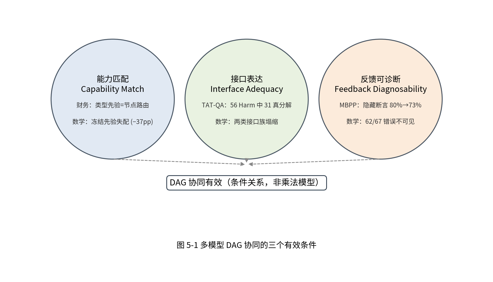

# 5 讨论

本章围绕四个问题组织，而不是复述实验结果：分解为什么不是免费的；条件能力为什么不能直接代表传播能力；Dynamic 为什么不能创造候选之外的能力；多模型 DAG 协同何时有效。四个问题的答案共同收敛到中心命题的三个条件。

## 5.1 为什么分解不是免费的

分解在暴露中间接口的同时，也引入三类成本：接口成本（中间产物必须可解析、可传递，任何格式或语义丢失都会成为新失败点）、传播成本（上游输出质量直接约束下游，上游错误不再有机会被整题推理的冗余纠正）与调度成本（节点数与切换次数增加，预算与时间开销上升）。严格配对基准把这三类成本与收益分开计量：同模型拆分本身在 TAT-QA 上显著有害（−21.0pp），在 MultiHiertt 上为不显著的正向信号（+6.0pp）；异构分工追回 +5.0pp，但总体仍未完全抵消（DAG-L/M 31.7% vs Mono-L 38.7%）。因此"拆分总提高性能"的直觉不成立，DAG 的正确定位是能力解耦接口，而不是精度加速器。

TAT-QA 上 56 个 Harm 的逐题分类进一步说明分解税的成分：真分解失败 31 例（推理在 gold facts 下仍错），接口损失 25 例（解析/执行失败与 6 例事实顺序/符号错位）。值得强调的反事实是：即便将全部接口损失修正，配对差仍为 −8.5pp 且区间不含零——该域的分解损失以真实推理退化为主，不能归因于实现 bug。复杂度分层同时给出"何时值得拆"的初步形状：TAT-QA 上分解效应随推导步数单调上升（−27.1 → +21.1 → +50.0pp），简单任务承担了绝大部分分解税。这提示分解决策是任务复杂度依赖的，但 3 步以上子层样本很小，本文只把它作为描述性机制证据，不给出"超过某步数必须拆分"的规则。

## 5.2 为什么条件能力不能直接代表传播能力

阶段评测揭示的是给定输入条件下的模型表现。条件化推理任务提供标准事实，使推理者主要承担关系识别与表达式构造；实际传播链还要求上游正确识别数值、实体、期间与单位。即使推理模型本身不变，输入来源变化也会改变其可解任务集合。因此条件节点 Oracle 是能力分析工具，不能直接作为完整执行的可达质量——条件口径的最佳固定质量为 0.31、逐任务推理 Oracle 为 0.41，而传播口径的同模型链最佳为 0.18、Oracle 为 0.23；冻结审计给出各面板传播 headroom 5.00/4.50/5.40/5.06pp，共同失败占比约 77%。跨模型矩阵提供更直接的机制证据：固定 medium 或 coder 推理者，更换为 large 抽取后最终质量提高——同模型执行将不同阶段的强弱项绑定，上游缺陷会掩盖下游能力，而 DAG 的作用之一正是使这种绑定可被打破。

由此得到两个方法论结论。其一，能力画像、条件 Oracle 与传播链质量是三个不同层级的测量，不可直接拼接；用不同任务集上的条件 Oracle 与传播 Oracle 之差估计"抽取噪声"的因果效应没有依据。其二，单模型成功可预测（传播画像中 ROC-AUC 0.75–0.84）不等于最优模型可路由：多个模型往往同时在简单任务成功、在复杂任务失败，这给单模型分类器提供了明显信号，却不给模型切换提供收益——AUC 对跨任务排序敏感，而路由收益取决于同任务候选差异、评分可比性与切换错误的代价。节点确认面板上类型先验与冻结节点路由质量相同，提示当前可稳定利用的结构主要是阶段差异，而非细粒度实例表示。

## 5.3 为什么动态适应不能创造能力

路由和恢复都只能在候选执行结果之间选择：对于给定模型、提示、输入与动作集合，如果所有候选都失败，改进选择本身不能产生其中不存在的正确答案。这是固定候选集合的上限，不是对整个任务可解性的判断。真实失败集合中四个动作的成功并集仅为 8/116（6.90%），局部子图重规划新增覆盖为零（NO-GO）——当前剩余限制不能简单归因于"动作选得不够好"，而是动作集合里确实缺少成功输出。结构解析诊断进一步提示，找到数值并不等于理解其关系：必要操作数出现在候选证据中，仍可能伴随实体绑定、期间对齐和表达式构造错误。

这一上限在归因消融中同样成立。四节点 DAG 面板上动态相对静态的 +20.0pp 中，Static-Matched 臂（保持静态语义、仅把恢复目标换成升级目标）单独取得 +18.3pp，策略逻辑超出目标选择的贡献仅 +1.7pp（不显著）——该面板的主要质量增益来自"失败节点升级至最强未试模型"这一动作本身，而这一动作之所以有效，正是因为候选集合中存在更强的未试模型。动态框架的可确证价值在于以选择性更新（933 次适配调用全部限于失败节点及其后代闭包、分支隔离零违例）与预算约束安全地承载该动作，而不是凭空创造能力。反过来，当候选集合被接口表达力封顶（数学域两类接口族均塌缩）或动作集合覆盖不足（8/116）时，任何调度策略都无法突破该上限。能力覆盖与动作选择因此是两个不同层级的上限，本文的贡献定位是后者。

## 5.4 多模型有向无环图协同何时有效

把前面三问合起来：分解有成本、条件能力不等于传播能力、动态受候选集合上限约束——那么协同的收益条件是什么？跨域正反对照给出统一答案：**能力匹配、接口表达与反馈可诊断性三者同时成立**。数学域中冻结自财务域的阶段分配先验整体失配（节点路由 13.0% vs 查询路由 50.0%），两类中间产物式分解接口均丢失表达能力，且 62/67 个求解错误"形式合法但数值错误"对部署信号完全隐形——分解、异构分配与动态适应同时失效。代码域中节点接口天然可执行、单元测试提供确定性失败反馈，动态真实呈 +6.0pp 的正向支持性证据（bootstrap CI 不含零、exact McNemar p=0.070 未达显著）。MBPP 的反馈降级重放把"反馈可诊断性"从观察变成受控证据：26/26 个静态失败与 7/7 个被修复的 Help 全部依赖测试断言信号，隐藏断言后同一适应机制的增益从 +6.0pp 反转为 −1.0pp。外部方法比较从另一侧复制了同一结构：级联策略在财务域（置信代理=答案可解析性）−20.0pp、在代码域（置信代理=单元测试）+5.0pp；答案级自精修在财务域大量改坏正确答案（8.0%）、在代码域成为点估计最强方法（85.0%，但与本文 Dynamic-Real 的配对差异未达显著，CI 跨零、p=0.267）。

这带来两层定位。其一，本文方法不是 universal best solver：在具有高质量单元测试反馈的代码任务中，简单 answer-level refinement 在点估计上取得更高质量且成本更低；本文方法的辨识度在于节点级、依赖感知、局部且可审计的动态执行机制，而非所有任务域的原始准确率领先。其二，强默认、选择性覆盖与预算约束的设计动机仍然成立：Conf-200 的正向信号未在 Conf-500 复现，风险—覆盖率曲线显示扩大干预引入更多 Harm，但都不能为未来数据指定已验证的安全阈值。资源层面同理：历史图复用与预算响应面证明的是"已观测动作在给定预算内覆盖多少失败"与"相关追问的局部重算机制"，而不是线上开销预测保证或多轮答案质量——缓存复用不是推理能力提升。

### 5.5 非支配机会为何不等于动态优化机会

多目标调度首先要求候选执行策略之间存在质量、成本与时延上的非支配差异，但 Pareto 前沿的存在并不意味着动态调度一定能够获得额外收益。在统一的 88 个任务支持集上，MC（medium 推理 + coder 验证）与 LC（large 推理 + coder 验证）构成非支配关系：前者具有更低的执行成本和观测服务时延，而后者具有更高的平均任务质量，说明当前模型池确实存在静态多目标权衡空间。然而，逐任务分析进一步表明，88 个任务中仅有 3 个任务能够通过从 MC 切换至 LC 得到恢复，对应的可恢复质量增益上界仅为 3.4 个百分点；其余大部分失败（78%）在当前候选策略下均无法通过调度切换解决。

更重要的是，这 3 个可恢复任务均未被当前部署反馈识别。其推理节点均能够正常解析，验证节点也能够返回格式合法的数值结果，但最终数值仍然错误。这表明当前运行信号主要能够检测格式或执行层异常，而难以识别形式合法但语义错误的输出。在当前候选集合和反馈机制下，$|R \cap D| = 0$，因此依赖该反馈触发策略切换的动态调度器不存在可利用的质量恢复机会。

上述结果表明，Pareto Opportunity 并不等价于 Dynamic Optimization Opportunity。动态多目标协同至少受到三个结构条件制约：候选策略之间需要形成足够的 Pareto 差异，需要存在可通过策略切换恢复的能力互补，同时运行反馈还必须能够识别这些真正需要切换的实例。仅满足静态非支配性并不不足以保证反馈驱动重优化产生实际收益。

本文证据的总体边界：精确 Oracle 仅覆盖已枚举的组合空间，完整动态策略空间没有全局最优；动态真实调用面板规模有限且部分读取评价答案；不同面板与估计对象不可拼接；模型池存在大量共同失败、成本异质性有限；服务时间不包含全部启动、排队与调度开销。这些限制共同决定本文结论适合表述为阶段互补、执行边界与选择性适应的机制分析，而不是一个在所有复杂任务上全面占优的系统。需要明确三个条件的证据强度并不相同：反馈可诊断性拥有受控降级重放证据（MBPP 隐藏断言重放），能力匹配拥有同先验跨域反转证据（财务先验在数学域 −37.0pp），接口表达能力则主要是配对基准与逐题失败分析的观察性证据——三者不构成可外推的充分条件。三个条件是条件关系而非数值模型，其正反两侧证据（财务节点分配与 MBPP 动态修复为正，数学塌缩与财务级联/自精修为反）均来自冻结协议的一次性运行（图 5-1）。

