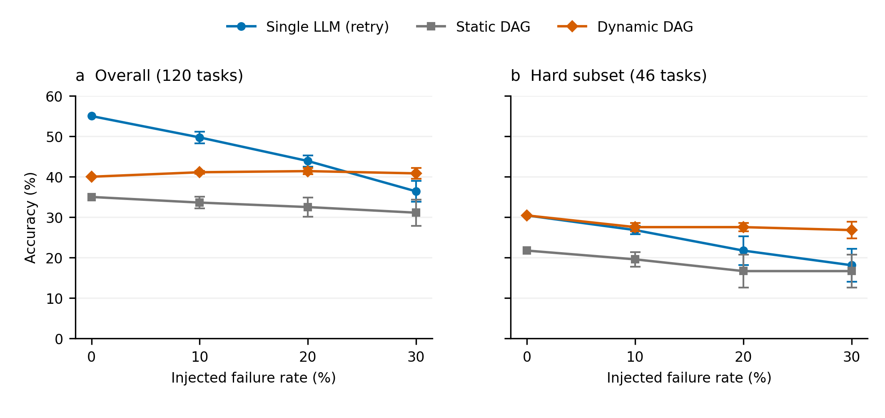
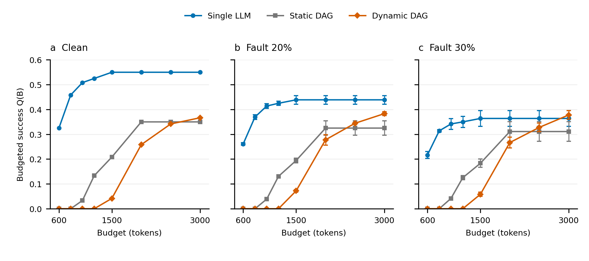

# 第四章 实验结果与分析

本章评价故障感知动态执行在复杂任务与故障环境中的作用，并分析其在多目标执行策略空间中的位置。实验依次刻画阶段能力与执行结构的差异，检验动态策略的故障鲁棒性，区分恢复动作与局部调度的贡献，最后分析质量、可靠性、成本与时延之间的条件依赖关系。本文的 Dynamic 是组合执行空间中的一种具体故障感知策略，而不是对整个空间求取全局最优解的通用优化器。

## 4.1 实验设置

### 4.1.1 数据集与任务设置

核心故障评估采用冻结的120个 TAT-QA 表格—文本混合算术任务。执行图包含两个证据分支、一个推理汇合节点和一个验证节点：$e_1$ 从表格抽取证据，$e_2$ 从文本抽取证据，$r$ 汇总前驱输出并生成计算表达式，$v$ 验证数值结果。任务同时涉及表格与文本材料，用于评价具有显式依赖的多阶段执行与恢复。

根据标准推导中的运算符数量，任务在执行前划分为 Easy（单运算，74题）与 Hard（至少两个运算，46题）。该标签仅用于离线分层分析，不作为部署策略的输入。基础实验沿用100任务、493个主要节点的条件能力面板，以及由 MultiHiertt 100题和 TAT-QA 200题组成的严格配对分解基准。已有节点分配的多目标分析使用88个公共任务，跨域分析使用 Math500 和 MBPP 各100题。各面板分别回答能力、分解、恢复或适用性问题，不合并分母，也不将同一面板上的后续分析视为独立泛化确认。

### 4.1.2 模型池与执行配置

候选模型为 Qwen2.5-7B-Instruct、Qwen2.5-14B-Instruct-GPTQ-Int8 和 Qwen2.5-Coder-7B-Instruct，分别记为 medium、large 和 coder。推理采用本地 vLLM 服务，生成参数为 temperature 0、top_p 1、max_tokens 512。核心四节点图的初始分配为 $e_1/e_2$ 使用 large、$r$ 使用 medium、$v$ 使用 coder。

故障评估复用已执行的相同模型—提示请求，新提示对应实际模型调用。三个注入种子改变故障实例，不构成三次独立模型训练或三个独立任务集。涉及历史四节点恢复对照的结果均采用修正解析器后重新判定的记录，属于既有执行的重分析而非独立确认；处理细节与来源见[S4.9](CHAPTER4_SUPPLEMENTARY.md#supp-s4-9)。

### 4.1.3 对比方法

**能力基线。** Single LLM 使用 large 直接完成任务，评价当前强模型的端到端能力。故障条件下允许同模型重试，不包含跨模型恢复。

**工作流基线。** Static DAG 固定初始结构与模型分配，不使用反馈恢复。Dynamic DAG 根据部署可得反馈重新执行失败节点及其受影响后继，保留未受影响分支。Full Replay 使用与 Dynamic-Real 相同的检测规则和恢复目标，但在恢复时重新执行整个四节点图，以隔离执行范围的影响。

**归因对照。** Static-with-fallback 允许固定局部回退；Static-Matched 在静态语义下匹配动态策略的恢复目标；Dynamic-Ideal 使用理想失败检测；Dynamic-Real 使用解析、表达式执行与输出一致性检查。前两种静态恢复臂不同于故障主实验中的无反馈 Static，不混用其名称与结果。理想检测臂仅用于机制分析，不作为可部署方法。

基础策略空间分析另外比较查询路由、节点路由与固定异构分配。外部方法采用 RouteLLM-style、FrugalGPT-style 和 Self-Refine-style 的同模型池适配实现，其比较条件在4.5单独说明。

### 4.1.4 评价指标与统计口径

**质量与可靠性。** 端到端质量 $Q$ 为最终答案正确率，代码任务以冻结单元测试判定成功。条件化节点质量单独报告，不能替代任务成功率。可靠性通过故障下的质量保持、相对退化和恢复率评价，其中

$$
\mathrm{Degradation}(p)=\frac{Q(0)-Q(p)}{Q(0)}.
$$

恢复率按各面板冻结的失败或故障任务分母计算；Static 在注入后仍正确的比例称为存活率，不称为恢复率。Help/Harm 分别计数由错到对与由对到错的任务，以避免仅依据净变化解释恢复。

**成本与时延。** $C$ 为 token 消耗，适配调用次数单独记录。$L$ 为观测服务时延。核心四节点执行与恢复对照采用顺序调用时延之和；历史88题分配面板沿用 DAG 关键路径聚合口径。不同口径不跨面板直接比较，也不被解释为包含排队、加载等开销的端到端墙钟时延。

**多目标评价。** 经验 Pareto 集合在最大化 $Q$、最小化 $C,L$ 的方向上构建，并报告三维 Q/C/L 与二维 Q/C 超体积（HV）独占贡献。对每个场景，令 $C_{\mathrm{ref}}=1.1\max C$、$L_{\mathrm{ref}}=1.1\max L$，将目标变换为

$$
\left(Q,\;1-C/C_{\mathrm{ref}},\;1-L/L_{\mathrm{ref}}\right),
$$

相对原点计算体积。某策略的独占贡献为包含与移除该策略时的总体 HV 差值。场景间参考值与候选集合可能不同，因此不直接比较跨场景 HV 大小。可靠性通过跨故障条件的表现补充评价，本次 HV 不被解释为四目标求解结果。

**预算评价。** 对已执行轨迹计算预算内正确完成率

$$
Q(B)=\frac{1}{N}\sum_{i=1}^{N}\mathbf 1(y_i=1\land C_i\le B).
$$

所有任务保留在分母中，超预算任务不计为预算内成功。该指标与恢复对照中的预算违规率均为事后评价，不等价于在线硬预算门控的效果。

**统计与证据层级。** 配对质量比较沿用已有任务级 bootstrap 区间和精确 McNemar 检验。故障主表报告三个种子的总体标准差，预算及 Adaptive 分析沿用原报告的样本标准差，并分别标注。种子波动不替代任务级显著性检验。完整故障评估、恢复效率对照、失败子集诊断与事后 oracle 分析分别解释，不以小样本诊断替代主评估。

### 4.1.5 故障模型

故障注入采用绑定“任务—节点—计划模型”的持续性能力故障。被选中的调用返回冻结故障池中的失败输出，同一模型重试相同节点会复现故障，切换模型则可能恢复。注入率为10%、20%和30%，随机种子为20260923、20260924和20260925。

该设置用于检验执行单元失效时的反馈恢复能力，不代表所有瞬态故障或基础设施异常。同模型重试的局限由故障定义决定，不能据此推断 Single LLM 对所有异常都缺乏恢复能力。注入率也不等于最终质量必然下降的幅度：被选中的任务可能原本已经错误，故障触发还可能改变后续恢复路径。因此，故障场景中的轻微正向波动不应被解释为故障本身提高任务能力。

## 4.2 执行策略空间刻画

本节刻画已测执行策略空间，包括节点级能力差异、模型分配方式与执行结构选择，说明后续动态策略所处的候选空间，而不预设某一策略普遍最优。首先固定节点输入条件，比较同一模型池在抽取、推理与验证阶段的质量（表4-1）。

**表4-1 阶段能力异质性与条件节点质量**

| 节点类型 | 节点数 | medium | large | coder | 逐节点 Oracle |
| --- | ---: | ---: | ---: | ---: | ---: |
| 抽取 | 193 | 0.3731 | 0.5959 | 0.3782 | 0.6943 |
| 推理 | 100 | 0.3100 | 0.2500 | 0.3100 | 0.4100 |
| 验证 | 200 | 0.5200 | 0.4550 | 0.5900 | 0.6200 |

large 在抽取上占优，medium 与 coder 的推理均值较高，coder 的验证质量最高，说明模型优势具有阶段依赖性。事后Oracle刻画候选能力机会，不证明部署特征能够识别这些机会。

为检验这些差异能否被利用，比较查询与节点路由：条件节点质量为0.4665与0.5355，相差6.90个百分点；tokens为4985.33与4856.43，时延总和为10.19与7.79秒。类型先验也达到0.5355，表明主要收益来自阶段粒度，不是已确证的实例级选择优势，亦不等于端到端质量提升。完整路由与传播诊断见[S4.1](CHAPTER4_SUPPLEMENTARY.md#supp-s4-1)。

随后采用严格配对的三臂基准，分别改变是否分解与推理模型。Mono-L 由 large 直接作答，DAG-L/L 由 large 抽取并推理，DAG-L/M 保留相同抽取输出而使用 medium 推理，以区分结构与模型分配的影响。

**表4-2 严格配对分解与异构分工**

| 面板 | N | Mono-L | DAG-L/L | DAG-L/M |
| --- | ---: | ---: | ---: | ---: |
| MultiHiertt | 100 | 11.0% | 17.0% | 15.0% |
| TAT-QA | 200 | 52.5% | 31.5% | 40.0% |
| 总体 | 300 | 38.7% | 26.7% | 31.7% |

TAT-QA 上同模型拆分下降21.0个百分点，95%置信区间为[−28.5,−13.5]；替换推理模型追回8.5个百分点，区间为[3.5,13.5]。总体异构分工提高5.0个百分点，但31.7%仍低于单体38.7%，平均tokens也由约1737增至约2189。局部互补未完全抵消分解的质量与资源代价。

复杂度分层呈现TAT-QA简单任务受损、较复杂任务获益的点估计差异，但复杂子组样本小，MultiHiertt也未复现相同趋势（[S4.1复杂度分层](CHAPTER4_SUPPLEMENTARY.md#supp-complexity)）。该结果不构成部署拆分阈值，说明局部能力优势仍须经由节点接口与实际输入传播检验。

能力、分配与结构对照共同刻画了后续恢复决策的基础：LLM workflow需组合选择执行结构、节点模型及恢复机制，而非仅选择单一模型。不同组合的质量、资源消耗与故障响应形成4.4的候选空间；下节检验其中故障感知Dynamic策略的局部恢复能力。

## 4.3 故障感知动态执行

### 4.3.1 故障条件下的鲁棒性

为区分基础任务能力与故障处理能力，在相同120题面板上比较clean与三个故障率。表4-3报告三种子结果，图4-1展示整体任务与Hard子集随故障率变化的趋势。

**图4-1 故障条件下执行策略鲁棒性。** 左图为全部120题，右图为46题Hard子集；两图采用相同纵轴尺度。10%、20%、30%点为三个注入种子的均值，误差棒为总体标准差，与表4-3及补充材料一致；clean点为固定面板结果，不表示重复运行误差为零。曲线连线用于展示已测点，不推断连续切换阈值。数据来自冻结的`MULTI_SEED_RESULTS.json`，可复现脚本及源数据位于`figures/`。

**表4-3 不同故障条件下的正确率（故障行：均值±总体标准差）**

| 条件 | Single LLM | Static DAG | Dynamic DAG |
| --- | ---: | ---: | ---: |
| Clean | 55.00% | 35.00% | 40.00% |
| Fault 10% | 49.72% ± 1.42pp | 33.61% ± 1.42pp | 41.11% ± 0.39pp |
| Fault 20% | 43.89% ± 1.42pp | 32.50% ± 2.36pp | 41.39% ± 0.79pp |
| Fault 30% | 36.39% ± 2.58pp | 31.11% ± 3.22pp | 40.83% ± 1.36pp |

在 clean 条件下，Single 比 Dynamic 高15.0个百分点，配对95%置信区间为[7.5,23.3]，McNemar $p=0.0005$。Dynamic 相对 Static 的差值为5.0个百分点，但 $p=0.109$，不足以确证 clean 质量改进。单模型同时消耗更少资源，其端到端能力优势应作为策略选择的基线，而不是从比较中排除。

故障率从10%升至30%时，Single 均值由49.72%降至36.39%，Dynamic 保持在40.83%—41.39%。Dynamic 相对 Static 的配对差值依次为7.50±1.36、8.89±2.08和9.72±3.75个百分点，三个种子方向均为正。Dynamic 相对 Single 在10%和20%时仍较低，在30%时出现4.44±1.42个百分点的均值优势。该交叉在三个种子均出现，但不等于已确证整体统计优势；例如种子20260923的对应配对检验 $p=0.31$。

任务级配对分析提供了独立于均值趋势的补充证据。在种子20260923下，Dynamic相对Static于10%、20%、30%故障率的Help/Harm分别为11/0、14/0、17/0，精确McNemar检验p值分别为0.000977、0.000122、0.000015（均≤0.001）。即这些已评估配对中未观察到将Static正确任务改错的情况；这是单种子结果，不是三种子合并统计，也不构成未见任务上的零伤害保证。

按4.1的定义及表4-3三种子质量均值，Single在10%、20%、30%故障下的相对退化约为9.6%、20.2%、33.8%，Dynamic为−2.8%、−3.5%、−2.1%。负值表示故障面板均值略高于clean参照，不能解释为故障提高基础能力；注入任务构成及恢复路径变化限制了这一差值的因果含义。

为判断恢复行为是否伴随这一质量保持，三种子汇总还报告 Dynamic 在10%、20%、30%故障下的恢复比例为0.39±0.10、0.42±0.03、0.44±0.01，Static 存活比例为0.22±0.08、0.25±0.09、0.29±0.10。两者分别描述恢复与无恢复下的存活，不作为同一动作成功率直接解释。结果支持动态恢复减轻该故障定义下的退化，不外推其他故障分布。

难度分层进一步检验效果是否集中于某类任务。Clean 下 Single 与 Dynamic 的 Hard 正确率均为30.43%，Easy 正确率分别为70.27%和45.95%，Static 对应21.74%和43.24%。在 Hard 子集的10%、20%、30%故障下，Single 均值为26.81%、21.74%、18.12%，Dynamic 为27.54%、27.54%、26.81%。这些结果显示较高故障条件下的质量保持，但46题子集与gold难度标签不足以建立通用部署规则，完整分层见[S4.2](CHAPTER4_SUPPLEMENTARY.md#supp-s4-2)。

这一变化与执行路径的差异一致：clean条件下，分解接口可能引入质量损失，额外节点调用增加资源开销；持续性能力故障发生后，模型切换与局部恢复则提供同模型重试之外的替代路径，使部分失败得以恢复。该解释由后续恢复对照支持，不意味着额外开销本身导致质量下降，也不意味着所有故障均可修复。

在当前候选策略与已评估条件下，策略的相对优势随故障水平变化。Single LLM 在 clean 条件下具有更高端到端质量和更低资源开销；随着所定义的持续性能力故障增加，Dynamic 表现出更稳定的质量保持。因此，在当前实验设置下，Dynamic的主要作用并非提升无故障环境下的任务求解上限，而是在存在持续性能力故障时，通过反馈驱动恢复减少性能退化。Dynamic是否值得采用取决于故障风险、资源预算和任务特征，而非单一准确率指标。

### 4.3.2 恢复机制贡献与局部执行效率

为区分恢复动作本身与执行策略调整的影响，本节分别分析恢复目标、反馈决策和执行范围。Static-with-fallback、Static-Matched与Dynamic-Ideal用于比较目标匹配及动态规则，Dynamic-Real进一步评价部署反馈。表4-4统一采用修正后的120题执行记录。

**表4-4 恢复归因与重执行范围对照**

| 策略 | 正确率 | 平均 tokens | 适配调用数 | 观测服务时延/秒 |
| --- | ---: | ---: | ---: | ---: |
| Static-with-fallback | 39.17% | 2759.4 | 426 | 7.79 |
| Static-Matched | 41.67% | 2799.1 | 425 | 8.67 |
| Dynamic-Ideal | 42.50% | 2664.5 | 426 | 7.33 |
| Dynamic-Real／Local Recovery | 40.00% | 2323.7 | 309 | 6.69 |
| Full Replay | 37.50% | 3346.6 | 592 | 10.36 |

匹配恢复目标后，正确率增加2.50个百分点，95%置信区间为[−1.67,6.67]，$p=0.453$；Dynamic-Ideal 相对 Static-Matched 的均值差仅0.83个百分点。Dynamic-Ideal 对 Static-with-fallback 的总体差值为3.33个百分点，区间[−2.50,9.17]、$p=0.388$。这些对照用于归因，不构成已经证实的逐组件性能递增链。Dynamic-Real 为40.00%，低于理想检测臂的42.50%，同时消耗更少资源；该结果也不能解释为部署检测与理想检测等价。

为直接检验依赖感知局部性的效率价值，比较采用相同检测和恢复目标的 Local Recovery 与 Full Replay。前者每次仅更新失败节点及受影响后继，后者重新执行整个图。局部恢复减少约1023 tokens/任务、283次适配调用和3.67秒/任务，分别约为31%、48%和35%；Full Replay 产生217次未受影响分支重复执行。由此，节省来自缩小重执行范围，而不是减少对照方法可用的恢复动作。

Full Replay 相对局部恢复的质量差为−2.50个百分点，95%置信区间[−5.83,0]，$p=0.25$。未检测到显著质量差异不等于完成非劣效证明，同提示输出审计中观察到的会话差异也限制了质量差值的机制归因，修正后审计与历史探针分别列于[S4.5](CHAPTER4_SUPPLEMENTARY.md#supp-s4-5)。结合归因对照，恢复目标匹配的质量增量点估计大于动态规则的额外增量，但现有检验不足以确证两者贡献的大小。相比之下，局部执行减少重复计算的证据更直接：动态机制的可验证价值主要体现为恢复效率，而非已确证的额外质量收益。

按静态实际消耗1.2倍事后统计，局部恢复与 Full Replay 的预算违规分别为0/120和54/120；在1.5、2.0、2.5倍阈值下，Full Replay 违规率为11.7%、1.7%、0%，局部恢复均为0%。两臂并未在执行时受这些阈值截断，因此准确率不随该违规扫描改变。结果支持局部恢复相对整图重执行的资源效率，不证明在线硬预算保证，也不表示其比Single更低成本。

### 4.3.3 恢复边界与失败归因

为解释仍未恢复的错误，本节沿失败检测、恢复动作和可修复性分析限制。首先评价初始输出上的部署信号，区分运行异常与语义错误。

**表4-5 不同错误类型的检测表现**

| 错误类型 | Precision | Recall | F1 |
| --- | ---: | ---: | ---: |
| 证据节点错误 | 1.000 | 0.869 | 0.930 |
| 可执行但结果错误的推理 | — | 0.000 | — |
| 不可执行的推理输出 | 1.000 | 1.000 | 1.000 |
| 验证节点错误 | 0.826 | 0.731 | 0.776 |

基础检测能够识别部分解析、执行与一致性异常，但68个可执行而错误的推理输出未被对应规则识别。已有证据扰动检查中，对36个结构完整输入修改一个事实值后，32个表达式仍可执行。两类结果共同说明，格式与可执行性检查不能替代语义诊断；固定图面板也不提供结构故障检测的验证。

为检验补充信号能否转化为质量收益，加入跨模型分歧 Verifier。Dynamic 与 Dynamic+Verifier 均为40.00%，Help/Harm=1/1、$p=1.0$；平均 tokens 从2324增至2727，时延从6.69增至7.06秒，新增调用146次。34次分歧触发中28次对应推理错误，归因记录中修复为7/34。检测精确率、触发后的修复比例与相对原策略的净增益是不同量，不能互相替代。该负结果说明额外检测信号并不必然带来净质量收益。

进一步按首要失败类型分析 Dynamic 初始错误的78题。证据解析或空输出44题中恢复7题，证据值错误8题中恢复1题，执行错误4题、推理错误20题与验证错误2题均未观察到恢复。这些任务均出现过某种检测事件，但出现下游信号不等于正确定位初始错误。故障注入子集的节点级恢复比例则随位置变化，例如种子20260923的30%注入下，证据、推理执行与验证节点对应40%、55%和40%；样本分别为15、11和10，不解释为所有同类故障的稳定恢复率。

已有固定动作覆盖提供另一项限制：在116个缺陷节点、96个任务上，再次调用、切换模型、重新取证和局部分解的成功并集仅8/116，即6.90%。这限定了已测动作与输出集合的可恢复机会，不证明更强模型或其他工具也无法恢复。完整类型归因见[S4.3](CHAPTER4_SUPPLEMENTARY.md#supp-s4-3)。

有效恢复需要可用反馈触发恰当干预，且所选动作在实际状态下能够成功。上述关系是机制链，而不是已经拟合的独立概率乘积。Dynamic 可以决定已有能力何时、何处被调用，但不能自动创造当前模型与动作集合中缺失的能力。其价值应由实际恢复与资源后果评价，而不是由触发次数或策略复杂度评价。

## 4.4 多目标执行策略权衡

4.2的实验表明，较高的条件节点质量并未保证分解后的端到端优势；4.3进一步显示，相同恢复规则在不同重执行范围下产生不同的资源后果。这些事实说明节点分配、执行结构与恢复配置不能孤立评价：局部优势不保证整体方案占优。本文因此将已评估策略视为组合执行空间中的候选解，分析其质量、可靠性、成本与时延权衡。本文仅研究已实现候选集合中的选择关系，不展开完整组合空间搜索。

为描述该空间，记执行策略为 $\pi=(X,Y,Z)$，其中 $X$ 为节点模型分配，$Y$ 为执行结构，$Z$ 为反馈条件化的恢复动作选择与执行范围。$Z$ 可以是一组根据运行状态调用动作的规则，而非固定的一次动作。质量、成本和时延分别记为 $Q(\pi)$、$C(\pi)$ 和 $L(\pi)$。可靠性以指标集合 $\mathcal{R}(\pi)=\{\rho_{\mathrm{keep}}(\pi;p),\rho_{\mathrm{rec}}(\pi;p)\}$ 描述，其中 $\rho_{\mathrm{keep}}=1-\mathrm{Degradation}(p)$ 为质量保持比，$\rho_{\mathrm{rec}}$ 为相应冻结失败集合上的恢复率。指标按场景和协议分别报告，不合成为单一标量。评价方向写为

$$
\max Q(\pi),\quad \max \rho_k(\pi;p)\ (k\in\{\mathrm{keep},\mathrm{rec}\}),\quad
\min C(\pi),\quad \min L(\pi).
$$

该表达刻画决策维度，不表示本文求解了上述所有目标。实证部分以Q/C/L分析非支配关系，并分别报告跨故障条件的可靠性和预算内完成率。质量保持比在clean质量非零时定义，可以超过1；恢复率只在对应分母有效时报告，不能把Static存活率当作同一恢复动作指标。

### 4.4.1 Pareto边界与策略非支配关系分析

为判断Dynamic是否提供其他策略不能替代的选择，基于每个场景的实测均值构建经验Pareto集合。故障场景采用三种子均值，Full Replay仅在已有clean对照中纳入。

**表4-6 场景内Q/C/L权衡与HV独占贡献**

| 场景 | 策略 | Q | tokens | 时延 | 非支配 | 独占HV（三维／二维） |
| --- | --- | ---: | ---: | ---: | :---: | ---: |
| clean | Single | 0.5500 | 602.5 | 0.53 | 是 | 0.3081／0.2345 |
| clean | Static | 0.3500 | 1503.2 | 4.63 | 否 | 0.0000／0.0000 |
| clean | Dynamic | 0.4000 | 2323.7 | 6.69 | 否 | 0.0000／0.0000 |
| clean | Full Replay | 0.3750 | 3346.6 | 10.36 | 否 | 0.0000／0.0000 |
| fault10 | Single | 0.4972 | 659.6 | 0.57 | 是 | 0.2861／0.2281 |
| fault10 | Static | 0.3361 | 1500.9 | 4.64 | 否 | 0.0000／0.0000 |
| fault10 | Dynamic | 0.4111 | 2175.4 | 6.59 | 否 | 0.0000／0.0000 |
| fault20 | Single | 0.4389 | 723.4 | 0.61 | 是 | 0.2360／0.1759 |
| fault20 | Static | 0.3250 | 1496.5 | 4.64 | 否 | 0.0000／0.0000 |
| fault20 | Dynamic | 0.4139 | 2191.8 | 6.62 | 否 | 0.0000／0.0000 |
| fault30 | Single | 0.3639 | 782.0 | 0.66 | 是 | 0.1796／0.1206 |
| fault30 | Static | 0.3111 | 1492.3 | 4.66 | 否 | 0.0000／0.0000 |
| fault30 | Dynamic | 0.4083 | 2250.1 | 6.82 | 是 | 0.0004／0.0040 |

注：二维为Q/C，三维为Q/C/L；时延单位为秒。HV仅在同一场景的候选和参考点下解释，不比较场景间绝对大小。

Clean、10%和20%故障条件下，Single在当前整体面板中同时具有较高质量、较低成本和较低时延，支配相应DAG策略。30%时，Dynamic的质量更高而资源开销也更高，与Single同时进入非支配集。该变化说明故障环境会改变多目标选择关系，不意味着Dynamic在所有目标上获胜。

作为非支配关系的补充量化，Single在每个场景内均具有最大的HV独占贡献；Dynamic在30%故障下的三维和二维贡献仅为0.0004和0.0040。它补充的是前沿中较高质量的一端，而成本与时延限制其覆盖范围。因此，实证结论是Dynamic在高故障条件下成为非支配执行策略，不是获得最高HV。均值非支配关系也不代表前沿成员具有已经确证的统计差异。

为检验模型分配是否同样形成多目标选择空间，保留历史88题公共面板。MC、LC、ML分别表示推理／验证模型为medium/coder、large/coder和medium/large。

**表4-7 已有节点模型分配的Q/C/L权衡**

| 分配 | Q | tokens | 关键路径观测时延/秒 | 经验关系 |
| --- | ---: | ---: | ---: | --- |
| MC | 0.182 | 1549 | 3.20 | 非支配 |
| LC | 0.205 | 1592 | 3.26 | 非支配 |
| ML | 0.159 | 1662 | 4.77 | 被支配 |

MC资源开销较低，LC质量较高，ML被两者支配。该结果说明节点分配本身也产生非支配权衡，但并不确证LC的统计优势。该面板与120题故障面板的任务及时延口径不同，不能拼接为同一Pareto前沿。静态差异能否被运行时切换利用，需要进一步检验逐任务互补与反馈覆盖。

### 4.4.2 预算约束下策略选择

非支配关系并不保证策略在有限预算内完成任务。为检验鲁棒性收益是否能够在资源限制下兑现，使用既有轨迹计算 $Q(B)$，超预算任务计为未在预算内成功。

图4-2比较相同候选在clean、20%与30%故障条件下的预算内完成率，表4-8保留对应数值。

**图4-2 预算—质量关系。** 三个面板使用相同坐标尺度；曲线取冻结预算汇总的八个档位。故障面板误差棒为三个种子的样本标准差，clean为固定执行记录。30%故障下，Dynamic在2500 tokens时低于Single，在3000 tokens时点估计较高；连线不估计连续预算的交叉阈值。超预算任务保留在分母中，曲线是事后轨迹评价，不代表在线截断执行。

**表4-8 token预算下的正确完成率**

| Budget | clean:Single | clean:Static | clean:Dynamic | f20:Single | f20:Dynamic | f30:Single | f30:Dynamic |
|---:|---:|---:|---:|---:|---:|---:|---:|
| 600 | 0.325 | 0.000 | 0.000 | 0.261±0.005 | 0.000±0.000 | 0.217±0.014 | 0.000±0.000 |
| 800 | 0.458 | 0.000 | 0.000 | 0.369±0.010 | 0.000±0.000 | 0.314±0.005 | 0.000±0.000 |
| 1000 | 0.508 | 0.033 | 0.000 | 0.414±0.010 | 0.000±0.000 | 0.342±0.022 | 0.000±0.000 |
| 1200 | 0.525 | 0.133 | 0.000 | 0.425±0.008 | 0.000±0.000 | 0.350±0.022 | 0.000±0.000 |
| 1500 | 0.550 | 0.208 | 0.042 | 0.439±0.017 | 0.072±0.005 | 0.364±0.032 | 0.058±0.008 |
| 2000 | 0.550 | 0.350 | 0.258 | 0.439±0.017 | 0.278±0.021 | 0.364±0.032 | 0.267±0.022 |
| 2500 | 0.550 | 0.350 | 0.342 | 0.439±0.017 | 0.344±0.005 | 0.364±0.032 | 0.328±0.017 |
| 3000 | 0.550 | 0.350 | 0.367 | 0.439±0.017 | 0.383±0.008 | 0.364±0.032 | 0.378±0.017 |

注：故障列沿用原分析的三种子均值±样本标准差，区别于表4-3的总体标准差。

在clean和20%故障条件下，Single在所有已测预算档位具有较高的预算内完成率。30%故障下，Dynamic在2500 tokens时仍低于Single，3000 tokens时其均值为0.378，高于Single的0.364。这说明不受预算限制时的质量优势未必在紧预算下成立；只有资源足以承担恢复，部分鲁棒性收益才能转化为预算内成功。

当前预算档位是离散的，不能据此声明精确的连续切换阈值，也不能将点估计差写为统计确证。该评价基于完整执行后的实际消耗，不预测预算截断将如何改变后续输出。它提供策略选择的实验依据，而非已经实现的在线最优控制器。

已有固定动作预算回放从恢复层面展示相同限制。token／时间预算为500／1秒、1000／2秒、2000／3秒、3000／3秒时，恢复率依次为2.59%、3.45%、4.31%、5.17%，无上限时为6.90%。预算放宽释放部分动作机会，但最终止于已有覆盖。回放使用已知消耗与离线成功停止，不能解释为部署时的精确开销预测或硬约束保证。

### 4.4.3 策略切换边界

为将场景比较转化为策略选择的边界认识，综合考察故障率、任务难度与预算。在整体面板已测条件下，Single在clean、10%和20%故障率具有最高质量均值，Dynamic在30%最高；Hard子集和预算内评价又呈现不同排序。这些结果说明优势策略依赖条件，但未求得完整组合空间中的 $\pi^*$。多目标下应首先讨论非支配集合，只有指定目标偏好或预算规则后，才有明确的候选最优选择。

静态Pareto机会也不必然转化为动态收益。已有FLARE-DAG在88题冻结输出重放中从LC出发，当推理节点r或验证节点v出现预定义失败信号时触发局部回退判断，满足相应分支条件后转向MC。本面板未观察到r失败触发，实际3次触发均来自v失败，回退后均未恢复，最终Q=0.2045，与固定LC相同。因此该实例未获得额外质量收益，不能作为已实现通用优化器的性能证据。

逐任务诊断进一步表明，静态非支配关系并不保证存在可由反馈识别的恢复机会。MC→LC的可恢复任务均未被对应反馈触发；其方向限定上界与实际LC→MC回落分别解释，完整分析见[S4.7](CHAPTER4_SUPPLEMENTARY.md#supp-s4-7)。

Adaptive oracle仅提供条件相关的入口组合诊断：clean下未超过Single且成本更高，20%故障下有组合收益，30%下低于全量Dynamic；它不是可部署算法，详见[S4.4](CHAPTER4_SUPPLEMENTARY.md#supp-s4-4)。

当前实验验证了已测执行策略空间中存在条件依赖性和多目标冲突，为未来面向LLM workflow的组合优化方法研究提供经验依据。执行结构、节点模型与恢复规则具有相互依赖的后果，但本文没有联合遍历全部组合，也没有验证通用组合求解器。本文已实现的贡献是故障感知、依赖感知的局部执行策略，以及对其多目标适用范围的实证刻画。

## 4.5 适用边界分析

本节属于补充适用性分析，而非主要性能比较。Math500与MBPP用于分析反馈机制在不同任务接口下的适用条件，不用于验证统一泛化性能。两类任务未重复完整三种子故障协议，不能据此声称故障鲁棒性跨域复现。

Math500上Single large、Static和Dynamic分别为54.0%、15.0%和16.0%。阶段诊断显示求解能力不足与校验覆盖同时造成损失，当前恢复未抵消这些影响；完整六臂结果、置信区间与节点分析见[S4.8](CHAPTER4_SUPPLEMENTARY.md#supp-s4-8)。该边界限于已测数学接口。

MBPP使用规划、生成、单元测试与修复节点，语法、运行时和断言失败可直接触发代码修复。Single large、Static与Dynamic-Real为76.0%、74.0%、80.0%。Dynamic对Static差值6.0个百分点，bootstrap区间[1.0,12.0]，但McNemar $p=0.0703$，因此作为支持性正向证据，不宣称稳定显著。恢复率7/26，修复49次，代价为平均增加95.7 tokens（11.9%）及22/100预算违规。该结果支持反馈与修复动作相匹配时的恢复价值，但伴随资源代价。

表4-9将已有恢复收益与其他执行形式对照，分别沿用Finance TAT-QA-200与MBPP-100的冻结模型池、评分器和预算规则。“-style”为适配实现，不是原系统的忠实复现。

**表4-9 已有评估设置下的跨域执行策略比较**

| 方法 | Finance Q | Finance tokens | Code Q | Code tokens |
| --- | ---: | ---: | ---: | ---: |
| Always-Large | 52.5% | 832 | 76.0% | 237 |
| RouteLLM-style | 52.5% | 832 | 76.0% | 237 |
| FrugalGPT-style | 32.5% | 743 | 81.0% | 302 |
| Self-Refine-style | 8.0% | 1545 | 85.0% | 386 |
| Heterogeneous DAG-L/M | 40.0% | 1093 | — | — |
| Static DAG | 31.5% | 1092 | 74.0% | 805 |
| Dynamic-Real | — | — | 80.0% | 901 |

注：两域分别沿用其冻结执行配置，不构成所有策略在所有域的完整交叉基准。“—”表示该外部比较面板未执行相应配置，不表示财务域没有Dynamic实验，也不以其他财务面板结果补齐。Finance Static为DAG-L/L；成本为对应单域面板均值，不与300题总体均值混用。预算参考为每任务 $\max(200,1.2\times\text{Static实际tokens})$，不表示已知到达时预算或各方法均未超预算。

RouteLLM-style在两个面板均未切换，结果与Always-Large相同；代码域Self-Refine-style达到85.0%，高于Dynamic的80.0%点估计，其配对差异未达显著（$p=0.267$）。故障感知局部恢复因此不具有跨执行形式的全面优势，其适用性受节点接口、反馈、修复能力与资源代价共同限制。
