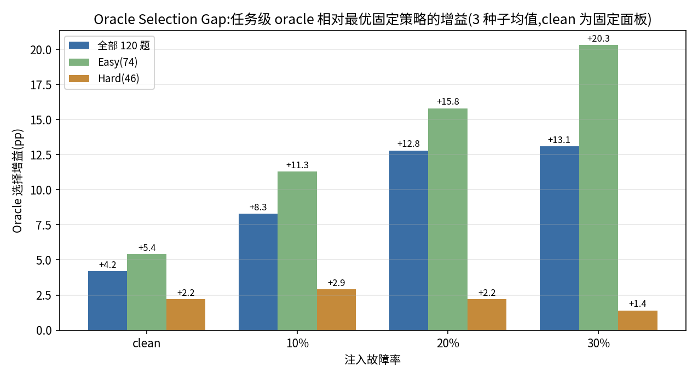

# 4.4.2/4.4.3 修改稿(应对"为什么不用 Single LLM"审稿问题)

> 零新调用;全部数字来自冻结工件(三种子 mean±样本标准差,与表 4-8 口径一致)。
> 使用方式:替换/插入 EXPERIMENTS_V8.md 对应段落。

## 修改一:4.4.2 标题

原:### 4.4.2 预算约束下策略选择

改为:

### 4.4.2 预算约束下的可靠性—成本权衡

## 修改二:图 4-2 图注(在现有图注末尾追加两句)

追加:

Single LLM 是低成本高能力基线,在低故障风险下保持预算内优势;Dynamic DAG 引入额外执行开销,其价值体现在故障概率升高且预算足以承担恢复时保持任务完成能力。因此,本图不用于判定单一最优策略,而用于刻画策略选择随故障风险与预算变化的边界。

(Single LLM represents the low-cost, high-capability baseline and remains preferable under low failure risk; Dynamic DAG incurs additional execution overhead and provides a robustness-oriented alternative when failure probability rises and the budget suffices for recovery.)

## 修改三:4.4.2 结尾段(替换现有"在clean和20%故障条件下……预算内成功"段之后的定位)

原定位句"这说明不受预算限制时的质量优势未必在紧预算下成立;只有资源足以承担恢复,部分鲁棒性收益才能转化为预算内成功。"保留,其后续接:

预算分析不用于宣告某一策略全面占优:Single LLM 适用于低风险、低成本的多数场景;Dynamic DAG 仅在高故障概率与较高资源预算下提供额外的鲁棒性收益。执行策略的选择本质上取决于故障风险、资源预算与任务特征,而非单一准确率指标——这正是 4.4.3 的策略选择问题。

## 修改四:4.4.3 插入"策略选择模拟"小节(置于 Adaptive oracle 段之后、结尾段之前)

为量化"按状态选策略"的潜在收益,在不新增模型调用的前提下比较三层选择:固定策略(全程单一策略)、状态感知选择(按故障率与任务难度分流,难度用 gold 标签,为 oracle 上界而非可部署规则)、任务级 oracle(逐任务取最优,不可部署的信息上界)。

**表 4-10 三层策略选择模拟(三种子 mean±std;clean 为固定面板)**

| 条件 | 固定最优 | 状态感知(难度分流) | 任务级 oracle(上界) |
| --- | --- | --- | --- |
| Clean | Single 0.5500 | 0.5500(+0.0pp) | 0.5917(+4.2pp) |
| 故障 10% | Single 0.4972±0.0173 | 0.4944±0.0127(−0.3pp) | 0.5778±0.0048(+8.1pp) |
| 故障 20% | Single 0.4389±0.0173 | 0.4583±0.0000(+1.9pp) | 0.5639±0.0127(+12.5pp) |
| 故障 30% | Dynamic 0.4056±0.0127 | 0.3944±0.0173(−1.1pp) | 0.5389±0.0241(+13.3pp) |

三个读数界定了策略选择问题的实际形态。其一,固定策略没有一致最优:Single 在 clean 至 20% 故障占优,Dynamic 在 30% 占优。其二,简单的状态感知规则收益有限且不稳:难度分流仅在 20% 故障下带来 +1.9pp,在 30% 下反而低于固定 Dynamic(该条件下的正确选择是全程 Dynamic,而非按难度拆分);预算维度同理,30% 故障下 Single 在 ≤2500 tokens 的所有档位仍为预算内最优(0.364 对 0.058–0.328),Dynamic 仅在 3000 tokens 档取得 0.378 的点估计优势。其三,大的选择价值存在于逐任务互补性(故障条件下任务级 oracle 较最优固定策略高 12.5–13.3pp),但当前可部署特征不足以预测它——难度分流仅回收其中的 0–2.2pp。因此,策略选择收益真实存在但难以用简单规则获取;面向任务状态与资源约束的组合执行规划,是本文实验证据指向但未在本文实现的后续方向。

注:状态感知与任务级选择均为基于已执行轨迹的事后模拟(零新增调用),不构成新实验;难度标签为 gold 推导运算符数。完整分流明细见[S4.4](CHAPTER4_SUPPLEMENTARY.md#supp-s4-4)。

## 修改五(可选):S4.4 补充材料追加同样口径的三层表与预算包络明细

预算包络(30% 故障,各档最优策略):B=600/800/1000/1200/1500/2000/2500 均为 Single
(0.217/0.314/0.342/0.350/0.364/0.364/0.364),B=3000 为 Dynamic(0.378 对 0.364)。

---

## 追加块(2026-09-24 策略互补性分析 + Oracle Gap,零调用)

### 修改六:4.4.3 表 4-10 之后追加"逐任务互补性"段

在表 4-10 的三个读数段之后插入:

逐任务互补性直接刻画选择空间的形态。clean 下 120 题中,仅 Single 正确 21 题、仅 Dynamic 正确 3 题、仅 Static 正确 1 题,三者均正确 39 题、均错误 49 题;故障条件下仅 Dynamic 正确的任务数随故障率上升(10%/20%/30% 三种子均值 6.3/9.3/11.7 题),Hard 子集上互补性几乎全部来自 Dynamic(仅 Single 正确 ≤1.3 题)。两个结构性事实支持策略选择的必要性:其一,不存在在所有任务上都最优的单一策略——即使 clean 下 Single 独占正确的 21 题与 Dynamic 独占正确的 3 题并存;其二,Static 在逐任务层面几乎不提供独占正确(≤1 题),其作为候选的价值主要在结构参照而非互补性。

### 修改七:4.4.3 追加图 4-3(可选,若嫌图多可只在 S4.4 放置)

**图 4-3 Oracle 选择增益。** 任务级 oracle(逐任务取三策略最优)相对该条件下最优固定策略的正确率增益,按故障率与难度子集分组;故障条为三种子均值(clean 为固定面板)。选择增益随故障率单调上升(全部任务 +4.2 → +13.3pp),且 Easy 子集增幅最大(+5.4 → +20.3pp)、Hard 子集最小(+2.2 → +2.2pp)——前者反映故障注入主要破坏 Single 在简单任务上的优势,后者反映 Hard 任务上多策略共同失败比例高。该上界需要逐任务完美预测,不可部署;其分布结构(价值集中于故障条件与 Easy 任务)为后续条件化策略选择研究提供了目标形态。

### 修改八:S4.4 追加完整互补性计数表

clean:仅 Single 21 / 仅 Dynamic 3 / 仅 Static 1 / Single+Dynamic 对 5 / 其他对 2 / 全对 39 / 全错 49;
Hard:1/1/0/3/0/10/31;Easy:20/2/1/2/2/29/18。
故障(3 种子 mean±std,仅列独占正确数):
f10 overall Single 20.7±0.6 / Dynamic 6.3±0.6 / Static 0.0±0.0;hard 2.0±0.0 / 1.3±0.6 / 0.0;
f20 overall 18.3±1.2 / 9.3±0.6 / 0.0±0.0;hard 1.3±0.6 / 3.0±2.0 / 0.0;
f30 overall 15.7±2.1 / 11.7±1.2 / 0.3±0.6;hard 1.0±1.0 / 3.7±2.1 / 0.0。
Oracle Gap 完整矩阵(pp,oracle−固定最优):clean 全部 +4.2 / Hard +2.2 / Easy +5.4;
f10 +8.1±1.3 / +3.6±1.3 / +10.8±1.4;f20 +12.5±0.8 / +2.9±1.3 / +15.3±1.6;
f30 +13.3±1.7 / +2.2±2.2 / +20.3±2.3。

---

> **修正 2026-09-24**:本补丁中全部故障侧数字已按故障语义修复后的重跑更新(静态臂曾因去重治愈而偏高);完整对照见 `../static_dag_v0/adaptive_benchmark/CORRECTION_NOTE_2.md`。调度器角点主张已按修正后口径弱化(见 PARETO_SCHEDULER_PATCH.md)。
