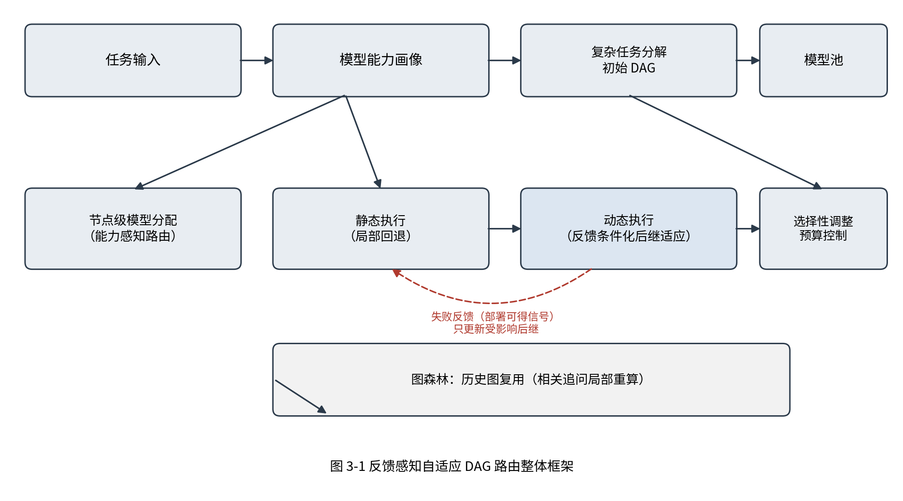

# 面向复杂任务的反馈感知多模型自适应有向无环图路由

Feedback-aware Adaptive DAG Routing for Multi-model LLM Collaboration

## 摘要

复杂任务包含信息抽取、关系推理和结果验证等不同能力需求，针对完整查询选择单一模型难以利用执行阶段间的模型互补。本文提出反馈感知的自适应有向无环图路由框架，将能力画像、节点级模型分配、静态执行与反馈条件化的后继适应相结合，并以选择性干预、预算约束和历史图复用组织多模型协同。财务复杂任务实验表明，冻结节点路由相对查询路由的条件化节点质量提高约 6.9 个百分点，主要收益来自阶段粒度；严格配对的三臂分解基准（300 任务、一次统一会话）进一步表明，同模型拆分本身在 TAT-QA 上显著有害（−21.0pp）、在 MultiHiertt 上不显著，而拆分后的异构阶段分工带来总体 +5.0pp 的显著增益、但未完全抵消分解损耗——DAG 的核心作用是解除阶段能力绑定、使异构能力分配成为可能，而非普遍提高推理精度。在含分支与汇合的四节点真实 DAG 面板上，选择性动态适应显著优于静态执行（+20.0pp），对照消融显示主要增益来自"失败节点升级至最强未试模型"这一动作本身，部署可得信号可保留 91.7% 的增益——Dynamic 的作用是在反馈和预算约束下选择性调用已有能力，而非凭空创造能力。跨域与外部方法比较进一步划定适用边界：代码域中单元测试反馈驱动的动态适应相对静态提升 6.0pp（bootstrap 区间不含零、精确 McNemar p=0.070 未达显著，属支持性证据），数学域中冻结的阶段分配先验与验证接口同时失配、DAG 全面劣于单体；同池同面板同评分器下，答案级迭代精修在代码域点估计最高但与本文方法的配对差异未达显著。统一命题为：**多模型 DAG 协同并非天然带来性能提升，其有效性取决于阶段能力匹配、节点接口表达能力和运行反馈可诊断性**；本文方法的贡献定位于节点级、依赖感知、局部且可审计的动态执行机制，而非所有任务域的原始准确率领先。

**关键词：** 大模型路由；多模型协同；任务有向无环图；反馈适应；选择性路由；预算约束

## 1 引言

### 1.1 背景与问题

复杂任务通常需要完成信息抽取、关系推理、数值计算和结果验证。不同阶段对模型能力的要求并不相同：适合从长材料中定位事实的模型，未必最擅长根据事实形成运算关系；能够生成正确表达式的模型，也未必具有最可靠的验证能力。因此，多模型协同的目标不能仅表述为给完整问题寻找一个统一的最佳模型，还需要决定各执行阶段由谁完成，以及上游状态改变后是否应调整后续计划。

查询路由通过预测模型效用在质量与资源之间作出选择，已有工作展示了偏好学习和成本控制的价值[1,2]。然而，对具有依赖关系的任务，模型选择还受到输入来源的影响。一个模型在标准事实条件下的推理表现，不等于它消费实际抽取输出时的表现。同模型端到端执行将抽取与推理能力绑定，可能使上游弱项掩盖下游优势。只依据条件化节点成绩分配模型，或者只依据整条同模型链的成绩评价推理能力，都可能遗漏这一差别。

显式有向无环图（Directed Acyclic Graph，DAG）将中间结果与依赖关系变为可调度对象，使阶段能力能够独立组合。但分解会增加接口和资源开销，模型切换也可能破坏原本正确的输出。因此，需要同时回答"是否存在互补机会"和"能否可靠选择这些机会"，并在执行反馈与剩余预算的约束下决定是否干预。

**本文的中心命题是：多模型 DAG 协同并非天然带来性能提升，其有效性取决于阶段能力匹配、节点接口表达能力和运行反馈可诊断性；DAG 的核心作用是解除阶段能力绑定，而 Dynamic 的作用是在反馈和预算约束下选择性调用已有能力。**全文的实验与讨论都围绕这一命题组织。

### 1.2 本文思路

本文提出反馈感知自适应 DAG 路由框架（Feedback-aware Adaptive DAG Routing），以模型能力画像支持控制路由，将复杂任务分解为初始 DAG，提供静态与动态两种执行模式。静态模式允许预定义局部回退，但保留后继模型计划；动态模式定义为反馈条件化的后续调整（Feedback-conditioned Downstream Adaptation），依据当前执行状态更新受影响后继的模型与恢复安排，不要求修改图拓扑。

框架采用选择性调整：保留已有强默认分配，只有在运行证据支持且资源允许时覆盖。预算控制决定恢复、升级或终止；图森林保存历史依赖与版本，在相关追问中复用仍然有效的节点。这些环节服务于共同的质量—成本—时延目标，而不是独立增加更多执行步骤。

研究围绕一条递进的证据链展开：首先测量阶段能力异质性；随后考察实际输入传播如何改变可用能力；再通过严格配对分解、跨模型组合和有限空间的精确事后上界定位剩余机会；最后检验选择性路由、静态与动态恢复、预算约束能否利用这些机会，并把同一套问题推向财务之外的数学与代码任务域。模型成功预测具有信号，并不意味着实例级最佳模型能够稳定预测；存在正 Oracle 差距，也不意味着该差距可以由当前表示与监督充分恢复。

本文围绕三个研究问题组织证据：

- **RQ1**：不同执行阶段是否存在可利用的异构智能体能力差异，节点级调度能否比查询级路由更有效地利用这些差异？（对应 4.2）
- **RQ2**：任务 DAG 分解与反馈驱动动态调度分别产生什么收益、代价及其归因？（对应 4.3，跨域边界见 4.5）
- **RQ3**：在质量—成本—时延联合目标下，异构智能体调度何时存在可利用的 Pareto 优化空间，运行反馈又在什么条件下能够将静态 Pareto 机会转化为动态优化收益？（对应 4.4，跨域边界见 4.5）

### 1.3 贡献

第一，**节点级异构协同**。通过能力画像和任务分解，把整题级模型选择转化为阶段级模型分配，并区分条件能力与传播能力。严格配对分解基准与跨模型传播实验共同表明，DAG 的核心作用是解除执行阶段之间的同模型绑定，使阶段级异构能力分配成为可能，而不是普遍提高推理精度。

第二，**反馈驱动 Dynamic DAG**。根据运行状态对失败节点及受影响后继进行局部、选择性、预算感知的调整。归因消融显示，四节点面板上动态相对静态的 +20.0pp 中主要增益来自"失败节点升级至最强未试模型"这一动作本身，动态框架的可确证价值在于以选择性更新与预算约束安全地承载该动作；失败检测在部署边界内使用部署可得信号（解析/执行/一致性/单元测试），不依赖标准答案。

第三，**Q/C/L 多目标协同调度及优化边界**。将异构智能体 DAG 执行形式化为质量—成本—时延联合优化问题，设计反馈驱动、剩余预算约束的后继局部 Pareto 重优化机制 FLARE-DAG。实验验证了候选执行策略之间存在真实的非支配权衡，同时通过逐任务分析给出反馈触发式动态调度的可恢复收益上界 $\Delta Q \le |R \cap D|/N$，揭示 Pareto 机会并不必然转化为可实现的动态优化收益，其有效性进一步受到 Pareto 多样性、可恢复能力互补性和反馈可诊断性的共同制约。

### 1.4 论文组织

第 2 章回顾相关工作；第 3 章给出框架与方法；第 4 章按研究问题组织实验，从能力异质性、分解与能力解耦、节点级分配、条件与传播能力、组合上界、静态与动态执行、恢复与预算、历史图复用，最后到跨域适用边界与外部方法比较；第 5 章围绕分解成本、传播瓶颈、候选上限与有效条件四个问题展开讨论；第 6 章总结全文。

## 2 相关工作

### 2.1 大模型路由与模型能力画像

RouteLLM 利用偏好数据学习查询到候选模型的选择，并评价质量与成本权衡。[1] 本文与其共享通过预测能力分配模型的目标，但选择对象为同一任务内部的类型化节点，且进一步研究执行后状态变化。节点基准的正差距并不意味着该差距一定可由问题编码预测，因此本文保留类型先验和事后最优选择作为不同参照。

FrugalGPT 研究通过模型调用策略降低开销并维持质量。[2] 本文同样关注有限资源下的选择，但将资源状态放在具有依赖关系的执行链中：一个恢复动作既消耗剩余预算，也改变后继输入。该区别是研究对象的细化，不构成对既有路由方法全面失效的判断。

### 2.2 任务分解与依赖图执行

LLMCompiler 将规划、任务分发与执行分开，利用依赖结构组织函数调用，并包含动态重新规划机制。[3] 本文借鉴显式依赖使执行过程可检查的组织思想，关注不同 LLM 在节点上的分工，以及失败后是否存在值得利用的替代能力。实验使用有限财务任务模板和小型链式图，不能据此宣称通用规划能力，也不将串行服务时长解释为并行图调度加速。

任务分解能够暴露中间接口，也增加接口错误和证据遗漏的机会。本文的严格配对三臂基准显示：同模型拆分本身在 TAT-QA 上显著有害（−21.0pp）、在 MultiHiertt 上不显著（+6.0pp），而拆分后把推理阶段换为更合适模型带来总体 +5.0pp 显著增益——分解的价值是打开阶段分配接口，而非普遍提高推理，因此不应预设分解必然改善。

### 2.3 反馈驱动的自适应执行

Self-Refine 通过反馈与修订迭代改进生成结果。[4] 本文关注的反馈作用对象包括执行模型、局部恢复动作与后续计划，除了输出修订，还需要处理依赖失效和资源消耗。本文也将反馈信号的可靠性作为实验变量：标准答案可以支持离线判定，却不能等同于在线可得反馈。

因此，本文对反馈驱动执行的补充主要在于明确调度和评价边界。相同提示的重试、使用新提示的再次生成，以及根据金标准筛选正确候选，是不同操作，应分别记录和解释。

### 2.4 多目标执行与历史记忆

Agent Workflow Memory 从历史经验中形成可复用工作流程，为后续任务提供执行指导。[5] 本文的图森林重点保存具体任务的输入输出、依赖和版本，通过显式修改定位需要重算的部分。当前实现并不等同于通用语义工作流检索，也没有充分验证大规模图剪枝。

质量、调用成本与时延的权衡可通过约束优化和非支配关系表达。本文采用这些已有决策概念比较有限策略，主要考察约束如何改变恢复机会，以及复用如何减少资源需求，不将采用帕累托准则本身作为算法创新。

综上，已有工作分别处理整题级路由（RouteLLM）、成本感知级联（FrugalGPT）、答案级迭代精修（Self-Refine）与函数调用编排（LLMCompiler）。据本文所知，同一冻结模型池内"节点级异构分配＋依赖感知的局部动态调整＋适用边界的机制分析"这一组合尚未被同时研究：整题级方法不利用阶段粒度，答案级方法不处理依赖传播，编排方法不以多模型分工为对象；且这些方法的收益条件本身缺少统一面板下的对照证据。本文在第 4 章的严格配对基准与 4.10.2 的统一外部基线比较中同时填补这两点。

## 3 方法

### 3.1 框架概览

给定任务 x、材料 D 和模型池 M，控制器利用离线能力画像形成执行偏好，将任务分解为初始图 G₀=(V₀,E₀)，再为具体节点建立模型分配 π₀。执行过程中维护状态 sₜ、反馈记忆 Hₜ 与剩余预算，选择保留计划、局部恢复或更新受影响后继。历史执行图以版本化集合 Fₜ 保存，支持相关请求复用。

整体流程为能力画像→控制路由→复杂任务分解→初始 DAG→静态／动态执行→选择性调整→预算控制→历史图复用（图 3-1）。

该顺序描述逻辑依赖：控制器在图构造前获得任务需求与资源偏好，具体节点分配在节点定义后完成，不另引入未实现的路由网络。

### 3.2 模型能力画像

模型画像包含质量 Q、token 消耗 C 与服务时长 L。必须区分两种输入条件。条件能力在标准前驱输入下评价当前节点；传播能力在实际前驱输出下评价节点或整条链。对于抽取模型 e 和推理模型 r，定义

$$
Q_{e,r}(x)=\mathbb E[Y\mid x,D,\operatorname{Extract}_e(D,x),r].
$$

同模型链 Q_{m,m} 同时受抽取与推理影响，不能作为模型 m 的纯推理能力。跨模型矩阵 Q_{e,r} 将两个角色分开，为分析阶段互补提供接口。

条件化节点路由使用冻结 GTE 问题编码、节点类型独热编码与问题长度：

$$
\phi_i=[e(x);\operatorname{onehot}(\tau_i);\log(1+|x|)],\quad
\widehat Q(i,m)=w_m^\top\phi_i+b_m.
$$

各模型的 Ridge 质量头在开发数据拟合，正则固定为 1。资源先验使用开发均值。后期 900 任务传播画像另以既有问题表示和可见输入统计评价质量与资源预测，并报告任务分组交叉验证；它不是对早期节点确认模型的测试后重训练。类型先验按照开发类型均值选择模型，用于区分类型粒度与额外实例表示的作用。

### 3.3 复杂任务分解与初始依赖图

节点 vᵢ=(τᵢ,Iᵢ,Oᵢ,Pa(i),Kᵢ) 记录类型、输入输出约定、前驱和约束。边 (vⱼ,vᵢ) 表示后者依赖前者输出。主要类型包括抽取、推理、验证和汇总，转换节点在自然存在时保留。只有有效前驱输出齐备后，节点才具备执行条件。

现有实例使用可检查的领域模板。语义节点完成事实定位和关系选择，确定性执行器处理表达式运算。图构造不是已经训练的通用自由文本规划器。显式依赖使模型角色能够分离，也使局部接口错误可被定位，但不保证拆分优于整题生成。

### 3.4 能力感知节点路由

查询级选择为 r_q:x→m，节点级选择为 r_n:(x,τᵢ)→mᵢ。初始效用为

$$
U(i,m)=\alpha\widehat Q(i,m)-\beta\widehat C(i,m)-\gamma\widehat L(i,m),\qquad
m_i^*=\arg\max_{m\in M}U(i,m).
$$

节点确认协议固定 U=Q̂−0.05C̄/1000−0.05L̄/10。系统保存候选预测与最终选择，不为展示多模型而强制平均分配。条件节点分数、同模型传播分数与跨模型组合分数对应不同输入条件，不互相替代。测试前封存表示、预测头和偏好；评价阶段不以标签重新调整模型分配。

### 3.5 静态依赖图执行

静态模式按初始依赖与分配执行。节点失败时允许冻结的局部回退；其结果作为后继实际输入继续传播，但后继模型计划保持不变。因此，静态不等于没有恢复，动态比较也不能仅通过增加调用预算获得优势。

执行记录包含请求、输出、解析状态、消耗及输入来源。缺失真实抽取输出时，不允许以标准事实隐式补齐部署快照。历史条件化实验中的标准事实仅按其原协议评价，并单独披露。中间节点存在缺陷与最终答案错误分别记录。

### 3.6 动态依赖图调整

动态模式统一定义为反馈条件化的后续调整。状态 Hₜ 记录已执行模型、实际结果、失败经历和资源消耗；更新对象可以是后继模型分配、恢复安排、预算可行域或验证策略。即使 Eₜ 不变，πₜ 随新证据改变也构成动态执行。

受影响节点集合为 Aₜ，其依赖范围为 Aₜ∪Desc_G(Aₜ)。未受影响且输入有效的节点保持原结果。局部分解可以改变结构，但不是动态定义的必要条件；既有局部重规划未扩大恢复覆盖，本文不将其作为成功组件。

反馈记忆与图调整具有不同作用。前者修正能力估计，后者改变后续执行选择。既有低容量实例使用类型、长度分桶、模型及失败状态计数；当前动作只应读取已经发生的反馈，未执行候选的事后质量不能用于实际选择。

检测信号必须区分运行异常与真实失败标签。解析错误、执行器异常及验证器拒绝是运行时可观测信号；最终答案是否正确通常只能离线判定。48 任务动态试验通过评价答案触发推理回退并更新失败计数，属于理想失败检测条件下的真实调用。本文以此评价给定可靠判定后的调度行为；部署边界内的闭环证据另由四节点面板的部署信号消融与代码域正式面板给出（4.3、4.5），但不外推到所有无标准答案场景。

### 3.7 选择性调整

选择性策略优先保留强默认分配，在候选改善证据不足时不切换。动态第二版使用既有候选保护、受影响后继门控、关键节点处理、能力排序与预算可行性规则。其类型排序结合历史失败次数形成修正分数，替换须满足冻结差距条件。关键节点处理目前主要体现于两节点链的最终推理节点，不能扩展成已验证的大图关键路径算法。

剩余差距研究采用已经实现的两阶段选择器：第一阶段评价是否覆盖默认模型 large，第二阶段选择替代模型。简记为

$$
r(x)=\begin{cases}\operatorname{argmax}_{m\ne m_0}s_m(x),&s_{\mathrm{switch}}(x)>\tau,\\m_0,&\text{otherwise}.\end{cases}
$$

这是选择逻辑的表达，具体候选门槛保持冻结代码设置。确认实验的 τ=0.5 在开发后固定。Ridge 决策分数未经概率校准，数值可以超出 [0,1]；不将高分误称为高置信度。两阶段传播路由与动态第二版是不同实例，前者的确认集结果不用于替代后者的动态执行结果。

风险—覆盖率分析考察覆盖默认策略的频率与 Help/Harm 的关系。其覆盖档位来自事后交叉验证分析，不转化为独立测试集上已经验证的固定安全阈值。

### 3.8 预算感知恢复

设预算为 B_C、B_L，已发生消耗分别为 cⱼ、ℓⱼ，则剩余预算为

$$
B_C^{\mathrm{rem}}=B_C-\sum_jc_j,\qquad B_L^{\mathrm{rem}}=B_L-\sum_j\ell_j.
$$

控制器在可行范围内选择恢复、升级或终止。既有动作集包括再次调用、切换模型、重新取证和局部分解。动作共享运行快照，标准答案、推导程序与 required operands 与运行输入隔离，仅供离线分类和评分。

预算响应面使用已记录动作的实际消耗筛选可行项，并按离线成功判定停止。因此它评价的是固定动作输出集合在不同剩余资源下的可达质量，不是实时预测开销的部署保证。动态实例的最小 token 门控也不等同于精确双预算控制。昂贵恢复只有在可行且存在新增覆盖时才有价值，动作复杂度本身不构成收益证据。

### 3.9 历史任务图复用

图森林 F={G₁^(ν₁),…,Gₖ^(νₖ)} 保存历史 DAG、子图、模型分配、反馈、可用质量与资源记录及版本。相关追问按检索、复用、修改、重算处理；输入含义和约束未变的节点可以保留，直接变化节点及受影响后继重新执行。

修改计算假设与修改源材料具有不同失效范围。前者可复用原材料抽取，后者需重做相关抽取。当前实现依赖显式任务标识和事实索引，已经验证小规模复用与版本化，未证明通用语义图检索和大规模剪枝效果。

### 3.10 多目标与约束决策

本文以约束质量最大化为主要表达：

$$
\max_{p\in\mathcal P}\widehat Q(p)\quad\mathrm{s.t.}\quad\widehat C(p)\le B_C,\;\widehat L(p)\le B_L.
$$

其中 p 包括模型分配和已有恢复策略。Q–C、Q–L 与 Q–C–L 非支配分析用于显示不同资源偏好下的候选权衡，不引入新多目标算法。

资源相近时，质量差异是主要决策依据；预算收紧时，C/L 决定某一方案是否可行。

### 3.11 反馈驱动的多目标局部重优化

为同时考虑任务质量、执行成本与响应时延，本文将 DAG 中的智能体协同调度建模为多目标执行决策问题。对于调度策略 $\pi$，定义任务质量、执行成本和端到端时延分别为 $Q(\pi)$、$C(\pi)$ 和 $L(\pi)$，优化目标表示为

$$
\max_{\pi} Q(\pi),\qquad \min_{\pi} C(\pi),\qquad \min_{\pi} L(\pi).
$$

其中，时延按照 DAG 的关键执行路径计算，以反映并行节点对端到端响应时间的影响。

在静态 Pareto 调度基础上，本文进一步设计反馈驱动的后继局部重优化机制 FLARE-DAG。设节点 $v_i$ 执行后产生运行反馈 $f_i$，上游实际输出为 $z_i$，则候选智能体的条件能力估计表示为 $\hat q_i(m \mid z_i, f_i)$。当运行反馈表明当前执行存在异常时，仅提取失败节点及其后继闭包 $\mathcal{A}(v_i) = \{v_i\} \cup \mathrm{Desc}(v_i)$，已成功完成且不受依赖传播影响的其他分支保持不变。根据已消耗资源更新剩余预算 $C_{\mathrm{rem}} = B_C - C_{\mathrm{used}}$、$L_{\mathrm{rem}} = B_L - L_{\mathrm{used}}$，随后仅在受影响子图内重新构造满足剩余预算约束的非支配候选集合，形成

$$
f_i \rightarrow \hat q_i(m \mid z_i,f_i) \rightarrow G[\mathcal{A}(v_i)] \rightarrow (C_{\mathrm{rem}},L_{\mathrm{rem}}) \rightarrow \text{Local Pareto Re-optimization}
$$

的反馈闭环。

对于动态优化收益的可实现性，本文进一步给出形式化上界。定义可恢复机会 $R(x)$ 为当前策略执行错误但候选策略集合中至少存在一种策略能够正确完成任务，部署反馈触发 $D(x)$ 为运行时信号检测到异常。任何仅依赖部署反馈触发候选策略切换的动态调度器，其可实现的最大质量增益受到以下约束：

$$
\Delta Q_{\mathrm{dynamic}} \le \frac{|R \cap D|}{N}.
$$

在两节点、三候选模型的固定组合分析中，定义 A=M_E×M_R，包含九个组合。逐任务取其记录质量最大值后平均，得到“枚举 3×3 模型组合空间内的精确 Oracle”。其最优性仅覆盖这九个既有输出；完整动态策略还包含反馈分支、恢复、停止和可能的结构变化，并未求得全局最优。预算约束 Oracle 使用实际开销，也只作为事后诊断上界。

## 4 实验

本章按三个研究问题组织冻结证据：4.2 检验阶段能力与节点级分配，4.3 区分分解、恢复动作和动态调用机制的贡献，4.4 检验 Q/C/L Pareto 空间及动态收益条件，4.5 提供跨域与外部方法参照。所有结果沿用已有冻结面板、记录与评价口径，不新增模型调用或实验；既有证据来源见 FINAL_CLAIM_AUDIT.md，多目标结果对应已提交的 frp_dag 冻结记录。

### 4.1 实验设置与评价口径

实验以 MultiHiertt 财务表文推理任务为主[6]，并以 TAT-QA[7]、MBPP[10]（代码）与 Math500[8,9]（数学）作为跨域面板。不同阶段使用不同面板，不能以相同数据集名称推定同一任务、输入条件或评分单位。官方无标签测试题不能沿用节点评分；节点确认采用经使用记录审计的有标签保留任务。表 4-1 汇总本文主要证据层级。

表 4-1 主要评价面板及用途

| 面板 | 规模 | 输入与评价单位 | 证据层级 |
| --- | --- | --- | --- |
| 条件节点确认 | 100 任务、493 个主要节点 | 规定条件输入；节点质量 | 冻结选择器确认，评分更新另行审计 |
| 传播能力画像 | 900 任务 | 同模型实际抽取至推理；任务正确率 | 开发数据、任务级五折交叉验证 |
| 跨模型传播 | 上述画像中 200 任务 | 实际抽取输出；九种组合 | 开发机制分析、有限组合 Oracle |
| Conf-200 | 200 任务 | 同模型传播链 | 900 题训练后冻结确认 |
| Conf-500 | 500 任务 | 同模型传播链 | 更大冻结确认 |
| 风险—覆盖率 | 上述 900+200+500=1,600 题 | 实际默认输出特征 | 合并后开发分析，不再独立 |
| 严格配对分解基准 | 300 任务（MH 100、TAT-QA 200） | 同题同模型同评分器，仅改执行结构 | FROZEN_BEFORE_EXECUTION，一次统一会话 |
| 静态—动态（两节点链） | 48 任务 | 实际上游输出，理想失败判定 | 已分析面板、真实分歧调用 |
| 静态—动态确认 | 250 任务（TAT-QA train） | 同协议冻结确认 | 一次性冻结，与全部历史工件零重叠 |
| 四节点 DAG 静态—动态 | 120 任务（含消融两臂） | 分支+汇合+尾节点，理想/真实检测 | 预注册，策略先冻结后运行 |
| 真实失败恢复 | 116 节点、96 任务 | 已审计失败快照 | 固定动作覆盖与预算回放 |
| 历史图复用 | 20 个追问 | 显式修改与局部重算 | 特定多轮工作负载 |
| 跨域 Math500 | 100 任务（分层冻结） | 计划式分解接口六臂 | 预注册 one-shot |
| 跨域 MBPP | 100 任务（冻结） | 单元测试为确定性评分 | 预注册 one-shot |
| 外部基线 addendum | 上述 300 任务面板 | 同池同面板同评分器同预算 | 冻结协议 one-shot |

核心候选池固定为 medium、large、coder（Qwen2.5-7B-Instruct / Qwen2.5-14B-Instruct-GPTQ-Int8 / Qwen2.5-Coder-7B-Instruct），checkpoint 在每次服务启动时按 provenance 哈希校验；R1 不进入节点路由。生成配置统一为 temperature 0、top_p 1、max_tokens 512。实验在项目现有 GPU 与 vLLM[11] 推理服务环境采集；本文不把观测服务时延总和称为包含加载、排队、调度的端到端墙钟延迟，也不从不同历史服务配置推断硬件加速。

核心术语在全文统一为：查询路由（Query Router）、节点路由（Node Router）、类型先验、静态执行（Static DAG）、动态执行（Dynamic DAG，部署检测臂为动态真实 Dynamic-Real）、有限候选 Oracle（finite candidate oracle）、能力匹配（capability match）、接口表达能力（interface adequacy）与反馈可诊断性（feedback diagnosability）。

**指标与统计口径**。Q（Quality）须按评价层级区分：条件化节点质量是指定输入条件下节点评分器的平均分；端到端任务质量是最终答案正确的任务比例。两种口径不可互换，节点级约 +6.9pp 不表示端到端任务准确率提高。C（Cost）记录 tokens，调用次数单独计算；L（Latency）采用记录的观测服务时延，不解释为硬件无关的系统延迟。Help 指默认错误而新策略正确，Harm 指默认正确而新策略错误。对参考策略 b 与相同候选空间 Oracle，差距恢复比例定义为 GR(r;b)=(Q_r−Q_b)/(Q_Oracle−Q_b)，分母须为正，且三项必须来自相同面板和评分口径。所有配对比较报告任务级配对差值 ΔQ、10 000 次配对 bootstrap 95% 区间（种子 20260916）与精确 McNemar 检验；区间包含零或 McNemar p≥0.05 时不称显著。

本章由 4.2 回答 RQ1、4.3 回答 RQ2、4.4 回答 RQ3；4.5 的跨域与外部方法比较共同提供 RQ2 和 RQ3 的边界证据。

**冻结与信息边界**。每个确认面板的协议与任务清单在任何调用前冻结并提交（FROZEN_BEFORE_EXECUTION），运行 one-shot，结果不做事后调整。标准答案、程序与必要操作数仅用于离线标签和评价，运行时反馈一律为部署可得信号（解析/执行/一致性/单元测试），不读取 gold。历史试验若使用标准事实、理想失败检测、事后已知开销或离线成功停止，则按相应条件解释；探索性诊断不提升为正式确认结果。

**执行配置与比较对象。** Static 保持冻结的初始分配及局部回退；Dynamic 按已有运行反馈规则选择性调整失败节点与受影响后继。理想检测臂与部署检测臂分别标注，不混同其信息条件。候选策略包括固定模型、查询/节点路由、固定跨模型组合、Static/Static-Matched/Dynamic，以及 MC、LC、ML 的 Q/C/L 比较；不同 Oracle 仅覆盖各自已执行候选集合。RouteLLM-style adapted baseline、FrugalGPT-style adapted baseline 和 Self-Refine-style adapted baseline 的特殊配置见 4.5。统一 88 个 common tasks 的多目标结果来自已有四节点面板的开发/受控机制分析，不作为新的独立泛化确认。

### 4.2 阶段能力异质性与节点级分配

**RQ1：不同执行阶段是否存在可利用的异构智能体能力差异，节点级调度能否比查询级路由更有效地利用这些差异？**

**阶段能力异质性。**在 100 任务、493 个主要节点的冻结确认面板上，三候选模型分别执行节点，以扩展执行器统一评分（表 4-2）。推理与验证采用基准规定的条件输入，因此本节首先测量阶段能力，而不是完整链成功率。

表 4-2 不同节点类型的条件化质量

| 类型 | 节点数 | medium | large | coder | 逐节点 Oracle |
| --- | --- | --- | --- | --- | --- |
| 抽取 | 193 | 0.3731 | 0.5959 | 0.3782 | 0.6943 |
| 推理 | 100 | 0.3100 | 0.2500 | 0.3100 | 0.4100 |
| 验证 | 200 | 0.5200 | 0.4550 | 0.5900 | 0.6200 |

large 在抽取上占优，medium 与 coder 的推理均值并列最高，coder 的验证质量最高。类型内 Oracle 相对最佳固定模型分别存在约 9.84、10.00 和 3.00 个百分点的差距。模型优势因阶段而异：同一模型池中不存在"所有阶段都最优"的单一模型，这为节点级选择提供了经验依据，也构成中心命题中"阶段能力匹配"条件的度量基础。Oracle 使用事后标签，不能直接证明这些机会可被输入特征预测——该问题由下文的冻结确认与残差路由诊断检验。

**节点级调度与查询级路由。** 将上述能力差异转化为分配问题：稳定收益来自阶段/类型粒度，还是来自强实例级学习器。节点路由相对查询路由的条件化节点质量提高 6.90 个百分点，并减少记录中的 token 与观测服务时延（表 4-3）。

表 4-3 冻结路由与类型先验比较

| 方法 | 平均节点质量 | 每任务 tokens | 每任务观测服务时延总和（秒） |
| --- | --- | --- | --- |
| Always Large | 0.4686 | 4,991.02 | 11.71 |
| 查询路由 | 0.4665 | 4,985.33 | 10.19 |
| 类型先验 | 0.5355 | 未独立汇总 | 未独立汇总 |
| 冻结节点路由 | 0.5355 | 4,856.43 | 7.79 |
| 新版矩阵逐节点 Oracle | 0.6065 | 不作部署比较 | 不作部署比较 |

以 Always Large 为参考，其条件化节点 GAP Recovery 为 (0.5355−0.4686)/(0.6065−0.4686)，约 48.5%，即接近一半。这里的"接近一半"是差距恢复比例，不是任务准确率。**类型先验与节点路由的均值相同——主要收益来自阶段粒度，而非问题表示的额外学习能力**；节点路由相对查询路由差异为正，而相对类型先验区间包含零。原结果中 0.6045 是旧 Oracle 选择在新评分器下的重评分；本表采用已留档复核的新版逐节点最大值 0.6065，不混用两者计算差距。

**能力机会的实现限制。** 剩余差距能否由实例级信号稳定利用？剩余差距路由以 large 为强默认，使用 900 任务开发数据拟合两阶段选择器，固定阈值 τ=0.5 后分别评价较小 Conf-200 与较大 Conf-500（表 4-4）。这里的 Oracle 仅取三条同模型传播链，与下文九组合 Oracle 不同。

表 4-4 冻结两阶段路由的确认结果

| 指标 | Conf-200 | Conf-500 |
| --- | --- | --- |
| 任务数 | 200 | 500 |
| large 默认质量 | 0.1900 | 0.1840 |
| 两阶段路由质量 | 0.2000 | 0.1780 |
| 同模型链 Oracle | 0.2350 | 0.2380 |
| 质量差异 | +1.00 个百分点 | −0.60 个百分点 |
| 质量差异 95% 区间 | [0.00,2.50] 个百分点 | [−1.60,0.20] 个百分点 |
| GAP Recovery | +22.22% | −11.11% |
| 切换次数 | 4 | 22 |
| Help／Harm | 2／0 | 1／4 |
| McNemar 精确检验 p | 0.500 | 0.375 |

较小确认集出现正向信号，但差异不显著；在更大确认集上未复现，点估计转负且同样不显著。因此不能将 +22.22% 作为稳定主结果，也不能反向断言剩余差距完全不可学习。在 Conf-200 上，能力画像路由与成对路由分别切换 135 和 137 次，质量为 0.16 和 0.15，低于默认的 0.19；两阶段策略只切换 4 次。该比较提示无充分依据的覆盖会引入损害。Conf-500 的机制分析在 34 个仅 large 占优任务与 27 个替代者占优任务上，触发分数的诊断 AUC 为 0.458：单模型成功可预测、相对优劣可排序以及最终路由有净收益，是不同层次的问题。

低覆盖率选择为何相对安全？将 900 开发任务、200 和 500 个已分析确认任务合并为 1,600 题开发语料，进行任务级五折预测与事后风险—覆盖率分析（表 4-5）。运行时特征来自 large 的实际抽取和推理输出；这一评价不能再称为独立确认，也不等同于零执行成本的到达时路由。

表 4-5 开发语料上的事后风险—覆盖率曲线

| 覆盖率 | 覆盖默认次数 | Help | Harm | 净改善数 | GAP Recovery |
| --- | --- | --- | --- | --- | --- |
| 2% | 32 | 2 | 0 | +2 | +2.47% |
| 5% | 80 | 6 | 0 | +6 | +7.41% |
| 10% | 160 | 8 | 1 | +7 | +8.64% |
| 15% | 240 | 8 | 6 | +2 | +2.47% |
| 30% | 480 | 12 | 15 | −3 | −3.70% |
| 50% | 800 | 22 | 39 | −17 | −20.99% |

在该分析中，5%—10% 覆盖具有正净收益且损害较少；扩大覆盖后，新增有害覆盖逐渐抵消帮助。它支持限制干预范围的机制动机，不证明 5%—10% 是新任务上的通用安全区间，更不能在看到曲线后将这些档位称为事先冻结阈值。既有流程在折分前进行全体无标签特征标准化，且覆盖档位为事后解释，因此本节保留开发层级。

900 任务画像使推理模型消费同模型实际抽取结果，测量传播链能力（表 4-6 与表 4-7）。任务级五折交叉验证保持同任务节点同折。

表 4-6 传播画像中的预测与路由结果

| 指标 | medium | large | coder |
| --- | --- | --- | --- |
| 单模型成功预测 ROC-AUC | 0.7511 | 0.7880 | 0.8391 |

表 4-7 传播画像中的路由质量

| 传播路由策略 | 最终质量 |
| --- | --- |
| 最佳固定模型／类型先验 | 0.1800 |
| 查询路由 | 0.1778 |
| 能力画像路由 | 0.1789 |
| 同模型链 Oracle | 0.2300 |

单模型成功存在可预测信号，但能力画像路由没有超过类型先验，差异区间 [−0.0111,0.0089] 包含零。900 个任务中，693 个三模型链均错、50 个均对、157 个存在模型间结果差异；大量共同失败和共同成功会抬高整体最优命中率，判断可路由性应关注模型表现不同的任务。

**条件能力不等于传播能力**。标准事实推理基准中的最佳固定质量为 0.31、逐任务推理 Oracle 为 0.41，存在 10 个百分点的条件空间；传播画像中最佳同模型链为 0.18、Oracle 为 0.23，只保留 5 个百分点的整链选择空间。但这两组数据的任务集和估计对象不同，不能把差值解释为严格配对的"抽取噪声损失"。零调用审计（证据编号见 FINAL_CLAIM_AUDIT）给出各面板传播 headroom：900 题开发集 5.00pp、Conf-200 4.50pp、Conf-500 5.40pp、合并 1,600 题 5.06pp；共同失败占比 77.0%／76.5%／76.2%／76.7%。本文统一引用上述冻结审计值，不采用无冻结来源的传播差距。由此，条件能力与传播能力必须分开估计：前者揭示理想输入下的能力，后者反映整个输入生成过程与下游执行的联合作用——这是"节点接口表达能力"条件的第一处直接证据。

在能力画像的 200 任务子集上，实际执行三个抽取模型与三个推理模型的九种组合，推理者消费对应抽取者输出（表 4-8）。该子集用于开发机制分析，不是 Conf-200 确认集。

表 4-8 跨模型传播矩阵

| 抽取模型／推理模型 | medium | large | coder |
| --- | --- | --- | --- |
| medium | 10.0% | 9.5% | 9.5% |
| large | 20.0% | 18.0% | 20.5% |
| coder | 13.0% | 11.5% | 11.0% |

该九组合空间的有限候选精确上界汇总于表 4-9。保持推理者 medium 不变，将抽取者从 medium 换成 large，质量由 10.0% 提高至 20.0%；保持推理者 coder 不变，对应变化为 11.0% 至 20.5%。固定 large 抽取后，medium 和 coder 的推理结果分别高于 large 推理的 18.0%。这表明同模型链可能因抽取弱项而掩盖下游优势，独立分配阶段模型能够解除这种绑定。上述比较支持阶段互补的机制解释，但当前未据该汇总表宣称各点估计差异均达到统计显著；large 抽取均值更好也不意味着它在每个任务上都是最优来源。

表 4-9 枚举组合空间的上界与差距

| 对象 | 质量 | 与精确 Oracle 的距离 |
| --- | --- | --- |
| Always Large：E_large→R_large | 18.0% | 12.5 个百分点 |
| 最佳固定组合：E_large→R_coder | 20.5% | 10.0 个百分点 |
| 枚举 3×3 空间内精确 Oracle | 30.5% | 0 |

最佳固定跨模型组合相对 Always Large 增加 2.5 个百分点，恢复对应 12.5 个百分点 Oracle 差距的 20.0%。剩余 10.0 个百分点表示在这九种记录中仍有任务特定机会，不表示当前路由器一定能够预测它们。该上界的完整名称是"枚举 3×3 模型组合空间内的精确 Oracle"（Exact Oracle within the enumerated 3×3 model-composition space），它不包含任意恢复序列、图结构、提示变体或动态预算分支；有限组合穷举不能被表述为完整 Dynamic DAG 的全局最优解。

异构阶段能力真实存在，节点粒度能够更充分利用这些差异；但 Routing Opportunity ≠ Learnable Routing Signal，Conditional Capability ≠ Propagated Capability。

### 4.3 任务分解与反馈调度的收益及归因

**RQ2：任务 DAG 分解与反馈驱动动态调度分别产生什么收益、代价及其归因？**

**DAG 分解与 Static 执行。** 本节回答：把整题拆成节点后，质量变化来自"拆分"还是"分配"。为把分解效应与模型选择效应分开，本文冻结 300 个任务（MultiHiertt 100、TAT-QA 200；任务标识与历史协议污染经审计，抽取失败即判失败、不重试、不喂标准事实）并在一次统一推理会话中执行三臂分解基准：Mono-L（单体 large 直接作答）、DAG-L/L（large 抽取→large 推理→确定执行）与 DAG-L/M（同一抽取输出→medium 推理→确定执行）。两个 DAG 臂共享同一次抽取、全部提示与生成配置，因此表 4-10 只改变"是否拆分"，表 4-11 只改变"推理模型"。

表 4-10 严格配对分解基准：拆分本身（Mono-L vs DAG-L/L）

| 数据集 | 配对 N | Mono-L | DAG-L/L | ΔQ | 95% CI | Help／Harm | McNemar p |
| --- | --- | --- | --- | --- | --- | --- | --- |
| MultiHiertt | 100 | 11.0% | 17.0% | +6.0pp | [−2.0,+14.0] | 11／5 | 0.21 |
| TAT-QA | 200 | 52.5% | 31.5% | −21.0pp | [−28.5,−13.5] | 14／56 | 4.3×10⁻⁷ |
| Overall | 300 | 38.7% | 26.7% | −12.0pp | [−18.0,−6.0] | 25／61 | 1.3×10⁻⁴ |

ΔQ 为任务级配对差值 DAG−Mono 的均值，95% 区间为 10 000 次配对 bootstrap，p 为精确 McNemar 检验。同模型拆分本身在 TAT-QA 上显著有害（−21.0 个百分点，Harm 56 远多于 Help 14），在 MultiHiertt 上为不显著的正向信号（+6.0 个百分点），总体 −12.0 个百分点且区间不含零。**DAG 不是天然的 Accuracy Booster**：分解引入真实的接口损耗，损耗集中于简单任务（表 4-12）。

表 4-11 严格配对分解基准：异构阶段分工（DAG-L/L vs DAG-L/M）

| 数据集 | 配对 N | DAG-L/L | DAG-L/M | ΔQ | 95% CI | Help／Harm | McNemar p |
| --- | --- | --- | --- | --- | --- | --- | --- |
| MultiHiertt | 100 | 17.0% | 15.0% | −2.0pp | [−7.0,+3.0] | 2／4 | 0.69 |
| TAT-QA | 200 | 31.5% | 40.0% | +8.5pp | [+3.5,+13.5] | 22／5 | 0.0015 |
| Overall | 300 | 26.7% | 31.7% | +5.0pp | [+1.3,+8.7] | 24／9 | 0.014 |

拆分之后把推理模型从 large 换成 medium：TAT-QA 显著追回 +8.5 个百分点，总体 +5.0 个百分点；MultiHiertt 上 medium 推理不优于 large（−2.0 个百分点，不显著），说明阶段互补是任务依赖而非普适。**但即使加上异构分工，DAG-L/M 总体 31.7% 仍低于 Mono-L 的 38.7%：异构分配显著缓解了分解造成的性能损失，但在当前 300 题总体上尚未完全抵消该损失**。据此，DAG 分解本身不应被宣称为质量提升手段；其作用是解除执行阶段之间的同模型绑定，为阶段级异构能力分配提供结构接口，最终收益取决于分解接口损耗与模型阶段互补性之间的平衡。

表 4-12 复杂度分层下的分解效应（表 4-10 对照）

| 数据集 | 复杂度 | N | Mono-L | DAG-L/L | ΔQ |
| --- | --- | --- | --- | --- | --- |
| TAT-QA | 1–2 步 | 177 | 53.1% | 26.0% | −27.1pp |
| TAT-QA | 3 步 | 19 | 52.6% | 73.7% | +21.1pp |
| TAT-QA | 4 步以上 | 4 | 25.0% | 75.0% | +50.0pp |
| MultiHiertt | 1–2 步 | 86 | 10.5% | 16.3% | +5.8pp |
| MultiHiertt | 3 步 | 9 | 11.1% | 33.3% | +22.2pp |
| MultiHiertt | 4 步以上 | 5 | 20.0% | 0.0% | −20.0pp |

复杂度按答案推导的算术步数计（TAT-QA 推导式二元运算符、MultiHiertt 程序函数调用）。TAT-QA 上分解效应随复杂度单调上升（−27.1 → +21.1 → +50.0 个百分点），简单任务的损害高度集中（1–2 步层 Help 4／Harm 52，McNemar p≈1.1×10⁻¹¹）；MultiHiertt 未复现该趋势且各层区间均跨零。因此"何时值得拆分"的证据是复杂度依赖的：随推理复杂度增加，显式分解的相对价值呈上升趋势；3 步与 4 步以上子层样本很小（n=19、n=4），该分层仅作描述性机制证据，不构成"超过某步数必须拆分"的规则。

TAT-QA 上 56 个 Harm 的逐题分类（零调用审计，证据编号见 FINAL_CLAIM_AUDIT）进一步区分两种损失：真分解失败 31 例（推理在 gold facts 下仍错 30、抽取值错 1）与接口损失 25 例（执行/解析 12、抽取不可解析 7、事实顺序/符号错位 6、百分比/千位缩放 0）。其中 6 例顺序/符号错位具体展示了节点接口丢失语义的机制——表达式语义正确而事实绑定顺序相反。**反事实敏感性：即便将全部 25 例接口损失修正，配对差仍为 −8.5pp（CI 不含零）——TAT-QA 的分解损失以真实推理退化为主，不是实现 bug**。成本口径：DAG 两臂平均 token 高于单体（总体 1737→2189），异构分工相比同模型分解几乎不增加 token；观测服务时延为同一推理环境下的观测值（Mono 2.63s、DAG-L/L 3.13s、DAG-L/M 3.08s），不解释为稳定算法加速。历史协议不净的配对结果已撤回，仅在早期探索记录中保留；本节仅采用上述严格配对三臂基准。

**Static、Static-Matched 与 Dynamic 的归因比较。** 动态执行的价值必须按 **Static → Static-Matched → Dynamic** 的顺序归因，否则"+20pp"会被误读为调度器本身的贡献。两节点链对照使用已分析的 48 任务真实调用面板（表 4-13）。静态允许局部回退，动态使用反馈更新执行选择。第二版复用已记录的静态前缀并执行分歧请求；真实上游输出进入下游，但推理失败检测与失败计数读取评价答案，属于理想失败检测条件下的 live 实验。

表 4-13 静态与动态执行

| 策略 | 正确任务 | 正确率 | 平均 tokens | 观测服务时延（秒） | Help／Harm |
| --- | --- | --- | --- | --- | --- |
| 静态 | 25/48 | 52.08% | 1,402.2 | 2.95 | — |
| 动态第一版 | 26/48 | 54.17% | 1,403.8 | 2.89 | 2／1 |
| 动态第二版 | 26/48 | 54.17% | 1,400.6 | 3.09 | 1／0 |

第二版相对静态约 +2.08 个百分点，已有逐任务复核区间 [0,6.25] 个百分点包含零，差异不显著。第二版减少观察到的 Harm，同时也少一个 Help，总正确数未变化；其观测服务时延略高于静态，不能写成 Q/C/L 全面占优。实现中 25/48 个任务带重调度标记，包含局部回退，不能等同于多后继全局调整。token 预算违规为零，但预算基准取静态实际消耗的 1.2 倍，非到达时即可知道的预算。该面板此前已分析，不是未经接触的 held-out test。开发层受控故障提供补充机制证据：模型分配干预中出现 Help=2、Harm=0；证据缺失为 1／1，错误中间值为 0／0。无干预对照仍有一例损害，且原恢复率汇总存在计数错误，故本稿只保留已复核 Help/Harm，不据此宣称严格的单因素因果证明。

为把"+2 个百分点左右的小效应"与样本波动区分开，本文在 250 个全新的 TAT-QA train split 任务上做了一次性冻结确认（`dynamic_v2_confirm_250`，策略与阈值同 48 任务面板逐字一致，选择规则与任务清单在任何调用前冻结并提交；与工作区全部历史工件零重叠）。结果：静态 103/250（41.2%）、动态 110/250（44.0%），配对 ΔQ = +2.8pp，任务级 bootstrap 95% CI [−0.8, +6.4] 覆盖零；McNemar 精确检验 b=13、c=6，p=0.167；Help/Harm = 13/6；平均 tokens 略低于静态（1,337.5 对 1,350.3），预算违规 0。按预注册三情形判定为情形二：方向在第二个独立面板复现（+2.1 → +2.8），规模一致，但统计上仍未确证。动态第二版的端到端质量收益应描述为"在两个独立面板上方向一致的小幅正向信号"，不是已确证的改进；其可确证的价值仍是 harm 控制与零预算违规。

多节点结构验证。上述两面板均为两节点链；为回应"自适应 DAG 与两阶段流水线有何区别"，本文构建了真实的四节点 DAG 面板（`multidag_dynamic_120`，120 个全新任务，策略在任何调用前冻结并提交）：e1（表格抽取，large）与 e2（文本抽取，large）并联为分支，r（汇总表达式生成，medium）为汇合点，v（数值校验，coder）为尾节点；仅选择 gold 答案同时需要表格与文本区域的任务（TAT-QA answer_from = table-text），保证分支在结构上不可退化。两臂共享初始分配、prompt、生成配置与预算规则（1.2×静态实际消耗），失败检测为理想条件，差异仅为冻结的适应规则（静态：每失败节点一次本地回退 e→coder、r→coder、v→medium；动态：抽取失败记忆切换、r/v 升级 large 并受预算门控）。结果：静态 16.7%、动态 36.7%，配对 ΔQ = +20.0pp，95% CI [11.7, 28.3] 不含零；McNemar 精确检验 b=28、c=4，p≈1.9×10⁻⁵；Help/Harm = 28/4；动态成本略低（−90 tokens）、预算违规 0。

结果汇总见表 4-14。

表 4-14 四节点面板四臂对照（同一冻结面板）

| 臂 | 质量 | ΔQ 对静态 | 95% CI | 说明 |
| --- | --- | --- | --- | --- |
| Static（理想检测） | 16.7% | — | — | 局部回退基线；预算违规 0 |
| Static-Matched（理想检测） | 35.0% | +18.3pp | [10.0, 26.7] | 静态语义＋升级目标；主要增益来源 |
| Dynamic-Ideal（理想检测） | 36.7% | +20.0pp | [11.7, 28.3] | McNemar b=28／c=4，p≈1.9×10⁻⁵；策略额外贡献 +1.7pp（CI [−4.2,+7.5]，p=0.77） |
| Dynamic-Real（部署信号） | 35.0% | +18.3pp | — | 增益保留率 91.7%（CI [77.8%, 100%]）；与理想检测无显著差异（b=2／c=0，p=0.5） |

**公平性消融（`multidag_ablation_120`，两个预注册对照臂，同一冻结面板，830 次新调用）**。针对"动态收益是否只是用了更强模型"的质疑，**Static-Matched 臂**保持静态语义（每失败节点一次恢复、无跨任务记忆、无门控、理想检测），但将恢复目标换成动态的升级目标（r 失败→large、v 失败→large）：Q = 35.0%（较静态 +18.3pp，CI [10.0, 26.7]），而完整动态策略 36.7%——策略超出目标选择的额外贡献仅 +1.7pp（CI [−4.2, +7.5]，McNemar p=0.77）。**归因如实报告：该面板上的主要质量增益来自"失败节点升级至最强未试模型"这一动作本身；动态框架的可确证价值在于以选择性更新与预算约束安全地承载该动作**（933 次适配调用零越界、分支隔离零违例、预算违规为零）。

**Dynamic-Real 臂**将失败检测全部替换为部署可得信号（解析/执行检查，加 v 与 r 的输出一致性检查，全程无 gold 参考）：Q = 35.0%，增益保留率 91.7%（任务级 bootstrap CI [77.8%, 100%]），与理想检测臂无显著差异（McNemar b=2/c=0，p=0.5），且成本更低（2,459.5 tokens）。需要说明其机制边界：保留率高的重要原因之一是尾节点校验的输出一致性检查在本面板近乎全触发（离线审计已表明该信号退化为常发），它等价于"尾节点总是请求更强模型复核"；r 节点的值错误检测不到（解析/执行检查的召回缺口），但该缺口在本面板上代价很小。结论：动态 DAG 的收益不依赖 gold 失败信号；其安全性与选择性仍由框架的审计性质保证。面板边界同时保留：区域受限抽取（仅表格或仅文本）的失败率（158/480 节点槽位）远高于全上下文抽取，校验尾节点几乎在所有任务上触发适配，结论限于单一任务域。

选择性调整保留强默认，仅在已有反馈规则支持时覆盖既有安排。选择性更新审计：933 次适配调用的每一次都属于某失败节点或其声明后代闭包（越界 0 次）；分支隔离检查 134 例全部通过——单侧分支失败时，干净分支从未被重执行，即**只更新真正受影响的后代，从不全图重跑**。

**故障与恢复机制。** 本节回答：反馈驱动的调整最多能兑现多少，取决于候选动作集合里有什么。

**真实失败与动作覆盖。**

原 148 个缺陷节点中有 32 个原最终答案已正确，审计后恢复集合为 116 个节点、96 个任务（表 4-15）。恢复以原最终答案错误为前提，避免将再次答对原本正确的任务计为救回。

表 4-15 固定恢复动作的真实失败覆盖

| 失败类型 | 节点数 | 再次调用 | 切换模型 | 重新取证 | 局部分解 |
| --- | --- | --- | --- | --- | --- |
| 证据类 | 45 | 0 | 1 | 2 | 1 |
| 推理类 | 48 | 0 | 1 | 1 | 1 |
| 结构类 | 23 | 2 | 0 | 2 | 0 |
| 合计 | 116 | 2 | 2 | 5 | 2 |

各动作成功集合重叠，其并集仅为 8/116，即 6.90%。**动态适应不能创造缺失的能力（Dynamic cannot create missing capability）：即使动作选择完全正确，也无法恢复该固定集合没有成功输出的节点**。这一结论仅限该困难集合及固定模型、提示与动作，不是所有任务的唯一瓶颈。两个再次调用的真实恢复案例并未保持原提示，因此不证明零温度同提示重试有效。局部子图重规划在独立开发的 40 节点上仅成功 1 个，加入后动作并集仍为 4/40，新增覆盖为零，按既有规则判定 NO-GO。拓扑变化没有自动扩展覆盖，不作为本文正贡献。

**剩余预算约束。**

预算响应面使用 116 节点的已测动作开销，在 11×7 个 token／观测服务时延档位上回放（表 4-16）。

表 4-16 四动作顺序策略的剩余预算响应

| token 预算 | 时间预算（秒） | 恢复率 | 同预算动作 Oracle |
| --- | --- | --- | --- |
| 500 | 1 | 2.59% | 3.45% |
| 1,000 | 2 | 3.45% | 4.31% |
| 2,000 | 3 | 4.31% | 5.17% |
| 3,000 | 3 | 5.17% | 5.17% |
| 无上限 | 无上限 | 6.90% | 6.90% |

紧预算限制昂贵动作，预算放宽增加可行覆盖，但最终仍止于固定动作并集。回放事先知道实际消耗，并用离线成功停止；零违反是可行性筛选的结果，不证明部署时具有准确时延预测。在九组合面板中，固定 large 抽取的三种推理组合成本约 4,430—4,436 tokens，观测服务时延约 5.08—5.19 秒，质量分别为 20.0%、18.0%、20.5%。正常预算下它们的资源差异较小，质量是主要区分轴；预算收紧后，资源项转为可行性条件。该观察限于当前组合与环境，不扩展为所有模型池的共同性质。

**证据改善为何不必然带来正确答案。**

已有结构感知解析诊断关注原同模型链共同失败的开发子集。零调用审计（证据编号见 FINAL_CLAIM_AUDIT）给出其可复核边界：25 个结构推理应答全部可解析，按冻结评分器重打分 Q = 0/25，与保存的评分汇总一致；但"25 条记录均覆盖必要操作数"这一早期工件不可复现——以当前版本化代码重算，top-30 候选对 gold 操作数的覆盖为 0/25 任务、全量解析事实为 14/25（原生成代码未版本化，早期覆盖数字不具审计效力，不予引用）。可审计的结论因此收窄为：结构化解析未产生任何正确答案，且其"覆盖恢复"前提本身无法复核。

对 D2—D4 变体：保存应答各 25/25 可解析，但配对输入未冻结，成功率不可重算，本文不报告任何来自会话记录的百分比；D0、D1 与 Dev-25 上的 gold-facts 臂没有已定位的冻结输出，相应未留档数字（0%、4%）同样无审计工件支持。作为补充，对 100 个 large 抽取→medium 推理失败任务上已冻结但此前未评分的证据重建调用进行首次评分：S0 基线／S1 重抽取／S2 跨模型／S3 定向缺失证据重建的 Q = 8%／8%／5%／8%，基线抽取操作数覆盖均值仅 35.4%——即使让模型主动检索缺失量并合并证据，成功率也不高于基线（探索性分析，非预注册）。

结合固定动作覆盖与跨模型传播结果，可以保守判断：证据检索、选择与模型路由的进一步改善未在所分析困难样本上形成稳定恢复证据；当前模型及动作覆盖是主要剩余瓶颈之一。不能据此否定更强证据推理、工具或模型在未来扩大可解集合的可能。

当前恢复瓶颈在于动作覆盖，而不只是动作选择。Dynamic 不创造模型池中不存在的能力，而是控制已有能力何时、何处以及以何种代价被调用。

**Graph Forest：历史 DAG 与执行复用。** 图森林在 20 个修改型追问中复用 40 个抽取节点，新执行 40 次调用，相对 80 次逻辑重执行需求减少 50%，记录 token 减少 91.4%。19/20 个流程可以执行且结果响应修改，但验证器接受为 0/20，因此该结果证明特定多轮工作负载的复用与资源机制，不证明 95% 答案正确率。多轮复用不并入单轮动态正确率，大规模剪枝尚未验证，不列为已验证贡献。**该结果保持辅助机制定位：复用只节省算力，不创造新能力**。

### 4.4 多目标优化空间与动态收益条件

**RQ3：在质量—成本—时延联合目标下，异构智能体调度何时存在可利用的 Pareto 优化空间，运行反馈又在什么条件下能够将静态 Pareto 机会转化为动态优化收益？**

**Phase 1：静态 Pareto 空间。** 本阶段使用统一 88 个 common tasks，保持 e1/e2 为 large，比较 r/v 的三个已有组合。按冻结的整链 Q/C/L 审计口径，MC（r=medium，v=coder，n=88）为 Q=0.182、C=1549 tokens、L=3.20 s；LC（r=large，v=coder，n=88）为 Q=0.205、C=1592 tokens、L=3.26 s；ML（r=medium，v=large，n=88）为 Q=0.159、C=1662 tokens、L=4.77 s。Q 与 C 按上述精度四舍五入展示，冻结记录不变；L 是按 DAG 关键路径聚合的观测服务时延，不是硬件无关的系统延迟。

MC 与 LC 均非支配：MC 的成本与观测服务时延更低，LC 的质量更高；ML 被 MC 和 LC 支配。因此当前模型池与 DAG 结构中存在经验 Q/C/L Pareto trade-off。本阶段只证明经验 Pareto 空间存在，不据此声称 LC 显著优于 MC。

**Phase 2：FLARE-DAG 动态局部重优化。** 本阶段沿用已实现链条：Feedback → Conditional Capability Update $q(m\mid z,f)$ → Affected Descendant Subgraph → Residual Budget Update → Local Pareto Re-optimization。调整限于失败节点及其受影响后继，已成功且独立的兄弟分支保留，并按剩余预算筛选候选。已有结果中，FLARE-DAG 的 Q=0.2045，与固定 LC 相同；由 MC 转向 LC 的静态策略选择差异，不应计为运行时重优化的额外质量收益。在当前冻结候选策略、模型池和部署反馈条件下，动态局部 Pareto 重优化未获得额外质量收益；该结果不等于算法在所有条件下无效。

**逐任务诊断与动态收益上界。** MC 与 LC 同时正确 15 个任务，MC 正确而 LC 错误 1 个，MC 错误而 LC 正确 3 个，同时错误 69 个。以 MC 为当前策略、LC 为已有切换候选时，可恢复互补性仅为 3/88=3.4%；三个可恢复任务全部未被部署反馈识别，即 $|R\cap D|=0$。

这里 $R$ 表示当前策略失败、但另一个既有候选策略能够恢复的任务集合；$D$ 表示部署可得反馈触发干预的任务集合。对于当前仅由部署反馈触发候选策略切换的机制，以任务成功率计的净质量增益满足

$$
\Delta Q_{\mathrm{dynamic}} \le \frac{|R \cap D|}{N}.
$$

该上界把可恢复且可触发的任务视为潜在正收益来源，不保证这些任务实际都能在预算内恢复，也不排除切换造成损害。当前冻结条件下，$|R\cap D|/N=0/88=0$，即动态额外质量收益上界为 0 pp。该上界仅针对当前候选策略集合、模型池、部署反馈机制和 feedback-triggered switching mechanism，不泛化为所有动态多目标优化都无法提高质量。

三个条件的当前状态为：Pareto Diversity 满足；Recoverable Complementarity 为 3/88=3.4%，很弱；Feedback Diagnosability 对可恢复机会的覆盖为 0/3。由此得到机制结论：**Pareto Opportunity ≠ Dynamic Optimization Opportunity**。

### 4.5 跨域适用边界与外部方法比较

本节考察不同任务域与已有方法参照下的有效条件和局限，共同支撑 RQ2 与 RQ3，不另设研究问题。

**财务／数学／代码跨域结果。**

早期探索性 Math500 实验（200 题六臂）用于发现潜在接口退化现象，但由于其任务筛选受旧评分器可解析范围影响，本文不将其作为正式证据；后续结论均基于冻结分层的正式 Math-100 面板。详细数字仅保留在 FINAL_CLAIM_AUDIT 与实验审计文件中。

**正式 Math500 面板**（100 任务，按答案类型分层抽样，FROZEN_BEFORE_EXECUTION，534 次调用，评分器为冻结的 LaTeX 归一化 + sympy 精确等价，对 500/500 个 gold 可解析）：单体 large 54.0%、查询路由 50.0%、单体 medium 49.0%，三个 DAG 臂 13.0%—16.0%（节点路由 13.0%、静态 15.0%、动态 16.0%；静态对 large −39.0pp，CI [−50,−27]；动态对静态 +1.0pp，b=1/c=0 无差异；有限候选 Oracle（六臂已执行单元内取最优）64%）。节点路由相对查询路由为 −37.0pp（McNemar p<1e-10）。阶段诊断显示损失分两层：给定计划的求解节点正确率仅 32%（medium 求解能力不足——冻结自财务域的阶段分配先验在此域失配），校验节点再把已答对的一半改错（32%→15%，校验覆盖规则将最终答案推向更弱的 coder 模型）。两类已测试的中间产物式分解接口（"数值事实→算术表达式"与"JSON 计划→自由求解"）在数学推理上均出现明显性能退化，不外推到未测试的数学任务与分解接口。

**正式 MBPP 面板**（100 任务，单元测试为确定性评分与部署反馈，FROZEN_BEFORE_EXECUTION）：代码域采用与财务域不同的自然节点接口——规划→代码生成→单元测试→修复/校验，语法错误、运行时错误、断言失败均为部署可得信号，全程不读取参考实现。六臂结果：单体 medium 68.0%、large 76.0%、查询路由 71.0%、阶段分配 73.0%、静态 74.0%、动态真实（Dynamic-Real）80.0%（有限候选 Oracle（节点—模型候选矩阵内取最优）87.0%）。配对对比：动态对静态 +6.0pp，95% CI [+1.0, +12.0] 不含零（Help/Harm = 7/1；McNemar 精确 p = 0.0703，两种检验在 0.05 阈值上的分歧如实报告）；恢复率（初始失败→最终通过）7/26 = 26.9%；修复共 49 次；代价为动态 +95.7 tokens（+11.9%）且预算违规 22/100。该正向效应按冻结表述规范为方向明确的支持性证据，不宣称稳定统计显著。其余对比均不显著：阶段分配对查询路由 +2.0pp（CI [−7, +11]），静态对单体 large −2.0pp，动态对单体 large +4.0pp（CI [−3, +11]）。三域六臂对照汇总见表 4-17。

表 4-17 跨域六臂对照总表

| 研究问题 | 财务域 | MBPP（代码） | Math500（数学） |
| --- | --- | --- | --- |
| 阶段级异质性 | 有明确节点级差异 | 有一定迹象，但未超过最强固定模型 | 冻结先验明显失效 |
| Node vs Query | 类型／阶段粒度更有效 | +2.0pp，ns | −37.0pp，显著退化 |
| Dynamic vs Static | 主要体现选择性与资源效率 | +6.0pp；bootstrap CI 不跨0，但 McNemar p=0.0703 | +1.0pp，ns |
| 运行反馈 | 部署信号有限 | unit test 为确定性反馈 | parse／一致性无法覆盖值错误 |
| 主要边界 | capability／action coverage | 有效修复但成本上升、预算违规 | 先验与节点接口均失配 |

**外部方法比较。**

为回答"与已有 routing / cascade / refinement 方法相比新增了什么"，本文在 Finance TAT-QA-200 与 MBPP-100 两个冻结面板上，以相同模型池、评分器与预算规则执行三类代表性方法的适配实现（全部标注 "-style" 并声明 adapted to the same frozen model pool, task panel, scorer, and budget constraints；不宣称对原系统的忠实复现）：RouteLLM-style adapted baseline 查询级学习路由（900 题开发语料传播结果重算标签 + GTE 嵌入 + 逻辑回归）、FrugalGPT-style adapted baseline 成本感知级联（廉价模型先执行、部署可得置信检查失败才升级）、Self-Refine-style adapted baseline 答案级迭代精修（批判-修订；代码域反馈为单元测试失败报告）。协议先冻结后运行（641 次调用，one-shot），结果见表 4-18。

表 4-18 外部方法比较（同池同面板同评分器同预算规则）

| Method | Finance Q | Finance tok | Code Q | Code tok | 反馈粒度 |
| --- | --- | --- | --- | --- | --- |
| Always-Large | 52.5% | 832 | 76.0% | 237 | 无 |
| RouteLLM-style adapted baseline | 52.5%（0 次切换） | 832 | 76.0%（0 次切换） | 237 | query |
| FrugalGPT-style adapted baseline cascade | 32.5% | 743 | 81.0% | 302 | cascade |
| Self-Refine-style adapted baseline | 8.0% | 1,545 | 85.0% | 386 | answer-level |
| Heterogeneous DAG（DAG-L/M） | 40.0% | 1,093 | — | — | node |
| Static DAG | 31.5%（DAG-L/L） | 1,092 | 74.0% | 805 | node |
| Dynamic-Real | — | — | 80.0% | 901 | node + 依赖感知 |

表注：成本为 TAT-QA-200 面板任务均值（4.3 中 1737→2189 为 300 题总体均值，二者口径不同）；所有方法执行同一预算规则（每任务 max(200, 1.2×静态实际 tokens)）与调用上限（级联 ≤2 次、Self-Refine 财务恰好 2 次／代码 ≤2 次修订、路由 1 次决策），预算违规按已记录结果单独说明。

注：Finance 列 40.0% 是异构静态阶段分配 DAG-L/M，不是 Dynamic-Real——Dynamic-Real 从未在 TAT-QA-200 面板上运行。RouteLLM-style adapted baseline 在本文冻结模型池与训练分布下未产生有效切换、退化为始终选择 large；这不应外推为对 RouteLLM 方法本身的判断。配对统计（证据编号见 FINAL_CLAIM_AUDIT）：Code 上 cascade 对 Always-Large +5.0pp，bootstrap CI [+1,+10] 但 exact McNemar p=0.0625 未达显著；Self-Refine 对 Always-Large +9.0pp，CI [+4,+15]，McNemar p=0.0039 显著；**Self-Refine 对 Dynamic-Real +5.0pp 点估计，CI [−2,+12] 跨零、McNemar p=0.267 未达显著**；Finance 上 cascade −20.0pp（p<1e-10）、Self-Refine −44.5pp（p<1e-10，自批判改坏 90/200、预算违规 80%）。

三点机制读数：其一，查询级学习路由在两个面板上均退化为强默认，与 4.2 的"剩余差距不可稳定学习"一致——路由机会不等于可学习的路由信号。其二，同一级联策略在 Finance（置信代理=答案可解析性）上 −20.0pp、在 Code（置信代理=单元测试）上 +5.0pp——"反馈可诊断性"条件从外部方法一侧被复制。其三，答案级自精修在 Finance 上大量改坏正确答案（8.0%），与本节数学域校验节点破坏同属"不可靠反馈/验证器本身是破坏源"；在 Code 上它成为点估计最强方法（85.0%），但与本文 Dynamic-Real 的配对差异未达统计显著。**因此本文方法的核心贡献并非在所有任务域取得最高原始准确率，而在于提供节点级、依赖感知、局部且可审计的动态执行机制**。

#### 损失归因消融

为定位 TAT-QA 上 21.0 个百分点分解损失的主要来源，在同一冻结面板上执行四版本消融：A（Mono-L）、B（当前 DAG-L/L）、C（DAG + 完整上下文透传）、D（DAG + gold facts）。版本 C 仅恢复 3.5 个百分点，说明接口信息丢失不是主要瓶颈。版本 D 比基线更差（27.0%），因为 gold facts 的 evidence 字段缺乏语义描述，证明 evidence 描述对推理的关键性。21.0 个百分点损失以分解诱导的推理退化为主（约 17.5 个百分点残余）。

#### 选择性分解

在 12 个纯执行前特征上训练逻辑回归分解门控（5 折交叉拟合），选择性分解在总体 300 题上达到 42.0%，同时超过单体基线 Mono-L（38.7%，+3.3pp）和强制分解 DAG-L/M（31.7%，+10.3pp）。Help/Harm = 20/10，CI [−0.3, +7.0]pp，McNemar p = 0.198。两域均正向（TAT-QA +3.5pp、MultiHiertt +3.0pp）。

| 方法 | Q | Oracle Gap |
| --- | --- | --- |
| Random | 28.0% | +20.0pp |
| Single Best (Mono-L) | 38.7% | +9.3pp |
| Weighted Sum | 40.7% | +7.3pp |
| **选择性分解（本文）** | **42.0%** | **+6.0pp** |
| Oracle | 48.0% | — |

不同决策粒度下，查询级路由 38.5%、节点级路由 40.0%、工作流级调度 56.0%（TAT-QA 200），决策粒度升级后质量持续提升。查询级路由反而低于单体 L（52.5%），与"路由机会不等价于可学习的路由信号"一致。

**三条件机制分析。**

本节把跨域观察收敛为三个条件的直接机制证据（全部为零调用重放，冻结日志 + 本地沙箱/评分器复算）。

能力匹配与接口表达的证据分别见 4.2、4.3 及本节跨域比较；以下保留对反馈信息量的独立诊断。

**反馈可诊断性**：MBPP 的 26 个 static 失败任务，26/26 代码可编译可运行、失败全部来自单元测试断言；Dynamic 修复的 7 个 Help 同样 7/7 依赖断言信号。把反馈降级为"仅 syntax/runtime（隐藏断言）"重放同一适应机制：Dynamic 80.0% → 73.0%，跌到 Static 74.0% 以下——+6.0pp 增益几乎 100% 由断言信号承载。同一机制、只换反馈信息量，增益即反转。Math 侧对称：67 个 solve 错误中 62 个"形式合法但数值错误"对 parse/一致性信号完全隐形，动态实际仅触发 6 次升级。财务域既有审计同向：P2 离线检测器 precision 1.0 / recall 33–39%，verifier 一致性信号退化为常发。

上述跨域与外部方法结果共同支撑 RQ2 与 RQ3 的适用边界；更完整的机制解释见第 5 章。它们不构成对跨域 Pareto 重优化的直接验证。

## 5 讨论

本章围绕四个问题组织，而不是复述实验结果：分解为什么不是免费的；条件能力为什么不能直接代表传播能力；Dynamic 为什么不能创造候选之外的能力；多模型 DAG 协同何时有效。四个问题的答案共同收敛到中心命题的三个条件。

### 5.1 为什么分解不是免费的

分解在暴露中间接口的同时，也引入三类成本：接口成本（中间产物必须可解析、可传递，任何格式或语义丢失都会成为新失败点）、传播成本（上游输出质量直接约束下游，上游错误不再有机会被整题推理的冗余纠正）与调度成本（节点数与切换次数增加，预算与时间开销上升）。严格配对基准把这三类成本与收益分开计量：同模型拆分本身在 TAT-QA 上显著有害（−21.0pp），在 MultiHiertt 上为不显著的正向信号（+6.0pp）；异构分工追回 +5.0pp，但总体仍未完全抵消（DAG-L/M 31.7% vs Mono-L 38.7%）。因此"拆分总提高性能"的直觉不成立，DAG 的正确定位是能力解耦接口，而不是精度加速器。

TAT-QA 上 56 个 Harm 的逐题分类进一步说明分解税的成分：真分解失败 31 例（推理在 gold facts 下仍错），接口损失 25 例（解析/执行失败与 6 例事实顺序/符号错位）。值得强调的反事实是：即便将全部接口损失修正，配对差仍为 −8.5pp 且区间不含零——该域的分解损失以真实推理退化为主，不能归因于实现 bug。复杂度分层同时给出"何时值得拆"的初步形状：TAT-QA 上分解效应随推导步数单调上升（−27.1 → +21.1 → +50.0pp），简单任务承担了绝大部分分解税。这提示分解决策是任务复杂度依赖的，但 3 步以上子层样本很小，本文只把它作为描述性机制证据，不给出"超过某步数必须拆分"的规则。

### 5.2 为什么条件能力不能直接代表传播能力

阶段评测揭示的是给定输入条件下的模型表现。条件化推理任务提供标准事实，使推理者主要承担关系识别与表达式构造；实际传播链还要求上游正确识别数值、实体、期间与单位。即使推理模型本身不变，输入来源变化也会改变其可解任务集合。因此条件节点 Oracle 是能力分析工具，不能直接作为完整执行的可达质量——条件口径的最佳固定质量为 0.31、逐任务推理 Oracle 为 0.41，而传播口径的同模型链最佳为 0.18、Oracle 为 0.23；冻结审计给出各面板传播 headroom 5.00/4.50/5.40/5.06pp，共同失败占比约 77%。跨模型矩阵提供更直接的机制证据：固定 medium 或 coder 推理者，更换为 large 抽取后最终质量提高——同模型执行将不同阶段的强弱项绑定，上游缺陷会掩盖下游能力，而 DAG 的作用之一正是使这种绑定可被打破。

由此得到两个方法论结论。其一，能力画像、条件 Oracle 与传播链质量是三个不同层级的测量，不可直接拼接；用不同任务集上的条件 Oracle 与传播 Oracle 之差估计"抽取噪声"的因果效应没有依据。其二，单模型成功可预测（传播画像中 ROC-AUC 0.75–0.84）不等于最优模型可路由：多个模型往往同时在简单任务成功、在复杂任务失败，这给单模型分类器提供了明显信号，却不给模型切换提供收益——AUC 对跨任务排序敏感，而路由收益取决于同任务候选差异、评分可比性与切换错误的代价。节点确认面板上类型先验与冻结节点路由质量相同，提示当前可稳定利用的结构主要是阶段差异，而非细粒度实例表示。

### 5.3 为什么动态适应不能创造能力

路由和恢复都只能在候选执行结果之间选择：对于给定模型、提示、输入与动作集合，如果所有候选都失败，改进选择本身不能产生其中不存在的正确答案。这是固定候选集合的上限，不是对整个任务可解性的判断。真实失败集合中四个动作的成功并集仅为 8/116（6.90%），局部子图重规划新增覆盖为零（NO-GO）——当前剩余限制不能简单归因于"动作选得不够好"，而是动作集合里确实缺少成功输出。结构解析诊断进一步提示，找到数值并不等于理解其关系：必要操作数出现在候选证据中，仍可能伴随实体绑定、期间对齐和表达式构造错误。

这一上限在归因消融中同样成立。四节点 DAG 面板上动态相对静态的 +20.0pp 中，Static-Matched 臂（保持静态语义、仅把恢复目标换成升级目标）单独取得 +18.3pp，策略逻辑超出目标选择的贡献仅 +1.7pp（不显著）——该面板的主要质量增益来自"失败节点升级至最强未试模型"这一动作本身，而这一动作之所以有效，正是因为候选集合中存在更强的未试模型。动态框架的可确证价值在于以选择性更新（933 次适配调用全部限于失败节点及其后代闭包、分支隔离零违例）与预算约束安全地承载该动作，而不是凭空创造能力。反过来，当候选集合被接口表达力封顶（数学域两类接口族均塌缩）或动作集合覆盖不足（8/116）时，任何调度策略都无法突破该上限。能力覆盖与动作选择因此是两个不同层级的上限，本文的贡献定位是后者。

### 5.4 多模型有向无环图协同何时有效

把前面三问合起来：分解有成本、条件能力不等于传播能力、动态受候选集合上限约束——那么协同的收益条件是什么？跨域正反对照给出统一答案：**能力匹配、接口表达与反馈可诊断性三者同时成立**。数学域中冻结自财务域的阶段分配先验整体失配（节点路由 13.0% vs 查询路由 50.0%），两类中间产物式分解接口均丢失表达能力，且 62/67 个求解错误"形式合法但数值错误"对部署信号完全隐形——分解、异构分配与动态适应同时失效。代码域中节点接口天然可执行、单元测试提供确定性失败反馈，动态真实呈 +6.0pp 的正向支持性证据（bootstrap CI 不含零、exact McNemar p=0.070 未达显著）。MBPP 的反馈降级重放把"反馈可诊断性"从观察变成受控证据：26/26 个静态失败与 7/7 个被修复的 Help 全部依赖测试断言信号，隐藏断言后同一适应机制的增益从 +6.0pp 反转为 −1.0pp。外部方法比较从另一侧复制了同一结构：级联策略在财务域（置信代理=答案可解析性）−20.0pp、在代码域（置信代理=单元测试）+5.0pp；答案级自精修在财务域大量改坏正确答案（8.0%）、在代码域成为点估计最强方法（85.0%，但与本文 Dynamic-Real 的配对差异未达显著，CI 跨零、p=0.267）。

这带来两层定位。其一，本文方法不是 universal best solver：在具有高质量单元测试反馈的代码任务中，简单 answer-level refinement 在点估计上取得更高质量且成本更低；本文方法的辨识度在于节点级、依赖感知、局部且可审计的动态执行机制，而非所有任务域的原始准确率领先。其二，强默认、选择性覆盖与预算约束的设计动机仍然成立：Conf-200 的正向信号未在 Conf-500 复现，风险—覆盖率曲线显示扩大干预引入更多 Harm，但都不能为未来数据指定已验证的安全阈值。资源层面同理：历史图复用与预算响应面证明的是"已观测动作在给定预算内覆盖多少失败"与"相关追问的局部重算机制"，而不是线上开销预测保证或多轮答案质量——缓存复用不是推理能力提升。

### 5.5 非支配机会为何不等于动态优化机会

多目标调度首先要求候选执行策略之间存在质量、成本与时延上的非支配差异，但 Pareto 前沿的存在并不意味着动态调度一定能够获得额外收益。在统一的 88 个任务支持集上，MC（medium 推理 + coder 验证）与 LC（large 推理 + coder 验证）构成非支配关系：前者具有更低的执行成本和观测服务时延，而后者具有更高的平均任务质量，说明当前模型池确实存在静态多目标权衡空间。然而，逐任务分析进一步表明，88 个任务中仅有 3 个任务能够通过从 MC 切换至 LC 得到恢复，对应的可恢复质量增益上界仅为 3.4 个百分点；其余大部分失败（78%）在当前候选策略下均无法通过调度切换解决。

更重要的是，这 3 个可恢复任务均未被当前部署反馈识别。其推理节点均能够正常解析，验证节点也能够返回格式合法的数值结果，但最终数值仍然错误。这表明当前运行信号主要能够检测格式或执行层异常，而难以识别形式合法但语义错误的输出。在当前候选集合和反馈机制下，$|R \cap D| = 0$，因此依赖该反馈触发策略切换的动态调度器不存在可利用的质量恢复机会。

上述结果表明，Pareto Opportunity 并不等价于 Dynamic Optimization Opportunity。动态多目标协同至少受到三个结构条件制约：候选策略之间需要形成足够的 Pareto 差异，需要存在可通过策略切换恢复的能力互补，同时运行反馈还必须能够识别这些真正需要切换的实例。仅满足静态非支配性并不不足以保证反馈驱动重优化产生实际收益。

本文证据的总体边界：精确 Oracle 仅覆盖已枚举的组合空间，完整动态策略空间没有全局最优；动态真实调用面板规模有限且部分读取评价答案；不同面板与估计对象不可拼接；模型池存在大量共同失败、成本异质性有限；服务时间不包含全部启动、排队与调度开销。这些限制共同决定本文结论适合表述为阶段互补、执行边界与选择性适应的机制分析，而不是一个在所有复杂任务上全面占优的系统。需要明确三个条件的证据强度并不相同：反馈可诊断性拥有受控降级重放证据（MBPP 隐藏断言重放），能力匹配拥有同先验跨域反转证据（财务先验在数学域 −37.0pp），接口表达能力则主要是配对基准与逐题失败分析的观察性证据——三者不构成可外推的充分条件。三个条件是条件关系而非数值模型，其正反两侧证据（财务节点分配与 MBPP 动态修复为正，数学塌缩与财务级联/自精修为反）均来自冻结协议的一次性运行（图 5-1）。

## 6 结论

本文研究复杂任务中的异构大模型协同执行，提出反馈感知的自适应 DAG 路由框架，以能力画像支持节点级分配，以反馈条件化的后继适应连接静态执行与动态调整，并通过剩余预算控制和历史图复用约束额外开销。动态适应不以修改拓扑为必要条件；模型重新分配、受影响后继更新与有限恢复均属于其执行范围。

全文围绕一个中心命题组织：**多模型 DAG 协同并非天然带来性能提升，其有效性取决于阶段能力匹配、节点接口表达能力和运行反馈可诊断性**。三组证据共同支持这一命题。

其一，严格配对分解基准显示同模型拆分本身在 TAT-QA 上显著有害（−21.0pp）、在 MultiHiertt 上为不显著正向信号（+6.0pp），异构阶段分工追回总体 +5.0pp 但未完全抵消分解损耗（DAG-L/M 31.7% 对 Mono-L 38.7%）——DAG 的核心作用是解除阶段能力绑定，而非提高推理精度。

其二，反馈驱动的动态适应呈现结构依赖的梯度：两节点链上为方向一致但未确证的小幅正信号；四节点真实 DAG 上选择性动态适应显著优于静态（+20.0pp，CI 不含零），但 Static-Matched 消融把归因说清——主要增益来自"失败节点升级至最强未试模型"这一动作本身（+18.3pp），动态框架的可确证价值在于以选择性更新与预算约束安全地承载该动作（933 次适配调用全部限于受影响后代、分支隔离零违例、预算违规为零），且部署可得信号可保留 91.7% 的增益。

其三，跨域与外部对照给出适用边界：代码域的单元测试反馈驱动动态适应取得 +6.0pp 的正向支持性证据（bootstrap CI 不含零、exact McNemar p=0.070 未达显著），而冻结的阶段先验与验证接口在数学域同时失配、DAG 全面劣于单体；外部方法比较中，答案级迭代精修在代码域点估计更高（85.0% 对 80.0%）但配对差异未达显著，级联策略则随置信信号质量在财务域与代码域符号反转。这些结果共同表明：本文方法不是 universal best solver，其辨识度在于节点级、依赖感知、局部且可审计的动态执行机制。

多模型协同的关键是识别不同执行阶段的能力互补，并在可靠证据和资源约束下进行选择性的节点分配与动态调整。与此同时，模型池及动作集合必须包含可利用的正确候选；困难共同失败任务上的选择优化，不能替代能力覆盖的扩展。动态适应不能创造候选集合中不存在的正确答案，分解也不是免费的——两者共同定义了结构化协同的有效边界。

这些结论受限于枚举的 3×3 组合空间、尚未优化的完整动态策略空间、大量共同失败、有限的成本与时延异质性、不稳定的剩余路由泛化，以及困难子集上较低的恢复覆盖。未来方向包括：任务复杂度的结构选择（在单体与 DAG 之间按预期分解损失自适应决策，本文的复杂度分层已给出描述性证据）、更强且更异质的模型池、扩展现有确定性执行器的符号与程序能力、更丰富的工具支持与证据推理、更可靠的选择性覆盖，以及更大动态策略空间中的近似最优决策。这些方向不属于本文已经完成并验证的机制。

## 参考文献

[1] Ong, I., et al. RouteLLM: Learning to Route LLMs with Preference Data. 2024. arXiv:2406.18665. [原文](https://arxiv.org/abs/2406.18665).

[2] Chen, L., Zaharia, M., and Zou, J. FrugalGPT: How to Use Large Language Models While Reducing Cost and Improving Performance. 2023. arXiv:2305.05176. [原文](https://arxiv.org/abs/2305.05176).

[3] Kim, S., et al. An LLM Compiler for Parallel Function Calling. 2024 年修订版，arXiv:2312.04511v3. [原文](https://arxiv.org/html/2312.04511v3).

[4] Madaan, A., et al. Self-Refine: Iterative Refinement with Self-Feedback. 2023. arXiv:2303.17651. [原文](https://arxiv.org/abs/2303.17651).

[5] Wang, Z. Z., Mao, J., Fried, D., and Neubig, G. Agent Workflow Memory. 2024. arXiv:2409.07429. [原文](https://arxiv.org/abs/2409.07429).

[6] MultiHiertt: Numerical Reasoning over Multi Hierarchical Tabular and Textual Data. ACL 2022. [正式论文页面](https://aclanthology.org/2022.acl-long.454/).

[7] TAT-QA: A Question Answering Benchmark on a Hybrid of Tabular and Textual Content in Finance. ACL-IJCNLP 2021. [正式论文页面](https://aclanthology.org/2021.acl-long.254/).

[8] Hendrycks, D., Burns, C., Kadavath, S., Arora, A., Basart, S., Tang, E., Song, D., and Steinhardt, J. Measuring Mathematical Problem Solving With the MATH Dataset. NeurIPS 2021. [正式论文页面](https://arxiv.org/abs/2103.03874).

[9] Lightman, H., Kosaraju, V., Burda, Y., Edwards, H., Baker, B., Leike, J., Schulman, J., Sutskever, I., and Cobbe, K. Let's Verify Step by Step. ICLR 2024. [正式论文页面](https://arxiv.org/abs/2305.20050).（MATH-500 子集由该工作引入）

[10] Austin, J., Odena, A., Nye, M., Bosma, M., Michalewski, H., Dohan, D., Jiang, E., Cai, C., Terry, M., Le, Q., and Sutton, C. Program Synthesis with Large Language Models. TMLR 2021. [正式论文页面](https://arxiv.org/abs/2108.07732).（MBPP 974 任务及测试划分）

[11] Kwon, W., Li, Z., Zhuang, S., Sheng, Y., Zheng, L., Yu, C. H., Gonzalez, J. E., Zhang, H., and Stoica, I. Efficient Memory Management for Large Language Model Serving with PagedAttention (vLLM). SOSP 2023. [正式论文页面](https://arxiv.org/abs/2309.06180).
