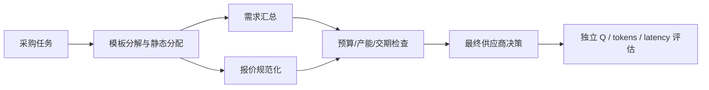

# Static DAG v0

主线正式调整为：

**Model Utility Profiling → Initial Routing → Static DAG → Execution Feedback → Dynamic Replanning → Pareto Multi-objective Optimization**

GAP / Label Repair 归档为前置证据：模型异质性与静态选择机会、初始估计的不确定性。Label Repair 未确认路由改善不等于证明不可能改善，不再自动增加 GAP 实验。

本阶段仅实现 Static DAG v0。20 个可复核的多步采购任务，每题 4 个 LLM 节点，使用历史模型行为作为初始画像，冻结质量、token 成本、耗时加权分配。任务输入含 4 部门需求、库存/储备、3 供应商价格/折扣/运费/手续费/产能/交期，以及预算/期限；最终给出可行最低成本供应商或 NONE。它是一个程序构造的工作流 pilot，不是自然复杂任务 benchmark。



运行：

```bash
python -m unittest static_dag_v0.test_core -v
python -m static_dag_v0.run prepare
python -m static_dag_v0.run execute
```

`prepare` 拒绝覆盖，绑定代码/输入/历史画像 hash；`execute` 拒绝自动重放，单节点一次调用，最多 80 次，仅使用本地检查点、禁模型下载。输出在 `run_v0/`：PROTOCOL、TASKS、PROFILES、PLANS、REQUESTS、NODES、PER_TASK、RESULTS、REPORT、STATUS。

节点画像目前是跨任务迁移的全局均值先验，未声称已实现 `f(q,m)` 的可靠校准或 GTE 部署服务。统一接口提供 Q/C/L 候选值，未来画像数据应显式保存 `(q,m,Q,C,L)`、模型版本、prompt hash、usage、计价依据、耗时与失败状态。不同来源的质量定义和费用口径不能直接混用。

下一阶段接口已保留节点反馈，但本轮不执行 Local Repair / Dynamic Replanning。之后应分别实现：当前节点修复；基于状态扩展后继 DAG、Q/C/L/R 估计、非支配过滤和固定 beam 的 Graph Forest。单/双/多目标共用候选计划接口；质量约束、风险语义、标准化、hypervolume 参考点和基线预算须在比较前冻结。尚无这些方法的性能结果。

评估表最终应包含 BestSingle、Router Only、Static DAG、DAG + Local Repair、Dynamic DAG。本次仅有 Static DAG；不为未实施的方法填数字，不把未实施的修复率/重规划成本/hypervolume 填成 0。1000 题画像数据集未在本次自动启动。
