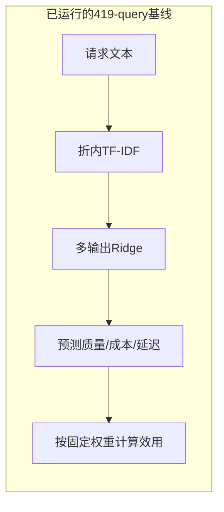
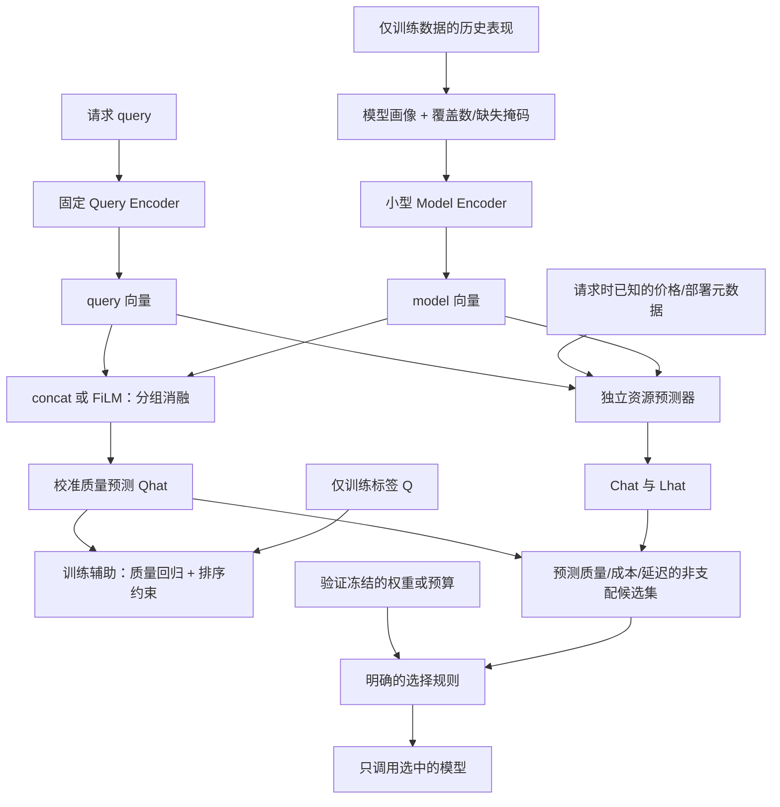

# MA-Router 表示学习设计草案

日期：2026-09-08。状态：DESIGN ONLY。仅新增设计文档；不更换 encoder、不训练、不改变 5000×4 采集或现有 split。

## 可验证的假设

在保持数据、编码器、参数预算与选择规则一致时，显式 query–model 交互和决策相关辅助监督能否改善校准质量预测及成本–质量表现？当前结果不能证明 query→winner 不可学习，也不能承诺 0.8061 会提升到 0.83。

已跑的 419-query 基线是 fold-local word/char TF-IDF + Ridge/kNN；R3 另有计划使用 GTE embedding 的未运行原型。因此不能把 419 的结果直接归因于 Transformer encoder 的语义表征不足。

## 当前结构与最小候选结构

图中 PROFILE 的数学/代码等分数必须来自实际训练表现，不填“R1数学0.95”等先验数字。没有某类数据则明确缺失，并附样本数；profile 是经验观测，不保证涵盖模型真实能力。

训练样本的 profile 优先使用训练内交叉拟合或独立训练参考子集，避免某题自己的标签进入该题输入；验证/测试使用整个训练集估计的固定 profile。任何归一化、聚类或 descriptor 学习均不能使用验证/测试回答。learned model_id embedding 是合法基线，不需要一开始删除；它不自动支持未见模型。

## Loss 与决策必须相接

最小 hybrid 可直接对同一质量头添加排序损失，而不是加一个训练后不参与决策的独立 rank head：

`L = mean((Qhat − Q)^2) + α * Lrank(Qhat)`

对同题候选 i,j，明确非平局时：

`Lrank_ij = softplus(−sign(Q_i−Q_j)*(Qhat_i−Qhat_j)/τ)`

α=0 为回归对照；α、τ 和近似 tie 规则在后续训练前确定并仅用验证选参。按 query 归一化，报告有效 pair 数；没有有效 pair 时排序项为可反传的零。质量相同的模型仍全部保留在回归损失中；不能把它们强行做成“一个正例，其余负例”。质量真 tie 不强迫 Qhat 按成本排序，成本偏好放在选择层；若另设成本 tie 排序头，应明示其目标与 Q 校准的区别，并做决策使用方式消融。

此结构是本项目的待验证设计，不是 EquiRouter 原实现。EquiRouter 对照需保留其质量 tie 时按成本排序的规则。纯 rank score 不可直接替代有单位的 Qhat 参与 `Qhat−λChat−μLhat`。

预测 Pareto 集合通常有多个模型。最终用预先固定的 `argmax(Qhat−λ Chat/sC−μ Lhat/sL)` 或明确预算约束选一个；sC/sL 仅训练拟合。选择不读取候选真实 test 成本和耗时。预测非支配不保证真实非支配，应报告选择后实际指标及约束违反率。

## 不优先添加的模块

- Difficulty Encoder：当前没有“数学/代码/推理难度四维”独立真值。可从训练回答派生 pool-relative difficulty 并训练预测器，但测试只能输入其预测值；不能读测试真实难度。没有维度监督时应叫 latent query feature，不能声称可解释难度向量。
- Cross encoder：需要逐候选进行交互编码，可能增加推理成本；没有依据承诺必胜。先与共享 query encoding 的轻量结构比较相同输入和净收益。
- 对比学习：若未来启用，用多正例或软权重处理相近候选，排除无依据的假负例；不能恢复成任意 winner 标签。先复现 RouterDC/CSCR 的可比配置，不能直接把其思想写成新贡献。
- 不同时更换 embedding、加 difficulty、换 loss、加 cross-attention。否则无法识别收益来源。

## 后续消融（数据门禁通过后）

| 组 | 模型侧表示/融合 | 监督 | 要回答的问题 |
|---|---|---|---|
| A | query-only 多输出头 | 回归 | 冻结 encoder 后的基线 |
| B | learned model_id embedding + concat | 回归 | 显式交互是否有益 |
| C | 训练内经验 profile + concat | 回归 | profile 是否优于 ID |
| D | 与 C 相同 | 回归 + 排序 | loss 的独立作用 |
| E | 与 C 相同但用 FiLM | 回归 | FiLM 的独立作用 |
| F | profile + FiLM | 回归 + 排序 | 是否有交互收益 |

控制 Query Encoder、训练 query、split、参数/调参预算、资源预测和选择规则。α=0 对照必须保留。Task/difficulty 额外作为后续独立消融，只有在部署可获得时才可输入；旧 C8 禁止 task_type 的协议不追溯修改。

最终仍比较既定八项 baseline，另加 Zero Router、EquiRouter；若研究对比学习，则加 RouterDC 或 CSCR。看质量校准误差、排序 regret、AIQ、质量约束下成本节省和包括 encoder 的 Router overhead。扩池泛化需要 leave-one-model-out 实验，不能由“使用 profile”直接推导。

## 文献对应与适用边界

- [RouteLLM, 2406.18665](https://arxiv.org/html/2406.18665v4)：MF 路由已建模 query 与模型的匹配，不能把其概括为完全没有 model representation。
- [ICL-Router, 2510.09719](https://arxiv.org/abs/2510.09719)：官方页面确认 AAAI 2026 接收。用 projector/LLM router 的查询重构对齐，再通过带模型表现的上下文向量预测成功；借鉴“用参考表现表达能力”，轻量 concat 不是完整复现，其新模型支持仍需要 profiling。
- [IRT-Router, 2506.01048](https://arxiv.org/html/2506.01048v2)：支持能力–题目属性交互；不是手工填入语义标签就能得到可靠能力维度。
- [EquiRouter, 2602.03478](https://arxiv.org/html/2602.03478v1)：FiLM 与成本 tie 排序的直接对照。
- [RouterDC, 2409.19886](https://arxiv.org/abs/2409.19886)：query encoder、模型 embedding 与双对比监督已有直接先例。
- [CSCR, 2508.12491](https://arxiv.org/abs/2508.12491)：已有成本敏感 query/model 共享表示。其 logit/perplexity profiling 需要相应接口与预算；当前只有回答文本的四模型数据不能假定具备这些特征。

因此，文献支持开展这种实验，但也说明“query-model matching + ranking”本身不是新颖性证明。数据准备优先级保持不变，待完整数据通过门禁再比较。
